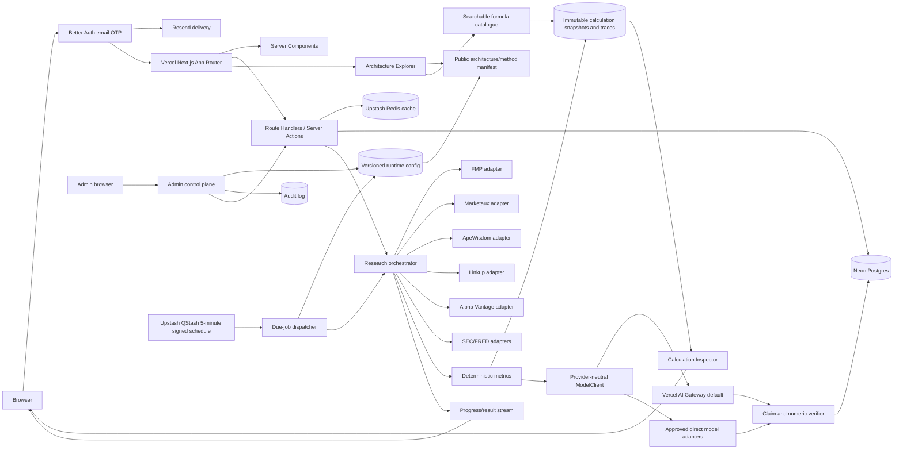
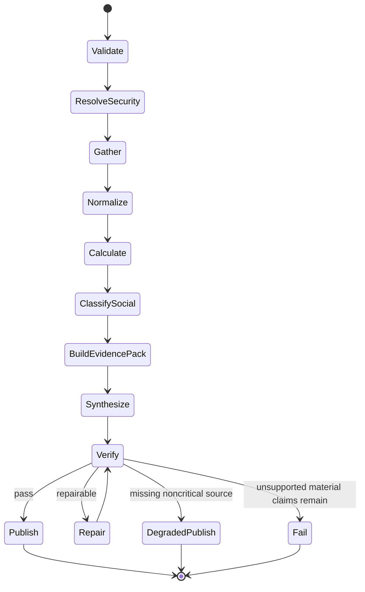
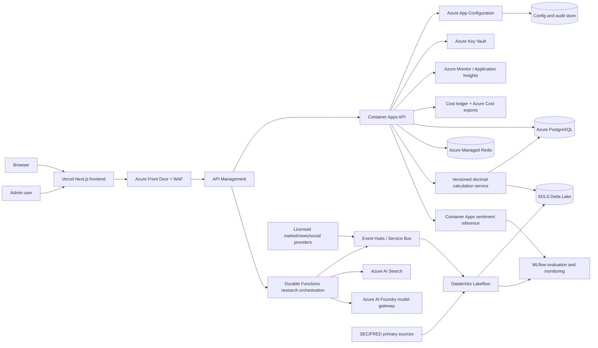

# Barebone-Style Social Sentiment Dashboard

## 48-Hour Proof-of-Value Agentic PRD and Technical Build Specification

**Version:** 1.5  
**Date:** 2026-08-23  
**Target implementer:** Claude Code or an equivalent coding agent  
**Target surface:** secured web application on Vercel  
**PoV build window:** 1–2 working days  
**Initial universe:** 30 seeded US-listed equities and ETFs, then administrator-controlled  
**Primary outcome:** demonstrate that a user can move from “what is retail attention doing?” to a source-backed, numerically grounded explanation in under 30 seconds.

---

## 1. Implementation contract

This is a build specification, not an executive report. The implementer must treat the decisions, contracts, acceptance tests, and exclusions below as requirements.

The 48-hour PoV must deliver six things well:

1. A market and sector sentiment dashboard with explicit freshness and coverage.
2. A Reddit-style trending leaderboard with mention counts, rank changes, and price context.
3. A ticker detail view that explains the leading narratives, bullish and bearish cases, and what changed.
4. An agentic research flow that gathers evidence, computes deterministic metrics, writes a cited explanation, verifies it, and streams progress.
5. An evidence drawer that lets the user inspect every material source behind the answer.
6. A Calculation Inspector that lets the user reproduce every deterministic metric, trace its actual inputs/provenance, compare official and personal assumptions, and reset safely.

The PoV must not pretend to have a Reddit or X firehose. Without an approved commercial Reddit agreement or paid X access, it must use the product labels **“observed Reddit sample,” “sampled social stance,”** and **“coverage-limited.”** It must never label its results “all Reddit,” “Reddit-wide,” “live X sentiment,” or equivalent.

The PoV preserves output quality through constrained scope, explicit uncertainty, deterministic calculations, and evidence-backed writing. It does not preserve production breadth, licensing, uptime, or historical depth. Those are separate production work packages.

### 1.1 Fixed decisions

- **ADR-001 — Vercel Hobby is the PoV application and backend runtime.** Use one Next.js App Router project with Server Components, Route Handlers, Vercel Functions, AI SDK, and optional Vercel Workflow. Do not introduce Azure, Databricks, Kafka, Kubernetes, or a separate Python service into the 48-hour critical path. Do not rely on Hobby Cron for intraday work.
- **ADR-002 — FMP Starter is the recommended market-data backbone.** Its published $22/month annual-billing tier includes US coverage, historical prices, fundamentals, and financial news. Use FMP Basic only for endpoint exploration because it is capped at 250 calls/day and its plan matrix restricts many datasets or symbols. Display or redistribution requires a separate FMP data-display/licensing agreement.
- **ADR-003 — Marketaux is the primary low-cost news-sentiment source.** The free plan offers 100 requests/day and three articles per news request; each article can include entity-level sentiment. Use aggressive caching and on-demand sector refreshes. Upgrade to Basic only if the three-article response cap harms the demo.
- **ADR-004 — ApeWisdom is a PoV-only attention index.** It exposes a keyless API containing ticker rank, mentions, upvotes, prior rank, and prior mentions. Its methodology scans selected investing subreddits twice hourly. It has no published commercial data license or SLA in the reviewed material, so it must not become the production source of record.
- **ADR-005 — Linkup is the on-demand evidence retriever.** Use `standard` search with `searchResults`, date filters, and `reddit.com` domain restriction to find representative public posts and current web evidence. Linkup currently grants a $20 balance/top-up each month; fast/standard search results cost $0.005 per call. Store URLs and short snippets, not scraped social archives.
- **ADR-006 — Alpha Vantage is a validator and specialty fallback, not the primary feed.** Its free allowance is 25 calls/day. Use its `NEWS_SENTIMENT`, `CONGRESS_TRADES`, and occasional quote/fundamental requests to cross-check selected outputs or fill a specialty feature.
- **ADR-007 — SEC EDGAR and FRED are primary-source enrichments.** EDGAR submissions and XBRL APIs require no API key and update quickly; FRED requires a free key. Call them sparingly for filings and macro context.
- **ADR-008 — LLMs do not calculate scores.** Code computes returns, rank changes, aggregates, shrinkage, confidence, sample rules, and signal states. The LLM classifies sampled text into a strict schema, synthesizes approved evidence, and generates follow-up questions.
- **ADR-009 — RAG is evidence assembly before it is vector search.** The 48-hour PoV uses a small, normalized evidence pack selected by SQL and deterministic filters. Do not add a vector database unless basic delivery is complete. Production can add Azure AI Search or pgvector.
- **ADR-010 — No trading recommendation in the PoV.** Output may describe setup, catalysts, risks, disagreement, and what to monitor. It may not issue personalized buy/sell instructions, target prices, or claims of predictive certainty.
- **ADR-011 — No single generic Hugging Face model is the product's sentiment engine.** The 48-hour PoV keeps the strict-schema LLM classifier for the small evidence sample and records Hugging Face candidates in shadow evaluation. The production target routes formal financial text, English financial-social text, and multilingual social text to separately validated classifiers, with LLM escalation for ambiguous/high-impact items. The provisional candidates are `ProsusAI/finbert` for English financial news, `nickmuchi/finbert-tone-finetuned-fintwitter-classification` for English financial-social stance, and `lxyuan/distilbert-base-multilingual-cased-sentiments-student` only as a multilingual tone fallback. None may be promoted on model-card metrics alone.
- **ADR-012 — The admin console is a governed control plane, not an environment-variable editor.** Runtime-safe settings, provider schedules, model routes, feature flags, quotas, and budgets live in versioned database configuration and can write back after validation. Secrets, infrastructure bindings, schema migrations, and legal invariants remain deployment-controlled. Every mutation records actor, reason, before/after value, environment, config version, and rollback target.
- **ADR-013 — User-editable schedules use a fixed QStash-driven dispatcher.** Vercel Hobby Cron cannot provide the required intraday precision. Configure one Upstash QStash schedule to call a protected dispatcher route every five minutes; the dispatcher reads due jobs from Postgres, obtains a Redis lock, and runs idempotent work. The admin console edits database job definitions, not QStash schedules. Keep one deployment-managed daily Vercel Cron heartbeat only as an optional stale-dispatch alert/failsafe, not the primary scheduler.
- **ADR-014 — The application includes a source-backed Architecture Explorer.** `/architecture` presents PoV and target-state diagrams, an accessible step-through animation, formulas, model routes, assumptions, constraints, and opportunities. It reads the same active configuration and method registry used by the application so the page cannot silently diverge from implementation.
- **ADR-015 — The monitored ticker universe is a governed security-master selection.** `/admin/settings/universe` provides a searchable, filterable checkbox table sourced from the canonical security master. It shows symbol, company, exchange, sector, industry, market capitalization, current price, session, short trend, data freshness, and eligibility. Selection changes are versioned, cost-previewed, bounded by plan limits, and applied to future refresh jobs; historical results are never rewritten.
- **ADR-016 — Authentication uses Better Auth email OTP delivered by Resend.** Open account creation is allowed for any successfully verified email. Six-digit codes are sent from `welcome@accounts.joshuai.nz`, expire after five minutes, allow three attempts, rotate on resend, and are stored hashed. Every verified user may access application and public-safe architecture routes. Only normalized email `joshuaifang@gmail.com` receives the PoV `admin` role; authorization is checked server-side on every admin read and mutation.
- **ADR-017 — An AI gateway is recommended but not mandatory.** Keep a provider-neutral `ModelClient` interface and versioned task routes. Default the PoV to Vercel AI Gateway because it is available on all Vercel plans, supports multiple providers, fallbacks and unified usage/cost reporting with no token markup. Direct OpenAI/Anthropic/Google/Azure adapters remain supported and can be selected globally or per task; deterministic application cost controls remain authoritative regardless of gateway.
- **ADR-018 — “Undervalued” is a model-dependent valuation range, not a fact.** Code calculates reproducible DCF, peer-multiple and analyst-consensus gaps only for eligible operating companies with adequate data. It displays model values, assumptions, range, confidence and disagreement separately. ETFs, financial firms under an incompatible generic DCF, pre-revenue/highly unstable cash-flow companies, stale inputs and insufficient peer sets return `not_applicable` or `insufficient_data`; no LLM calculates fair value.
- **ADR-019 — Every deterministic metric is inspectable and replayable.** Every displayed calculated value links to an immutable Calculation Inspector showing the versioned formula, actual normalized and provider inputs, transformations, intermediate steps, full precision, displayed rounding, provenance, assumptions and result hash. Authenticated users may view rights-sanitized provider payloads, persist bounded assumption overrides to their account, reset to official defaults, create explicitly shared scenario snapshots and report issues. User scenarios never overwrite official snapshots or source data.

### 1.2 Owner decisions and adopted defaults

These values were confirmed on 2026-08-23. Items marked “provisional” should be reconsidered after the first seven days of measured operation.

| Decision | Recommended PoV default | Why it matters |
|---|---|---|
| Authentication | Better Auth email OTP through Resend | Owner uses Resend verification delivery and wants one-time passcodes |
| Signup policy | Open account creation after successful email OTP verification | Owner-confirmed; requires rate limits, abuse monitoring and account deletion |
| OTP sender | `welcome@accounts.joshuai.nz` from a verified Resend domain | Owner-confirmed; deployment controlled |
| Administrator identity | `joshuaifang@gmail.com` exact normalized-email allowlist | Determines admin authorization; do not display it publicly |
| Admin roles | One `admin` role in PoV; split `ops_viewer`, `ops_operator`, `config_admin`, and `compliance_admin` in target state | Controls who can run jobs, change models, or broaden data handling |
| Vercel plan | Hobby | Intraday dispatch moves to QStash; do not assume Pro-only capabilities |
| Initial ticker universe | Seed the 30-symbol list in Section 14.3, then manage it only through the admin selector | Owner-confirmed; keeps first-week coverage tractable and avoids a hard-coded permanent list |
| Universe hard limit | 100 active symbols in PoV | Prevents an accidental provider-quota/cost explosion |
| Catalogue breadth | All active US-listed equities and ETFs supported by FMP, with US/exchange/type eligibility filters | Determines identifier resolution, catalogue size and profile completeness |
| Catalogue-wide field freshness | Frequent current price/trend only for checked symbols; use bulk refresh for all rows only if entitlement is confirmed | Catalogue-wide live fields can change the required FMP tier and data-display agreement |
| Model-provider policy | OpenAI, Anthropic, Google and Azure-hosted models are all permitted; task routes remain allowlisted/versioned | Enables independent synthesis/verification and gateway/direct alternatives |
| AI transport | Vercel AI Gateway default with direct-provider fallback; not mandatory | Lowest PoV integration effort while preserving portability |
| Architecture visibility | Every authenticated user sees public-safe architecture; operations overlays are admin-only | Owner-confirmed |
| Raw payload retention | Seven days for sanitized payloads when provider rights permit; zero days otherwise | Affects debugging, privacy, and contractual compliance |
| Normalized retention | 90 days for PoV | Enables rank/trend history without an unbounded store |
| Budget behavior | Monthly hard budget USD 100; warn at USD 80, reduce optional work at USD 90, block noncritical paid work at USD 100 | Owner-confirmed; fixed subscriptions and variable usage share the same headline budget but are itemized |
| Production approvals | One approver in PoV; two-person approval for compliance/model-method changes in production | Reduces risky configuration changes |
| Display time zone | Store/schedule in UTC; show market events in US Eastern and admin-local time secondarily | Avoids DST and schedule ambiguity |
| Calculation coverage | Every deterministic metric | Owner-confirmed; includes price, attention, sentiment, confidence, composites, technicals and valuation |
| Personal assumptions | Persist bounded assumption overrides to the authenticated account; support ticker-specific or account-wide scope; reset to official defaults | Owner-confirmed; source/provider data remains immutable |
| Calculation evidence | Normalized value, provider-original field and primary-source/SEC evidence when available | Owner-confirmed; rights and redaction still apply |
| Calculation validation | Show external FMP DCF and analyst consensus separately, replay frozen inputs, expose full precision and displayed rounding | Owner-confirmed |
| Calculation sharing | Stable authenticated links for official calculations; opt-in identity-stripped share snapshots for personal scenarios | Owner-confirmed |
| Calculation feedback | Users can report data/formula/assumption/staleness issues into an admin review queue; no automatic correction | Owner-confirmed |
| Sanitized payload visibility | Any authenticated user may inspect only the rights-permitted sanitized payload tied to a visible calculation input | Owner-confirmed; arbitrary provider-data browsing remains admin-only |
| Calculation catalogue | Searchable catalogue within `/architecture` plus contextual links beside every metric | Owner-confirmed |

---

## 2. Product goal, user, and success definition

### 2.1 Primary user

An active self-directed investor who follows US equities, sees a ticker gaining attention, and wants to understand:

- whether attention is genuinely rising or merely high;
- whether the observed discussion is bullish, bearish, mixed, or uncertain;
- which narratives are driving the move;
- whether price and discussion are confirming or diverging;
- what evidence supports the explanation;
- what to monitor next.

### 2.2 Core jobs to be done

- “Show me which stocks are gaining retail attention fastest.”
- “Explain why this ticker moved up the ranking.”
- “Separate the loudest narrative from the best-supported narrative.”
- “Compare social stance with recent price action and news sentiment.”
- “Tell me what would confirm or falsify the current thesis.”
- “Let me ask a follow-up without losing the evidence already gathered.”
- “Show me exactly how this number was calculated, which source fields were used, and what changes under my assumptions.”

### 2.3 PoV success criteria

The PoV is successful when all of the following are true:

- A first-time user can open the dashboard and understand the top three observed attention changes without instructions.
- At least 20 configured tickers have current price context and an attention record.
- A selected ticker returns a completed research answer in **30 seconds or less at p95**, with the first visible progress event in under **1 second**.
- Every material factual claim has one or more visible source links.
- Every displayed number comes from a stored provider field or a versioned deterministic calculation.
- Every deterministic value/chart point opens an immutable formula/input/step trace with exact and displayed precision, provenance and a successful frozen replay.
- A user's bounded scenario assumptions survive sign-out, remain isolated to that account, show the official comparison and reset to official defaults.
- The application abstains when evidence or sample size is insufficient.
- Re-running the same request against the same stored inputs produces the same deterministic metrics.
- A provider failure produces an explicit degraded state rather than invented content or a blank page.
- The expected monthly PoV spend remains below **$50**, excluding optional FMP display licensing and public-commercial hosting requirements.

### 2.4 Non-goals for 48 hours

- Full Reddit, X, Stocktwits, Discord, Telegram, or YouTube coverage.
- Public redistribution of social content without approved rights.
- Millisecond streaming market data.
- Portfolio import, broker integration, personalized suitability, order execution, or autonomous trading.
- Historical backtesting of social signals.
- Bot detection using full author graphs.
- Options flow, short interest, institutional estimates, or paid alternative datasets.
- Multilingual sentiment.
- Mobile apps.

---

## 3. Scope matrix: production target vs 48-hour PoV vs excluded

| Capability | Production target | 48-hour PoV implementation | Excluded from PoV / reason | Quality guardrail |
|---|---|---|---|---|
| Authentication | Multi-tenant identity, RBAC, audit, deletion | Better Auth open verified-email signup with Resend OTP; ordinary user plus one deployment-allowlisted admin; session revocation/deletion | Passwords, social login, enterprise SSO and organization tenancy | Generic OTP responses, rate/attempt limits, hashed codes, server authorization; no anonymous provider/research endpoints |
| Ticker universe and search | Canonical security master with identifier history and entitlement rules | FMP-derived US security master plus a searchable checkbox selector; seed 30 and hard maximum 100 active symbols | Global listings and complex dual-listing resolution | Reject ambiguous/ineligible symbols; preview call and cost impact before activation |
| Market prices | Licensed real-time/delayed feed with entitlements | FMP Starter quotes and daily history; Twelve Data Basic only as an internal fallback | Tick data and exchange-by-exchange entitlement UI | Display provider timestamp and “real-time/delayed/EOD” label |
| Fundamentals and valuation | Point-in-time statements, ratios, estimates and specialized valuation models | FMP fundamentals plus deterministic DCF/peer range for eligible operating companies; FMP DCF/analyst consensus shown separately | Bank/ETF/pre-revenue-specialized valuation and investment recommendations | Never mix fiscal periods/currencies; expose formula, assumptions, ineligibility and confidence |
| News | Licensed feed, corrections, clustering, archive | Marketaux entity news/sentiment plus FMP news URLs | Full-text redistribution | Store metadata/snippets only; dedupe by URL/title |
| Reddit attention | Licensed raw posts/comments with deletion handling | ApeWisdom ranks/mentions/upvotes as a PoV index | Claiming platform-wide coverage | Label “observed sample”; show methodology link and timestamp |
| Reddit narratives | Licensed raw corpus and clustering | Linkup domain-restricted search for 5–10 representative URLs per ticker | Exhaustive conversation coverage | “Representative sampled sources,” not “consensus” |
| X sentiment | Paid X API or licensed reseller | Hidden/disabled feature flag | $0.005 per post read makes broad PoV coverage expensive and incomplete | Do not infer X sentiment from web snippets |
| Stocktwits | Enterprise Firestream/sentiment endpoints | Hidden/disabled feature flag | New public API registrations are closed; enterprise access required | No scraping |
| Mention leaderboard | Cross-platform normalized attention | ApeWisdom 24h rank, mentions, upvotes, prior rank | Cross-platform combined ranking | Name the source in the title and tooltip |
| Fastest risers | Robust time-series velocity and anomaly scores | Rank delta and mention delta from ApeWisdom; local snapshots improve after deployment | Long historical baseline | Minimum-base rule and “new entrant” state |
| Raw sentiment | Routed, calibrated classifiers over licensed posts with LLM escalation | Sampled LLM classification of representative snippets; Hugging Face candidates run in shadow only if time permits | Author-normalized score without author-level data | Show sample count, route, model revision, abstentions, and calibrated confidence |
| Engagement sentiment | Platform-aware engagement weighting | Not shown as a formal metric; upvotes shown separately | A weighted sentiment would create false precision | Keep attention and stance as separate axes |
| Narrative clusters | Embedding/topic model with drift and cluster history | LLM extracts up to three themes from deduped evidence pack | Persistent online clustering | Each theme needs at least two supporting items or is labeled “single-source” |
| Cross-source divergence | Reddit/X/news/price disagreement | Observed Reddit attention vs Marketaux news sentiment vs 5-day price return | X and Stocktwits comparison | Describe association, never causation |
| Market sentiment | Broad market/news/social composite with calibration | SPY/QQQ/IWM price regime + market-news sentiment + sector ETF breadth | “Fear and greed” branding or predictive claim | Expose component scores and coverage |
| Sector sentiment | Constituent-level weighted aggregation | 11 US sector ETF proxies with cached Marketaux sentiment and returns | Full constituent universe | Label “sector proxy,” not sector population |
| Notable change analysis | Continuous event-triggered explanation | Generate for top three rank movers on dashboard refresh | Every-ticker automatic narrative | Cache for 30 minutes and require evidence threshold |
| Insider activity | Form 4 parser and transaction taxonomy | FMP insider endpoint or SEC link on ticker detail | Full cluster-buy score | Distinguish open-market purchases from grants/exercises |
| Congress trades | Official disclosure pipeline and lag model | Alpha Vantage `CONGRESS_TRADES` on demand behind feature flag | Scheduled market-wide scan | Always show transaction and disclosure dates |
| Filings | Full EDGAR ingestion, parsing, chunking, amendment handling | Latest submissions and source link; optional key XBRL facts | Full filing RAG | SEC is primary; show filing date/form |
| Agentic research | Durable, replayable multi-step workflow | Typed parallel fetch + deterministic analysis + LLM synthesis + verifier | Open-ended autonomous agent | Hard tool allowlist, max steps, timeouts, budgets |
| Follow-up questions | Context-aware suggestions based on evidence gaps | Template-driven questions optionally rewritten by LLM | Unbounded curiosity prompts | Only suggest questions the system can answer |
| RAG | Hybrid vector/keyword index with source rights | SQL-selected evidence pack, optional pgvector after P0 | Ingesting the web or Reddit into a vector lake | Retrieval returns source IDs, not untraceable text |
| Alerts | Durable monitors, dedupe, notification preferences | None; optional manual refresh | 24/7 monitoring | Avoid unreliable “real-time” claim |
| Mobile | Native iOS/Android | Responsive desktop/mobile web | Native applications | PWA polish only if time remains |
| Databricks | Lakehouse, batch/stream processing, MLflow evaluation | Excluded from critical path | Setup time exceeds value for 20–50 tickers | Provide migration mapping, not premature deployment |
| Operations console | Segregated RBAC, approvals, full audit, incident controls | Secured `/admin` with one admin role, status, refresh, schedules, model routing, bounded raw-data inspection, settings, and cost controls | Editing secrets or infrastructure from the browser | Versioned writes, validation, confirmation, audit, and rollback |
| Runtime configuration | Central typed config service with staged releases | Postgres-backed typed settings plus environment-variable bootstrap | Arbitrary key/value or executable settings | Only allowlisted keys; invariants remain code-controlled |
| Dynamic refresh scheduling | Durable scheduler/queue with calendars and backfill | One fixed five-minute QStash schedule plus DB job definitions | Using Hobby Cron for intraday work or rewriting external schedules from the admin UI | QStash signature verification, Redis lock, idempotency, retry policy, next-run preview |
| Architecture explorer | Generated architecture catalogue tied to deployed services and model registry | `/architecture` PoV/target tabs, animated walkthrough, formulas, assumptions, opportunities, and text alternative | Secrets, internal hostnames, exploit-relevant details | Render from a versioned architecture manifest and active public-safe configuration projection |
| Calculation transparency | Governed lineage/semantic layer with point-in-time replay | Generic immutable Calculation Inspector for every deterministic metric, exact/display precision, normalized/provider/primary provenance and searchable formula catalogue | Editing source facts or rewriting historical calculations | CI-enforced `calculation_id` coverage and hash replay against frozen inputs |
| Personal valuation scenarios | Multi-tenant scenario workspaces and approval policy | Bounded account/ticker assumption overrides, official comparison, reset and opt-in authenticated sharing | User-defined formulas, source-data edits and use in public rankings | Private by default; versioned/audited; admin adjustment visible and resettable |

---

## 4. Provider research and selection

### 4.1 Recommended PoV stack

| Need | Default provider | Free/low-cost allowance | Why selected | PoV limitations | Production decision |
|---|---|---:|---|---|---|
| Quotes, history, profile, fundamentals, news, events, insiders | Financial Modeling Prep Starter | $22/month billed annually; 300 calls/minute | Broadest single integration for the price; stable API family; US coverage | Personal plan and endpoint entitlements must be tested; display/redistribution requires agreement | Keep if commercial license and reconciliation pass; otherwise replace/augment with licensed market feed |
| Free market-data fallback | Twelve Data Basic | $0; 8 API credits/minute and 800/day | Real-time US equities and technical indicators; easy batch support | Individual plans are personal/internal/non-commercial and cannot be commercially displayed | Use only for internal PoV; business plan begins at materially higher cost |
| Financial news with entity sentiment | Marketaux Free | $0; 100 requests/day; 3 articles/request | Entity tagging, sentiment, symbol and industry filters | Three-article cap can under-sample; commercial rights must be confirmed | Upgrade or replace with licensed news feed after evaluation |
| News sentiment and specialty validation | Alpha Vantage Free | $0; 25 calls/day | `NEWS_SENTIMENT`, insider, Congress, fundamentals, technical indicators | Too few calls for dashboard-wide primary use | Retain as validator or upgrade if its specialty data is valuable |
| Reddit mention index | ApeWisdom | Keyless public API | Returns rank, mentions, upvotes, prior rank, and prior mentions immediately | Selected subreddit universe, uppercase ticker rules, no published SLA/commercial license | Replace with approved Reddit/licensed social provider |
| Current web/social evidence | Linkup | $20 balance topped up monthly; $0.005 fast/standard search result call | Cheap, low-latency, domain/date filters, TypeScript SDK, source URLs | Search index is not an exhaustive social corpus; underlying source rights still apply | Keep for open-web retrieval; do not confuse with social firehose |
| Filings and XBRL | SEC EDGAR | Free; no key; fair-access limit | Primary source; submissions typically update in under a second, XBRL under a minute | US issuers only; no CORS; parsing needed | Production source of truth for US filings |
| Macro series | FRED | Free API key | Authoritative and simple for rates, CPI, unemployment, spreads | Application must follow FRED API terms | Production-capable with caching and attribution |
| LLM routing | Vercel AI Gateway | $5/month free AI credits; zero token markup | One integration, spend visibility, provider fallback, all major models | Free credits are small; model outputs still require evaluation | Production-capable with budgets, routing, and privacy review |
| Database | Neon Postgres | Free: 0.5 GB/project and 100 CU-hours/month/project | Fast setup, pooled Postgres, scale to zero, pgvector available | Short restore/observability window | Migrate to Azure PostgreSQL or paid Neon when SLOs demand it |
| Cache/rate limits | Upstash Redis | Free: 256 MB and 500,000 commands/month | Serverless REST client works cleanly with Vercel | No production SLA on free tier | Upgrade or migrate to Azure Managed Redis |
| Hosting | Vercel | Hobby $0; Pro $20/month with $20 usage credit | Fastest deployment for Next.js; CDN, WAF, functions, CI/CD | Use Pro for a business/public PoV; Hobby is best treated as personal/testing | Keep frontend; move sensitive APIs to Azure if required |

### 4.2 Provider findings that materially affect the design

#### Financial Modeling Prep

FMP’s [published pricing](https://site.financialmodelingprep.com/pricing-plans) currently shows:

- Basic: free, 250 calls/day, end-of-day history, profile/reference data, endpoint exploration.
- Starter: $22/month billed annually, 300 calls/minute, US coverage, up to five years of history, annual fundamentals/ratios, historical prices, financial news, crypto, and forex.
- Premium: $59/month billed annually, 750 calls/minute, intraday charts, technical indicators, calendars, and broader history.
- Ultimate: $149/month billed annually, 3,000 calls/minute, transcripts, fund holdings, 13F, one-minute data, and bulk/batch delivery.

The stable [FMP documentation](https://site.financialmodelingprep.com/developer/docs) exposes symbol search, quote, historical charts, profile, statements, ratios, news, press releases, SEC filings, insider trades, sector performance, technical indicators, and House/Senate trade endpoints. Its [cycle-time documentation](https://site.financialmodelingprep.com/developer/docs/cycle-times-stable) lists real-time quotes and intraday indicators, five-minute news refresh, approximately two-minute insider updates, and one-to-two-hour earnings calendar updates.

For the admin security catalogue, FMP documents:

- `stock-list` for the broad provider-supported symbol directory;
- `profile-bulk?part=N` for bulk company name, price, market cap, sector and industry;
- `batch-quote-short?symbols=...` for compact multi-symbol price/change/volume refresh;
- `batch-exchange-quote?exchange=...` and `batch-etf-quotes` for broad quote snapshots;
- `company-screener` for server-side discovery by market cap, price, sector, country and related fields.

These endpoints are the correct performance shape, but documentation visibility is not plan entitlement. FMP's pricing associates bulk/batch delivery most clearly with Ultimate, so implementation startup must run an authenticated capability probe under the purchased plan and record `available`, `forbidden`, response limits and observed call accounting. The PoV fallback is: `stock-list` for the complete local directory, paginated `company-screener` if entitled for profile enrichment, and chunked `batch-quote-short`/individual profile calls only for the checked universe. Never promise catalogue-wide “current” fields when the plan cannot refresh them; show the exact field timestamp or `—`, and surface the limitation in the impact preview. If catalogue-wide current price/market cap/industry is mandatory, budget for the bulk entitlement or select a provider/plan that contractually includes equivalent bulk delivery.

For valuation, FMP documents standardized income/balance/cash-flow statements, TTM ratios/key metrics, enterprise values, analyst estimates, price-target consensus and DCF endpoints. Use the underlying statements/metrics as model inputs and recompute/reconcile important values. FMP's DCF output is a validator/reference, not the application's unquestioned fair value: the application must preserve its own WACC, growth, terminal, share-count and debt/cash assumptions and expose them to the user. Price-target consensus is market expectation, not intrinsic value, and remains a separate field.

Important: FMP states that displaying or redistributing its data requires a Data Display and Licensing Agreement. A paid personal API plan is not automatically a public-app license. The PoV may be implemented internally while commercial terms are evaluated.

Do not rely on FMP’s legacy social-sentiment endpoints for the new build. Current stable documentation does not clearly expose an equivalent social product, while older pages list Twitter/Stocktwits-derived fields. Treat this as legacy/uncertain until an authenticated endpoint probe and written entitlement confirmation succeed.

#### Marketaux

Marketaux’s [documentation](https://www.marketaux.com/documentation) says it covers more than 5,000 sources, 200,000 entities, 80 markets, and 30 languages, with symbol, industry, exchange, country, time, and sentiment filters. Responses include entity-level sentiment suitable for deterministic aggregation. Its [free plan](https://www.marketaux.com/pricing) allows 100 requests/day but returns only three articles per news request.

PoV strategy:

- Cache market news for 60 minutes.
- Refresh each of 11 sector proxies no more than twice daily.
- Fetch ticker news on demand and cache for 30 minutes.
- Never call Marketaux directly from the browser.
- Record query parameters and returned article count so thin coverage is visible.

#### Alpha Vantage

Alpha Vantage’s [free tier](https://www.alphavantage.co/premium/) is capped at 25 requests/day. Its [documentation](https://www.alphavantage.co/documentation/) includes live/historical `NEWS_SENTIMENT` with ticker/topic/time filters, insider transactions, `CONGRESS_TRADES`, politician metadata, fundamentals, prices, and technical indicators.

Use it for:

- one nightly validation sample across up to 10 tickers;
- a feature-flagged Congress lookup;
- a fallback news-sentiment response when Marketaux is unavailable;
- test fixtures during development.

Do not place it on the critical dashboard refresh path.

#### Twelve Data

Twelve Data’s [free Basic plan](https://twelvedata.com/pricing) currently offers 8 API credits/minute and 800/day, including real-time US equities/ETFs, forex, crypto, reference data, technical indicators, and batching. This is attractive for an internal demo. However, its [usage terms](https://support.twelvedata.com/en/articles/5332349-commercial-and-personal-usage) state that individual plans are for personal/internal/non-commercial use and do not permit commercial display or redistribution. A business plan is required for a commercial website.

Use Twelve Data only as an internal PoV price fallback. Do not design a public launch around its free plan.

#### ApeWisdom

The [ApeWisdom API](https://apewisdom.io/api/) exposes 100 results/page with `rank`, `ticker`, `name`, `mentions`, `upvotes`, `rank_24h_ago`, and `mentions_24h_ago`. Its [methodology](https://apewisdom.io/methodology/) says it scans a selected group of stock and crypto subreddits twice per hour, counts each ticker once per submission/comment, and requires `$` prefixes for ambiguous ticker-like words.

This is nearly ideal for reconstructing the Barebone screenshots quickly. It is not sufficient for production because the reviewed pages do not provide a commercial license, deletion contract, complete raw corpus, author fields, or SLA.

Required label in the UI:

> Observed Reddit attention from selected investing communities. Coverage and methodology differ from the full Reddit platform.

#### Reddit

Reddit’s [Responsible Builder Policy](https://support.reddithelp.com/hc/en-us/articles/42728983564564-Responsible-Builder-Policy) requires explicit approval before API access. Its [Data API terms](https://redditinc.com/policies/data-api-terms) require a separate agreement for commercial use, prohibit unapproved model training, and impose retention/deletion restrictions. Eligible free API clients are documented at 100 queries/minute, but approval and use-case rights—not the nominal rate limit—are the binding constraint.

Therefore:

- Do not train or fine-tune a model on Reddit content.
- Do not retain full post/comment bodies in the PoV.
- Use public result URLs and short search-result snippets only for representative evidence.
- Start a Reddit commercial-access conversation before turning the PoV into a public product.

#### X

X’s [pay-per-use pricing](https://docs.x.com/x-api/getting-started/pricing) currently lists post reads at $0.005 per returned post and trend reads at $0.010. Reading 10,000 posts/day would cost approximately $50/day before downstream processing. A tiny sample would be cheap but misleading as a market-wide signal.

Decision: hide X in the PoV. Add it only when a defined query universe, cost ceiling, rights review, and coverage test are approved.

#### Stocktwits

The public [developer registration page](https://api.stocktwits.com/developers) says new registrations are paused. Stocktwits’ [Firestream](https://firestream.stocktwits.com/documentation) and sentiment endpoints expose streaming messages and detailed symbol sentiment for authorized enterprise accounts, while its [terms](https://stocktwits.com/about/legal/terms/) prohibit automated extraction outside approved APIs.

Decision: no Stocktwits in the PoV. Keep a provider adapter interface ready for a future enterprise contract.

#### Linkup

Linkup’s [pricing](https://docs.linkup.so/pages/documentation/platform/pricing) grants an initial $20 balance and tops it back up to $20 monthly. Fast/standard raw search results cost $0.005/call, sourced/structured output $0.006, and deep search results $0.05. Its [best-practices guide](https://docs.linkup.so/pages/documentation/endpoints/search/best-practices) recommends `fast` for keyword lookups, `standard` for one or a few parallel searches, and `deep` for sequential multi-page research.

PoV calling pattern:

```ts
await linkup.search({
  query: `${symbol} ${companyName} investor discussion catalyst risk`,
  depth: "standard",
  outputType: "searchResults",
  includeDomains: ["reddit.com"],
  fromDate: threeDaysAgo,
  maxResults: 10,
});
```

Use raw search results rather than Linkup’s synthesized answer because the application’s own evidence ledger and verifier must control final claims.

#### AI gateway decision

An AI gateway is a control layer between this application and model hosts. It does not improve a model's reasoning by itself. Its job is to centralize model/provider selection, credentials, failover, rate and budget policy, usage attribution and operational telemetry.

**The application does not require Vercel AI Gateway.** The PoV uses it by default because it is available on all Vercel plans, provides one API across many providers, configurable provider/model fallbacks and unified spend/usage monitoring, and currently charges upstream list price with no token markup. The included monthly credit is small and must not be treated as a production budget.

Required abstraction:

```ts
interface ModelClient {
  generateStructured<T>(request: StructuredModelRequest<T>): Promise<ModelResult<T>>;
  generateText(request: TextModelRequest): Promise<ModelResult<string>>;
  streamText(request: TextModelRequest): Promise<ModelStream>;
  listCapabilities(): Promise<ModelCapability[]>;
}

type ModelTransport =
  | "vercel_gateway"
  | "direct_openai"
  | "direct_anthropic"
  | "direct_google"
  | "azure_foundry"
  | "openrouter"
  | "cloudflare_gateway"
  | "portkey"
  | "litellm";
```

The versioned `model_route` chooses transport, provider, model/revision and fallback for each task. Application schemas, evidence rules, timeouts, retries, token limits, cost events and verification do not depend on the transport. Keys and gateway base URLs remain deployment-only.

| Option | Strengths | Costs/risks | PoV decision |
|---|---|---|---|
| Vercel AI Gateway | Best fit with AI SDK/Vercel; broad model access; provider/model fallback; BYOK; unified usage/spend; available on Hobby | Adds Vercel as an inference intermediary; provider-specific features may lag; still requires application evaluation and cost ledger | **Default transport, optional** |
| Direct provider SDKs | Full provider feature surface, direct contracts/keys and least intermediary dependency | Separate SDKs, credentials, retries, dashboards and cost normalization; cross-provider failover is application work | Implement one direct fallback adapter for the chosen primary model family |
| OpenRouter | Very broad catalogue, provider ordering/fallback, ZDR filtering and unified API | Separate vendor/credit/privacy review; routing defaults require explicit constraints; BYOK economics differ | Good independent alternative if Vercel Gateway is rejected |
| Cloudflare AI Gateway | Analytics, logging, caching, rate/spend controls and dynamic routing; core features currently free | Adds Cloudflare control plane and configuration; less native to this Vercel/AI SDK implementation | Credible low-cost alternative, especially if Cloudflare is already used |
| Portkey | Rich conditional routing, guardrails, retries, circuit breaking, canaries and traces | Some budget/governance functions are paid/enterprise; more configuration than PoV needs | Production evaluation candidate, not needed in 48 hours |
| LiteLLM proxy | Open source, self-hosted, broad provider support, virtual keys, spend tracking and fallback | Requires operating a separate Python gateway, database/telemetry and upgrades | Excluded from PoV; useful when self-hosting/control outweighs operations |
| Microsoft Foundry model router/gateway | Fits target Azure governance, deployment policy, model subsets and Monitor; supports cost/balanced/quality routing | Azure setup and evaluation burden; router behavior/cost must be benchmarked; not the shortest PoV path | Target-state candidate after evaluation on at least 100 representative prompts |

Recommended routing policy for the PoV:

```text
social_stance       small structured-output model; HF shadow only
research_synthesis  strongest approved general reasoning model within per-run budget
claim_verification  independent model family/provider where practical
followup_rewrite    cheap small model, with deterministic-template fallback
query_expansion     disabled until retrieval tests justify it
```

The admin may change allowlisted routes and transports, but cannot type arbitrary model IDs. A server-side capability refresh validates current IDs, structured-output/tool support, context limits, pricing status and privacy eligibility before activation. A gateway outage falls back only to an explicitly configured direct provider; it never silently chooses an unapproved model.

#### SEC EDGAR and FRED

SEC [data APIs](https://www.sec.gov/search-filings/edgar-application-programming-interfaces) require no key and provide submissions plus XBRL company facts. The SEC states that submissions usually update in under one second and XBRL in under one minute. Automated access must identify the application and remain below the SEC’s [10 requests/second fair-access threshold](https://www.sec.gov/filergroup/announcements-old/new-rate-control-limits).

FRED requires a free [API key](https://fred.stlouisfed.org/docs/api/fred/v2/api_key.html). Cache macro values daily. Suggested series: DFF, DGS2, DGS10, CPIAUCSL, UNRATE, VIXCLS, and BAMLH0A0HYM2.

### 4.3 Reddit community watch universe

ApeWisdom already provides filters for individual communities. The PoV should retain both the aggregated `all-stocks` result and selected community snapshots so the UI can distinguish broad attention from a single-community burst.

| Tier | Communities | Use | Treatment |
|---|---|---|---|
| Broad equity | `r/wallstreetbets`, `r/stocks`, `r/investing`, `r/StockMarket` | Primary discovery and cross-community confirmation | Include in the core observed-attention view |
| Trading/catalyst | `r/options`, `r/Daytrading` | Short-horizon catalysts, positioning language, technical discussion | Display separately or cap at 30% of combined attention |
| Speculative niche | `r/pennystocks`, `r/SPACs`, `r/WallStreetbetsELITE`, `r/Wallstreetbetsnew` | Early speculative bursts and small-cap narratives | Never combine directly with mega-cap baseline; show manipulation/thin-liquidity warning |
| Crypto-only | `r/CryptoCurrency`, `r/Bitcoin`, `r/CryptoMoonShots`, related filters | Out of scope for equity PoV | Exclude unless the security is a crypto-linked equity and the query explicitly requests context |
| Non-Reddit | 4chan `/biz/` | High-noise speculative context | Exclude from P0 |

Cross-community confirmation rule:

```text
confirmed_breadth = mentions appear in at least 2 broad-equity communities
concentrated_burst = >= 70% of observed mentions come from one community
```

The PoV may not be able to compute these values if the convenience provider returns only aggregate results. In that case, omit the metric. Do not ask an LLM to guess community breadth from a handful of search results.

For X, do not create an influencer list in P0. A hand-picked account list produces survivorship and curator bias and is especially vulnerable to paid promotion. If licensed X coverage is added later, create governed account categories rather than one opaque list:

- issuer and investor-relations accounts;
- named executives and directors;
- regulators, central banks, ministries, and elected officials;
- credentialed financial journalists and primary newsrooms;
- sell-side and independent analysts whose identity can be verified;
- domain experts for semiconductors, energy, biotech, defense, and other sectors;
- broad retail accounts, scored separately from verified/official sources.

Account category must remain a feature, not a credibility verdict. Source identity, conflicts, coordination, deletion, reposting, and historical reliability require separate controls.

### 4.4 Considered providers not selected for the default PoV

| Provider | Useful capability | Why not the default | When to choose it |
|---|---|---|---|
| Finnhub | Advertises real-time prices, fundamentals, technical analysis, news/Reddit/Twitter sentiment, insider sentiment, Congress trades, and filings | Its news-sentiment endpoint is premium; the reviewed market-data plan begins at $49.99/month with personal-use terms, and social-data entitlement/pricing needs confirmation | Choose if an authenticated trial proves one subscription replaces FMP + Marketaux + social convenience sources and commercial terms are acceptable |
| FMP legacy social sentiment | Historical/trending social fields in older API family | Current stable documentation does not clearly expose a supported equivalent; historical pages refer to Twitter/Stocktwits-derived fields | Use only after FMP confirms the stable endpoint, source lineage, plan entitlement, retention, and commercial display rights in writing |
| Direct Reddit Data API | Best source lineage and potential raw posts/comments | Explicit approval is required; commercial use requires permission/contract; retention and AI restrictions apply | Start immediately as the production procurement path, but do not block the 48-hour internal PoV |
| X API | Direct source and clear pay-per-use pricing | Broad reads become costly quickly; small samples are easy to misrepresent | Add when the target universe, tracked queries/accounts, daily read ceiling, and expected user value are measured |
| Stocktwits Firestream | Purpose-built finance social stream and sentiment detail | Enterprise authorization required; new public developer registrations are paused | Strong production candidate if enterprise pricing fits and its symbol-level sentiment reduces build effort |
| Self-hosted FinBERT | Deterministic local classification without per-token fees | Deployment, calibration, finance-domain drift, sarcasm, and serverless cold starts add risk inside 48 hours | Evaluate after the evidence pipeline exists; compare against the LLM classifier on the same labeled set |

### 4.5 Hugging Face sentiment-model evaluation and selection

#### 4.5.1 The product task is stance, not generic sentiment

The dashboard needs **target-conditioned market stance**:

```text
Given (text, resolved security, publication time), classify whether the author expects
the resolved security to move positively, negatively, neither, or cannot be determined.
```

That is not the same task as detecting whether prose sounds positive. Examples:

- “Great company, but the stock is priced for perfection” has positive corporate tone and potentially bearish security stance.
- “Margins fell, but far less than feared” contains negative words and may be bullish relative to expectations.
- “I shorted it and got destroyed” contains `short` but does not necessarily express a current bearish thesis.
- “This is fine” beside a collapse chart may be ironic.
- “Apple harvest looks weak” is unrelated to `AAPL` despite a company-name collision.

Every evaluated Hugging Face checkpoint is therefore a component candidate, not a complete sentiment system. Entity resolution, source/time context, irony/ambiguity handling, calibration, abstention, aggregation, and explanation remain separate requirements.

#### 4.5.2 Evidence-grading rules

A model card receives more weight when it discloses the training corpus, label definitions, held-out test design, per-class metrics, license, and deployable artifacts. Download count and likes are adoption signals, not quality evidence. Self-reported in-domain accuracy is not comparable across datasets. Teacher/student agreement is not ground-truth accuracy. Random splits of a small headline corpus can also overstate real-world performance because duplicate events, publishers, or near-identical sentences may cross the split.

The following assessment is based on the linked model cards, datasets, and primary papers as reviewed on 2026-08-23. It is a shortlist, not an assertion that every model tagged `sentiment-analysis` on Hugging Face was exhaustively benchmarked.

#### 4.5.3 Candidate decision matrix

| Candidate | Training domain and output | Evidence available | Deployment / rights | Product fit | Decision |
|---|---|---|---|---|---|
| [`lxyuan/distilbert-base-multilingual-cased-sentiments-student`](https://huggingface.co/lxyuan/distilbert-base-multilingual-cased-sentiments-student) | General multilingual text; positive/neutral/negative; DistilBERT student of an mDeBERTa NLI zero-shot teacher | Card reports 88.29% agreement with teacher predictions over 146,721 examples. This is fidelity to the teacher, not accuracy against human annotations. The underlying 591k-row dataset combines 12-language general sentiment sources rather than finance-specific stance. | Apache-2.0; approximately 100M parameters; 541 MB F32 weights and a 541 MB ONNX file; available through HF Inference | Good language-coverage/triage option. Weak on ticker direction, relative expectations, finance idioms, and irony; probabilities are not demonstrated as calibrated. | **Useful only as multilingual tone fallback or shadow feature. Do not use as the ticker bullish/bearish source of truth.** |
| [`cardiffnlp/twitter-roberta-base-sentiment-latest`](https://huggingface.co/cardiffnlp/twitter-roberta-base-sentiment-latest) | English social media; negative/neutral/positive; base pretrained on roughly 124M tweets and fine-tuned on TweetEval | Strong provenance and public benchmark lineage. Its task remains generic tweet sentiment, not finance-conditioned stance. | CC-BY-4.0; roughly 125M parameters / 501 MB PyTorch weights; HF Inference available. A quantized ONNX conversion exists for the earlier Cardiff checkpoint, not necessarily this exact revision. | Strong general English-social auxiliary; understands handles, URLs, emoji, and short-message style better than formal-finance models. | **Recommended auxiliary disagreement/quality signal, not the primary finance stance model.** |
| [`cardiffnlp/twitter-xlm-roberta-base-sentiment`](https://huggingface.co/cardiffnlp/twitter-xlm-roberta-base-sentiment) | Multilingual social; fine-tuned in Arabic, English, French, German, Hindi, Italian, Spanish, and Portuguese after pretraining on about 198M tweets | Research-backed. The [newer explicit multilingual checkpoint](https://huggingface.co/cardiffnlp/twitter-xlm-roberta-base-sentiment-multilingual) reports about 0.693 macro-F1 on its multilingual tweet test set, illustrating that multilingual three-way sentiment remains materially imperfect. | Large XLM-R base footprint (about 278M parameters and roughly 1.1 GB F32 weights); HF Inference available; model-card license metadata must be cleared before commercial release. | Better social-domain alignment than `lxyuan`, but slower and still not financial stance. | **Benchmark as the higher-quality multilingual challenger; do not put on the synchronous PoV path.** |
| [`ProsusAI/finbert`](https://huggingface.co/ProsusAI/finbert) | English financial text; positive/negative/neutral; finance-domain BERT fine-tuned on Financial PhraseBank | Peer-reviewed/paper-backed baseline with clear financial-domain rationale. PhraseBank is only about 4,840 older financial-news sentences, so Reddit, slang, and modern meme language are out of distribution. | BERT-base, approximately 109M parameters / 438 MB PyTorch weights; HF Inference available. The upstream GitHub project is Apache-2.0, while the HF repo lacks explicit license metadata and should be reviewed before launch. | Reliable baseline for headlines, press releases, filings snippets, and as a second opinion on Marketaux—not for raw Reddit stance. | **Recommended baseline for English financial news/formal text.** |
| [`yiyanghkust/finbert-tone`](https://huggingface.co/yiyanghkust/finbert-tone) | English formal finance; positive/negative/neutral; pretrained on 4.9B tokens from filings, earnings calls, and analyst reports, then fine-tuned on 10,000 annotated analyst-report sentences | The associated research reports 88.2% out-of-sample accuracy for analyst tone and better finance-vocabulary handling than generic BERT. Its target is formal communication tone. | About 109M parameters; HF Inference available; model/dataset licensing requires explicit review. | Excellent formal-finance challenger, especially analyst reports and earnings material; weak match for Reddit conversational stance. | **Benchmark against ProsusAI for formal text; do not use as the only social classifier.** |
| [`mrm8488/distilroberta-finetuned-financial-news-sentiment-analysis`](https://huggingface.co/mrm8488/distilroberta-finetuned-financial-news-sentiment-analysis) | English financial-news sentences; three-way tone; 82M-parameter DistilRoBERTa fine-tuned on Financial PhraseBank | Card reports 98.23% validation accuracy, but it is self-reported and in-domain on the same small 4,840-sentence corpus. No meaningful social or temporal OOD evidence is supplied. | Apache-2.0; smaller/faster than BERT-base; HF Inference available; quantizations are listed. | Attractive low-latency news classifier if an independent event/time split confirms quality. | **PoV/production challenger for news; do not select solely because of the 98.23% card metric.** |
| [`nickmuchi/finbert-tone-finetuned-fintwitter-classification`](https://huggingface.co/nickmuchi/finbert-tone-finetuned-fintwitter-classification) | English finance-related tweets; bearish/bullish/neutral; FinBERT-tone fine-tuned on 9,938 training and 2,486 validation items | Card reports 0.884 F1 and 0.884 accuracy. Semantic target is the closest reviewed match to the product. Metrics are self-reported, the card gives little limitation analysis, and Twitter/news-like items are not equivalent to Reddit threads. Training for 20 epochs while validation loss rises suggests overconfidence risk even as classification metrics plateau. | About 109M parameters / 439 MB safetensors; no hosted Inference Provider at review time; commercial license metadata is absent even though the source dataset is MIT. | Best provisional open checkpoint for English financial-social direction, subject to rights review, calibration, and Reddit OOD testing. | **Provisional production champion for English financial-social stance; self-host only after evaluation. Keep out of the 48-hour critical path.** |
| [`peyterho/finbert-macro-sentiment`](https://huggingface.co/peyterho/finbert-macro-sentiment) | English finance, tweets, auditor, macro, and climate text; three-way sentiment; 20k examples across five datasets | Detailed self-reported evaluation: 0.881 macro-F1 in-domain, 0.913 on an OOD PhraseBank set, but about 0.677 on a mapped stock-news OOD set. The card explicitly notes later-epoch calibration deterioration. It is newer and has limited external validation. | Apache-2.0; 109M parameters; not hosted by an Inference Provider at review time. | Broader than legacy FinBERT and a sensible challenger for mixed news/social evidence. | **Run in the bake-off, but do not promote until dataset leakage, label mappings, and calibration are independently reproduced.** |
| [`tabularisai/ModernFinBERT`](https://huggingface.co/tabularisai/ModernFinBERT) | English finance across synthetic and real news, tweets, crypto, and macro text; three-way tone | Transparent table shows mixed results: about 0.70 F1 on Twitter, 0.61 on FiQA, 0.58 on one financial-news set, and 0.63 average F1. That is useful but does not substantiate a universal replacement. | Apache-2.0; approximately 149M parameters / 598 MB F32; no hosted Inference Provider at review time. | Interesting modern architecture and broader training; insufficient advantage for the extra uncertainty and deployment effort. | **Experimental challenger only.** |
| [`finiteautomata/bertweet-base-sentiment-analysis`](https://huggingface.co/finiteautomata/bertweet-base-sentiment-analysis) | English tweets; positive/negative/neutral; BERTweet plus about 40k SemEval tweets | Good social-domain fit and known SocialNLP lineage. Not finance specific. | The card states non-commercial/scientific-research-only use and upstream dataset restrictions. | Useful research benchmark but a poor commercial dependency. | **Exclude from a commercial production build unless counsel confirms separate rights.** |
| [`siebert/sentiment-roberta-large-english`](https://huggingface.co/siebert/sentiment-roberta-large-english) | General English across 15 datasets; binary positive/negative | Strong general-domain evaluation, but no neutral/unclear class and no finance/social targeting. RoBERTa-large is unnecessarily heavy for this role. | Hosted; large model; licensing must be checked. | Forces factual/neutral market posts into a directional class and would inflate false certainty. | **Exclude.** |
| [`nlptown/bert-base-multilingual-uncased-sentiment`](https://huggingface.co/nlptown/bert-base-multilingual-uncased-sentiment) | Six-language product reviews; 1–5 stars | Clear held-out product-review metrics, but wrong domain and label semantics. | MIT; about 200M parameters; hosted. | A “five-star” review classifier is not market stance. | **Exclude.** |
| [`tabularisai/multilingual-sentiment-analysis`](https://huggingface.co/tabularisai/multilingual-sentiment-analysis) | 23-language general/social/review tone; five ordered sentiment classes; synthetic training data | Reports approximately 0.93 “off-by-one” validation accuracy rather than exact macro-F1 on independent real-world financial text. | CC-BY-NC-4.0; roughly 100M parameters; non-commercial restriction. | Wider languages than `lxyuan`, but evidence and commercial rights are worse for this product. | **Exclude from commercial production; optional research comparator.** |

Crypto is a separate route. If the scope later includes crypto assets rather than crypto-linked equities, benchmark [`ElKulako/cryptobert`](https://huggingface.co/ElKulako/cryptobert), which is trained on Stocktwits crypto messages, against a fresh licensed crypto-social set. Do not apply a crypto classifier to equities by default.

#### 4.5.4 Recommended model policy

**48-hour PoV**

Keep the current batched strict-schema LLM classifier for the five-to-twelve sampled social items per requested ticker. It can jointly resolve target relevance, conditional language, stance, and ambiguity without adding a 400–1,100 MB model download or a second runtime. If time remains, call one hosted Hugging Face model in **shadow mode** and store its probabilities, but never change displayed scores based on an unvalidated shadow result.

PoV model route:

```text
Marketaux entity sentiment -> news input signal (already provider-generated)
Small/fast LLM via AI Gateway -> sampled ticker-conditioned social stance
Stronger LLM -> evidence-bounded commentary only
Deterministic TypeScript -> aggregation, shrinkage, confidence, ranking, and state
HF candidate -> optional shadow prediction, excluded from user-visible score
```

**Production target after bake-off**

```text
English formal financial text
  -> ProsusAI/finbert champion vs finbert-tone / DistilRoBERTa challengers

English financial-social text
  -> nickmuchi FinTwitter champion vs peyterho FinBERT challenger
  -> Cardiff Twitter-RoBERTa as domain-disagreement signal

Non-English social text
  -> Cardiff XLM-T challenger
  -> lxyuan student as low-cost tone fallback only

Ambiguous, ironic, multi-ticker, high-impact, low-margin, or model-disagreement item
  -> strict-schema LLM adjudicator

All item predictions
  -> deterministic calibrated aggregation and abstention
```

This policy is provisional. “Champion” means the model to test first, not permission to deploy it.

#### 4.5.5 Production inference algorithm

1. Normalize handles and URLs to placeholders, but preserve cashtags, company names, negation, percentages, prices, dates, and options terms.
2. Resolve every explicit/implicit entity against the security master. Reject ticker collisions and record whether the target is direct, comparative, or merely mentioned.
3. Detect language and source class (`financial_news`, `filing`, `reddit`, `x`, `stocktwits`, `other_social`).
4. Select exactly one primary classifier for that route and obtain all class logits. Never infer labels from numeric IDs without the pinned revision's `id2label` mapping.
5. Apply the route-specific calibration object. Raw softmax is named `raw_model_confidence`; only calibrated output may be named `confidence` in product APIs.
6. Run auxiliary disagreement checks. An auxiliary model may trigger escalation but must not be combined with arbitrary hand-written ensemble weights.
7. Escalate to the LLM when any provisional condition is true: primary top probability below 0.70; top-two margin below 0.20; multiple resolved tickers; contradiction/negation; irony score above 0.60; primary and auxiliary directions disagree; or the item is marked high-impact. These thresholds must be tuned on the golden set.
8. Return `unclear` if adjudication lacks context. Abstention is a valid output and carries zero signed stance.
9. Store the text hash, model ID, immutable revision SHA, tokenizer revision, route, raw logits, calibration version, final label, escalation reason, latency, and evaluator version.
10. Aggregate only after duplicate/thread/author caps, freshness decay, sample-size shrinkage, and source coverage rules are applied.

Do not run these models in the browser. Client-side inference would force large downloads, create device-dependent behavior, expose model artifacts, complicate revision control, and shift resource cost to the user. Do not download models from the Hub on every Vercel request. Transformers.js is technically viable when a compatible ONNX repository exists—prefer quantized artifacts, cache locally, reuse the pipeline, pin a revision, and dispose it on shutdown—but a long-lived container is the correct production home for these model sizes.

#### 4.5.6 Unified prediction contract

Every classifier, including the LLM adjudicator, must map into one contract:

```ts
const ClassifierResultSchema = z.object({
  evidenceId: z.string().uuid(),
  securityId: z.string().uuid(),
  tickerRelevant: z.boolean(),
  relevance: z.enum(["direct", "comparative", "incidental", "unrelated"]),
  tone: z.enum(["positive", "negative", "neutral", "unclear"]),
  stance: z.enum(["bullish", "bearish", "neutral", "unclear"]),
  probabilities: z.object({
    bullish: z.number().min(0).max(1),
    bearish: z.number().min(0).max(1),
    neutral: z.number().min(0).max(1),
  }).nullable(),
  rawModelConfidence: z.number().min(0).max(1).nullable(),
  confidence: z.number().min(0).max(1).nullable(),
  language: z.string(),
  sourceClass: z.enum(["financial_news", "filing", "reddit", "x", "stocktwits", "other_social"]),
  modelId: z.string(),
  modelRevision: z.string(),
  calibrationVersion: z.string().nullable(),
  route: z.string(),
  escalated: z.boolean(),
  escalationReasons: z.array(z.string()),
  ambiguityFlags: z.array(z.enum([
    "irony", "conditional", "multi_ticker", "ticker_collision",
    "quotation", "negation", "insufficient_context"
  ])),
});
```

For classifiers that only emit positive/negative/neutral **tone**, `stance` must remain `unclear` unless a validated route-specific mapping and direct target relevance are available. The application may not relabel generic positive tone as bullish by convenience.

#### 4.5.7 Bake-off and promotion gates

Build a point-in-time golden set before model promotion:

- PoV seed: at least 300 items—120 Reddit-style equity posts/comments, 80 finance tweets/headlines, 60 financial-news sentences, and 40 multilingual/ironic/ticker-collision hard cases.
- Production: at least 2,000 licensed items stratified by source, language, sector, market-cap band, stance, time horizon, and high/low volatility periods.
- Double-label at least 25% using the written annotation guide; adjudicate disagreements.
- Split by event, time, ticker, and near-duplicate cluster—not random rows alone—to reduce leakage.
- Keep target relevance, market stance, tone, ambiguity, and time horizon as separate labels.

Report per route:

- stance macro-F1 and per-class precision/recall;
- **decisive precision at coverage** for bullish/bearish predictions;
- ticker-relevance precision and false entity-association rate;
- expected calibration error and Brier score;
- abstention rate and accuracy among non-abstained items;
- high-impact false-decisive rate;
- p50/p95 latency, cold start, memory, and cost per 1,000 items;
- slices for sarcasm, negation, multiple tickers, slang, non-English, small caps, and unseen events.

Minimum internal promotion gates, subject to risk review:

```text
ticker-relevance precision >= 0.95
decisive bullish/bearish precision >= 0.90
stance macro-F1 >= 0.80
ECE <= 0.08 after calibration
no material slice is > 10 percentage points below overall macro-F1 without a routed fallback
p95 warm batch latency <= 500 ms for 32 items on the chosen production CPU/GPU
```

If no encoder clears the gates, keep it in shadow and use the LLM route with a larger abstention region. Accuracy claims must name the dataset, time cutoff, split design, model revision, and coverage.

---

## 5. Functional requirements

### F01 — Dashboard shell

**Route:** `/dashboard`

The dashboard must render four regions:

1. **Market sentiment** — one composite state, component bars, commentary, coverage, and freshness.
2. **Sector sentiment** — 11 sector proxy cards ordered by sentiment change or current score.
3. **Potential early signals** — top Reddit attention riser, latest insider item, and optional Congress item.
4. **Notable movers** — top gainers/losers in observed social rank with price context.

Required states:

- loading skeleton;
- fresh;
- stale but usable;
- provider-degraded;
- insufficient coverage;
- empty initial snapshot.

Acceptance criteria:

- Cached page response p95 under 2 seconds.
- Every card shows `as of`, provider/source label, and coverage status.
- No generated commentary appears if the composite has fewer than two populated components.

### F02 — Reddit attention leaderboard

**Route:** `/social/reddit`

Columns:

- current rank;
- ticker;
- company/ETF name;
- rank change vs 24h;
- mentions in observed 24h window;
- mention change vs prior 24h;
- upvotes;
- current session or most recent price return;
- data freshness.

Controls:

- filter by configured universe / all returned stocks;
- sort by rank, rank change, mentions, mention change, or upvotes;
- hide ETFs toggle;
- search ticker;
- methodology drawer.

Rules:

- `rank_change = rank_24h_ago - rank`; positive means rising.
- If `rank_24h_ago` is missing, label `NEW`, not an infinite rank increase.
- If `mentions_24h_ago < 5`, suppress percentage growth and show absolute delta.
- Do not infer bullishness from mention growth.

### F03 — Notable top-rank-change analysis

The top three qualifying rank risers must appear as cards, matching the Barebone interaction pattern.

Each card contains:

- current rank;
- rank change;
- pre-market/regular-session return when available;
- observed mentions and comparison window;
- a one-line evidence-backed reason;
- a link to ticker analysis.

Qualification:

```text
rank_change >= 5
AND current_mentions >= 10
AND prior_mentions >= 5
AND symbol resolves to configured security master
```

The analysis must not say “the stock rose because Reddit discussed it.” It may say, “Retail attention and price both rose during the observed window; the available evidence does not establish causality.”

### F04 — Ticker social analysis

**Route:** `/ticker/[symbol]/social`

Sections:

1. Header: symbol, company, price, return, market session, last updated.
2. Attention: rank, mentions, rank delta, mention delta, upvotes, local snapshot sparkline.
3. Sampled stance: bullish/bearish/neutral/unclear distribution with sample count and confidence.
4. Narrative map: up to three current themes, each with evidence links.
5. Bull case vs bear case: evidence-constrained summaries.
6. Cross-source comparison: social attention, news sentiment, price regime.
7. What to watch: two to four observable confirmation/falsification items.
8. Evidence drawer: all used sources with provider, timestamp, snippet, and URL.
9. Suggested follow-ups.

If fewer than five representative social results are found, the stance chart is replaced with:

> Too few representative social sources were found to estimate stance reliably. Attention metrics remain available.

### F05 — Market sentiment

The PoV market composite is explanatory, not predictive.

Components:

- **Market-news sentiment:** entity/topic sentiment from recent Marketaux results.
- **Price regime:** SPY, QQQ, and IWM 5-day and 20-day returns normalized by recent volatility.
- **Sector breadth:** share of 11 sector ETFs with positive 5-day return.
- **Observed retail stance:** stance of representative market-level social results, if sample size is adequate.

Return both the overall score and components. The UI must allow a user to see that a “bullish” composite came from price breadth even when social data is unavailable.

### F06 — Sector sentiment

Use these ETF proxies initially:

| Sector | Proxy |
|---|---|
| Communication Services | XLC |
| Consumer Discretionary | XLY |
| Consumer Staples | XLP |
| Energy | XLE |
| Financials | XLF |
| Health Care | XLV |
| Industrials | XLI |
| Materials | XLB |
| Real Estate | XLRE |
| Technology | XLK |
| Utilities | XLU |

Each card shows news sentiment, 5-day return, attention where available, sample size, and the label **“sector ETF proxy.”**

### F07 — Agentic research run

**Trigger:** “Analyze” button or a natural-language question on a ticker page.

Progress events visible to the user:

1. Resolving ticker.
2. Loading market and company data.
3. Loading observed attention and representative discussion.
4. Loading current news and primary sources.
5. Computing deterministic metrics.
6. Synthesizing evidence.
7. Verifying numbers and citations.
8. Complete / degraded complete / failed.

The user sees high-level step names, not hidden chain-of-thought.

### F08 — Follow-up questions

Generate three suggestions from explicit evidence gaps:

- price/social divergence;
- upcoming earnings or material calendar event;
- leading narrative with an unresolved factual premise;
- insider/Congress activity present;
- sector or peer comparison available.

Examples:

- “Is the attention increase supported by company news or only discussion momentum?”
- “How does NVDA’s observed stance compare with other semiconductor names?”
- “What evidence would invalidate the leading bullish narrative?”

Never suggest options analysis, short interest, institutional estimates, or X trends unless those tools are configured.

### F09 — Governed operations and administration console

**Route group:** `/admin/*`  
**Access:** authenticated admin only in PoV; split roles in production.  
**Purpose:** answer “Is the system healthy, current, within rights and budget, and what controlled change should I make?” without SSH, SQL, or a redeploy for routine operations.

The console requires these pages:

| Route | Primary operator question | Required content/actions |
|---|---|---|
| `/admin` | Is the product healthy now? | Overall status; freshest/stalest source; failed/overdue jobs; MTD cost and forecast; provider/model incidents; active config version; quick refresh; recent audit changes |
| `/admin/data-sources` | What can each source supply and when may we use it? | Health, purpose, enabled state, last attempt/success, latest data timestamp, next due, latency/error trend, quota, cadence, freshness/retention, rights/agreements, endpoint coverage, test and refresh actions |
| `/admin/jobs` | What refresh work is scheduled or failing? | Job definitions, human schedule, UTC schedule, next five runs, last result, duration, rows/items, cost, lock state, retry/backoff, enable/pause, run now, cancel queued run, history |
| `/admin/models` | Which model performs each AI task? | Task routes, provider/model/revision, prompt and schema version, fallback chain, shadow/canary percentage, temperature/token/time/cost caps, allowed data class, latest evaluation, test playground, stage/activate/rollback |
| `/admin/data-explorer` | What exactly did a provider return and what did normalization change? | Bounded sanitized raw payload, normalized rows, hashes, timestamps, provenance, parser version, validation errors, filters by provider/job/ticker/run, diff, copy JSON, retention status |
| `/admin/costs` | What is costing money and will budgets be exceeded? | Today/MTD/forecast, priced vs unpriced usage, provider/model/feature/user/run breakdown, unit prices, cache savings, quota burn, budget policies, anomaly alerts, invoice reconciliation status |
| `/admin/settings` | Which runtime assumptions can be changed safely? | Typed searchable settings catalogue, active/staged values, source/default, validation, blast radius, preview/diff, reason, effective time, approval state, history and rollback |
| `/admin/settings/universe` | Which securities does the PoV monitor? | Searchable checkbox security master with symbol, company, exchange, sector, industry, market cap, price, trend, freshness and eligibility; filters, bulk selection, active-count/cost preview, stage/activate/rollback |
| `/admin/audit` | Who changed or ran what? | Actor, role, action, object, environment, reason, before/after, result, request/correlation ID, IP/user agent, timestamp, approval and rollback event |

#### F09.1 Admin overview hierarchy

The default `/admin` view must be useful before interaction:

1. Hero status: `healthy`, `degraded`, `stale`, or `blocked`; last computed time; active environment/config version.
2. Action strip: `Refresh due data`, `Refresh selected source`, `Pause noncritical jobs`, and `Switch to fallback model`. Each action shows expected provider calls and estimated cost before confirmation.
3. Freshness timeline: current data age versus each source's warning and hard-expiry thresholds.
4. Cost strip: today, month-to-date, projected month-end, remaining hard budget, and unpriced usage.
5. Exceptions first: failed/overdue jobs, open circuits, expiring agreements, missing credentials, breached quotas, unsupported model routes.
6. Recent activity: last ten job runs and config/audit changes.

#### F09.2 Data-source status and agreement register

Each provider row must distinguish five clocks:

```text
last_attempt_at     when the application last tried
last_success_at     when the call last succeeded
data_as_of          when the provider says the returned data was current
ingested_at         when this application stored it
next_due_at         when the scheduler expects to try again
```

Do not label a source “fresh” from `last_success_at` alone. Freshness is:

```text
data_age = now - data_as_of
freshness_ratio = data_age / configured_warning_age

fresh     when data_age <= warning_age
stale     when warning_age < data_age <= hard_expiry_age
expired   when data_age > hard_expiry_age
unknown   when data_as_of is absent or incomparable
```

The agreement register must include:

- provider and product/plan;
- contract owner and operational contact;
- agreement status: `research_only`, `internal_pov`, `commercial_display_approved`, `restricted`, `expired`, `unknown`;
- allowed purposes: fetch, cache, display metadata, display snippets, derived analytics, model input, model training, export;
- prohibited purposes and required attribution;
- geographic/user/product scope;
- retention and deletion/takedown obligations;
- API/plan quota and rate limit;
- agreement start/renewal/expiry/review dates;
- source link or document reference;
- last human review, reviewer, and notes.

An admin may update the register, but changing an agreement from restricted/unknown to commercially approved is a gated compliance action and must not automatically enable a provider. Enabling requires a separate configuration change and audit record.

#### F09.3 Job scheduling and manual refresh

The PoV deploys one fixed Upstash QStash schedule to `POST /api/cron/dispatch` every five minutes. QStash evaluates the schedule in UTC unless explicitly configured otherwise and signs each delivery. The route verifies the QStash signature before selecting due `job_definition` rows, taking a distributed lock, creating an idempotent `job_run`, and executing bounded work. QStash delivery retries are transport-level only; deterministic application retry/backoff and dependency policy remain in the job system.

Admin-editable job fields:

- enabled/paused;
- schedule type: interval or five-field cron;
- display timezone; stored execution schedule remains UTC;
- active windows, such as US market hours;
- jitter window to avoid simultaneous provider calls;
- provider/symbol/sector scope;
- priority and maximum runtime;
- concurrency policy: `forbid`, `replace`, or `allow`—default `forbid`;
- maximum attempts and exponential backoff;
- cache invalidation/materialization actions after success;
- per-run provider-call and cost ceiling;
- stale-serving and hard-expiry behavior;
- dependency job IDs and minimum upstream freshness.

`Run now` first shows a dry-run estimate: affected scope, predicted calls, quota impact, expected cost, cache bypass behavior, and lock/concurrency outcome. Normal refresh respects TTLs. `Force refresh` bypasses TTLs, requires a reason and second confirmation, and is disabled when rights/quota/hard-budget policy forbids the call.

#### F09.4 Model-routing controls

The model page exposes task routes, not one global “LLM” selector. Required tasks:

| Task route | PoV default | Operator controls | Safety invariant |
|---|---|---|---|
| `social_stance` | Fast structured LLM | Transport/gateway, allowlisted provider/model; schema/prompt version; batch size; fallback; cost/time cap; HF shadow model | Output must match stance schema; deterministic aggregation remains external |
| `research_synthesis` | Stronger reasoning model | Transport/gateway, primary/fallback; max input evidence; max output tokens; temperature; timeout; per-run cap | Evidence/metric IDs required |
| `claim_verification` | Cheap independent model | Transport/gateway, primary/fallback; strictness; timeout; repair allowed | Prefer a different model family/provider from synthesis; one repair maximum |
| `followup_rewrite` | Fast low-cost model or deterministic templates | Enable/disable; model; cost cap | Questions limited to configured tools/data |
| `query_expansion` | Disabled by default | Enable; model; max queries/domains | Cannot remove domain/source restrictions |
| `multilingual_tone` | Disabled/shadow in PoV | HF model/revision; supported languages; confidence threshold | Tone cannot be silently mapped to ticker stance |
| `news_tone_validation` | Marketaux primary, FinBERT shadow | HF model/revision; shadow/canary | Provider entity sentiment stays separately visible |

Only transports/models from a server-maintained capability allowlist can be selected. `Vercel AI Gateway` is the default transport, not an invariant. The UI must display transport, actual provider, context window, input/output pricing, gateway fee/markup if any, data-retention policy, region/privacy eligibility, schema capability, latest evaluation result, and whether credentials are configured. Model selection writes a staged `model_route` version, runs schema and golden-fixture checks, shows predicted cost/latency change, and then activates. Emergency fallback can be immediate but still requires a reason and audit record.

#### F09.5 Runtime setting catalogue

Settings must be typed, bounded, described, and assigned a governance class:

| Class | Examples | Admin behavior |
|---|---|---|
| Runtime-safe | Feature visibility, configured symbols, sector proxies, cache TTL within bounds, UI page size, evidence-item cap, noncritical provider enable/pause | Validate and activate immediately; audit and rollback |
| Operational-gated | Refresh cadence, provider timeout/retries, circuit thresholds, stale/hard-expiry ages, sample minimums, search depth, LLM time/token/cost limits, budgets | Preview impacts; require reason and confirmation; production may require approval |
| Analytical-gated | Composite weights, shrinkage constants, freshness half-life, stance thresholds, model/calibration/prompt versions | Create staged config; run golden calculations/evals; activate only after passing checks |
| Compliance-gated | Retention days, raw-payload visibility, agreement/use status, content export, training eligibility | Compliance role/approval; never automatically broaden rights |
| Deployment-only | API keys, database URLs, QStash signing keys/token, `INTERNAL_DISPATCH_SECRET`, Resend key, auth secret, encryption keys, infrastructure endpoints, package versions | Read-only configured/missing/last-rotated indicator; edit in Vercel/Azure secret manager and redeploy |
| Invariant | No unsupported facts, citation requirement, no personalized trade instruction, no treating missing components as zero | Not editable in UI |

Suggested runtime-safe or gated variables:

```text
universe.symbols
universe.max_symbols
universe.asset_types
universe.exchanges
universe.minimum_market_cap_usd
universe.minimum_price_usd
universe.require_current_quote
universe.trend_window_sessions
universe.growth_windows_calendar_days
universe.market_cap_bands_usd
universe.default_sort
universe.valuation_filter
sector.proxy_map
features.congress_enabled
features.hf_shadow_enabled
research.max_evidence_items
research.max_social_items
research.max_provider_seconds
research.max_total_seconds
research.max_linkup_calls
research.max_llm_calls
research.max_cost_usd
cache.dashboard_ttl_seconds
cache.ticker_ttl_seconds
freshness.provider.<id>.warning_seconds
freshness.provider.<id>.hard_expiry_seconds
provider.<id>.enabled
provider.<id>.timeout_ms
provider.<id>.retry_count
provider.<id>.circuit_open_seconds
provider.<id>.daily_call_cap
social.min_relevant_items
social.display_min_items
social.freshness_half_life_hours
social.shrinkage_k
market.weights.news
market.weights.price
market.weights.sector_breadth
market.weights.sampled_social
market.label_thresholds
valuation.enabled
valuation.minimum_methods
valuation.minimum_confidence
valuation.margin_of_safety
valuation.erp
valuation.terminal_growth
valuation.growth_caps
valuation.peer_minimum
valuation.peer_market_cap_ratio_bounds
valuation.method_weights
models.route.<task>.primary
models.route.<task>.transport
models.route.<task>.fallbacks
models.route.<task>.prompt_version
models.route.<task>.temperature
models.route.<task>.max_input_tokens
models.route.<task>.max_output_tokens
models.route.<task>.timeout_ms
budget.daily_usd
budget.monthly_usd
budget.provider.<id>.monthly_usd
budget.model_route.<task>.monthly_usd
budget.action_at_80_percent
budget.action_at_100_percent
retention.normalized_days
retention.sanitized_raw_days
```

Formula settings must satisfy constraints such as composite weights being nonnegative and summing to one before dynamic missing-component renormalization. Any change increments `method_version`; historical results retain their original config version.

#### F09.5.1 Monitored-universe selector

The selector distinguishes the **catalogue** from the **active monitored universe**. The catalogue may contain every provider-supported active US equity and ETF, while only checked eligible rows receive recurring social/news/price processing. Loading the page must query the local security master; it must not fan out to FMP per visible row.

Required columns:

| Column | Definition/source | UI behavior |
|---|---|---|
| Selected | Membership in the staged/active `universe_member` version | Checkbox; keyboard-selectable; sticky column |
| Symbol/company | Canonical `security` record, normally refreshed from FMP symbol/profile data | Search symbol or company; open ticker detail in new tab |
| Exchange/type | Canonical exchange and `equity`/`etf` | Filter chips; ineligible types disabled with reason |
| Sector/industry | Provider taxonomy mapped to the application's canonical taxonomy | Filter and group; show `Unknown` rather than inventing a category |
| Market cap | Latest provider market capitalization in USD plus observation timestamp | Compact USD formatting; range filter; unavailable stays `—` |
| Current price | Latest permitted quote, currency, session and timestamp | Never imply real time; display delayed/EOD/session label |
| Growth | Adjusted-price total returns over 7, 30, 90 and 180 calendar days | Each horizon sortable independently; show `—` for insufficient history; exact as-of/baseline dates in tooltip |
| Trend | Direction from the selected growth horizon, plus 20-session sparkline if cached | Text and arrow as well as colour; selected horizon remains visible in the column label |
| Valuation gap | Deterministic valuation range/midpoint versus current price, method count and confidence | Filter `model-implied undervalued`, `uncertain`, `overvalued`, `not applicable`; never reduce the range to an unsupported fact |
| Data state | Quote/profile/social eligibility and freshness | `ready`, `partial`, `stale`, `unsupported`, or `rights-blocked` |

The checked universe has refresh priority. Catalogue-wide price/market-cap/trend is displayed only when a bulk/exchange/screener endpoint is entitled and within budget. Otherwise an unselected row may show its last cached value and timestamp or `—`; the product must not trigger a provider call during table rendering or label an old catalogue field current. The admin header displays field coverage percentages, for example `industry 96% · market cap 92% · price fresh 8% (active universe)`.

PoV enrichment tiers are explicit:

1. **All provider-supported active US equities/ETFs:** symbol, company, exchange and type are searchable locally.
2. **Catalogue ranking cohort:** eligible liquid rows with cached price/market cap and 7/30/90/180D returns; refresh in resumable off-hours chunks when bulk entitlement is absent. Sort/filter results display cohort size, last completed batch and field coverage.
3. **Valued cohort:** the 30 checked equities plus up to 50 shortlisted candidates requested by the admin. Full DCF/peer valuation is not silently run for thousands of catalogue rows in the 48-hour PoV.

The admin can select up to 20 candidate rows and choose `Evaluate valuation`; a dry run shows statement/metric calls, estimated/unpriced cost and expected completion. The `model-implied undervalued` filter states `valued rows only (x/y coverage)`. Production-wide valuation requires bulk fundamentals, a durable distributed batch pipeline and point-in-time data licensing.

Growth and trend calculations:

```text
as_of_close = adjusted close for the latest completed session
baseline_h = adjusted close for the last session on or before (as_of_date - h calendar days)
growth_h = as_of_close / baseline_h - 1

h in {7, 30, 90, 180}

up       when selected growth_h >= +1%
flat     when -1% < selected growth_h < +1%
down     when selected growth_h <= -1%
unknown  when either endpoint is unavailable, unadjusted without disclosure,
         stale beyond policy, or more than four calendar days from the requested anchor
```

This is descriptive price performance, not company revenue/earnings growth and not a forecast. Use adjusted prices for splits and distributions where the provider/license supports them; otherwise label the return unadjusted. Sorting uses nulls last and deterministic tie-breakers: selected horizon descending, market cap descending, symbol ascending.

Market-cap filter defaults are configurable but seed as:

```text
micro:  market_cap < $300M
small:  $300M <= market_cap < $2B
mid:    $2B <= market_cap < $10B
large:  $10B <= market_cap < $200B
mega:   market_cap >= $200B
```

Required interactions:

- server-side search, sort, filtering and pagination/virtualization for a comprehensive catalogue;
- filters for selected/unselected, sector, industry, exchange, asset type, market-cap band, price band, each growth horizon, selected trend direction, valuation state/confidence/method, and data state;
- sort choices for 7D, 30D, 90D and 180D growth ascending/descending, market cap, current price, valuation midpoint gap, confidence, company and symbol; the default is 30D growth descending;
- `Select visible`, `Select all matching`, `Clear matching`, import symbol list, export selected list, and restore active version;
- saved presets such as `Mega-cap technology`, `S&P 100 candidate set`, and `Sector ETFs`; presets are suggestions, not automatic index-membership claims unless sourced;
- disabled checkboxes with a plain-language reason when a symbol is unsupported, ambiguous, inactive, contract-restricted, missing required identifiers, or would exceed the hard universe cap;
- sticky summary with `selected / maximum`, additions/removals, expected calls per refresh/day/month, estimated incremental cost, longest projected batch duration, and affected jobs;
- staging: changing checks updates a draft only. `Activate` requires a reason, creates a new config/universe version, invalidates relevant materializations, and queues a bounded bootstrap refresh for additions;
- removal stops future refreshes but preserves historical rows until retention policy expires; it does not delete or rewrite past research;
- concurrent edits use `expected_version`; a stale draft must be rebased or discarded rather than overwriting a newer active universe.

Impact preview formulas:

```text
incremental_calls_per_cycle = sum(provider_calls_required_per_added_symbol)
incremental_calls_per_day = incremental_calls_per_cycle * enabled_cycles_per_day
incremental_monthly_cost = incremental_calls_per_day * billing_days * effective_unit_price
bootstrap_calls = added_symbols * enabled_bootstrap_operations
```

Provider batch endpoints and cache hits reduce these estimates. The preview must show its assumptions and display `unpriced` for any source without a unit price; it must never treat unknown cost as zero.

#### F09.5.2 Model-implied valuation range

The selector may answer “does the model indicate undervaluation, and by how much?” only through deterministic, versioned valuation models. The UI wording is **“model-implied valuation gap”**, not “true value.” It must show the current price, low/base/high model values, gap range, eligible methods, assumptions, calculation date, financial statement date and confidence.

Required inputs:

| Input | Preferred source | Use |
|---|---|---|
| Current and adjusted historical prices | FMP quote/history | Price denominator and return context |
| Income, balance sheet and cash-flow statements, preferably TTM plus at least three annual periods | FMP standardized statements; SEC/XBRL validation for US issuers | FCFF, debt, cash, shares, margins and data-quality checks |
| Enterprise value/key metrics/ratios | FMP, recomputed from component fields where possible | Peer-multiple calculations and reconciliation |
| Analyst estimates and price-target consensus | FMP when entitled | Near-term growth input and a separately displayed expectations reference |
| Beta | FMP profile/key metric or locally computed history | Cost of equity input |
| Risk-free rate | FRED `DGS10` | WACC input |
| Equity risk premium | Versioned assumption, seeded at 5.0% | WACC input; clearly labelled assumption, not provider fact |
| Sector/industry and market cap | Canonical profile/security master | Peer selection |

**Method A — unlevered DCF for eligible operating companies**

```text
tax_rate = clamp(median(valid effective tax rates over 3 years), 0%, 35%)
NOPAT = EBIT * (1 - tax_rate)
FCFF = NOPAT + D&A - capex - change_in_net_working_capital

cost_of_equity = risk_free_rate + beta * equity_risk_premium
pre_tax_cost_of_debt = clamp(abs(interest_expense) / average_total_debt,
                             risk_free_rate + 1%, 20%)
after_tax_cost_of_debt = pre_tax_cost_of_debt * (1 - tax_rate)
WACC = E/(D+E) * cost_of_equity + D/(D+E) * after_tax_cost_of_debt

EV_DCF = sum(FCFF_t / (1 + WACC)^t, t=1..5)
       + [FCFF_6 / (WACC - terminal_growth)] / (1 + WACC)^5
equity_value = EV_DCF + cash - debt - preferred_equity - minority_interest
DCF_value_per_share = equity_value / diluted_shares
```

Near-term FCFF growth uses available analyst operating estimates only after reconciliation to the same fiscal periods; otherwise use a winsorized blend of three-year revenue and FCFF history. Growth fades linearly toward terminal growth. Seed bounds are `-10%..25%` near-term and `0%..2.5%` terminal, with `WACC - terminal_growth >= 1.5 percentage points`.

Scenarios are explicit rather than simulated precision:

```text
bear: near_growth - 3pp, WACC + 1.5pp, terminal_growth - 0.5pp
base: active assumptions
bull: near_growth + 3pp, WACC - 1.5pp, terminal_growth + 0.5pp
```

Each scenario is revalidated against all bounds. DCF is ineligible when normalized FCFF is persistently non-positive/unstable, required statements or share/debt/cash fields are missing, the firm is a bank/insurer requiring a different capital model, or the denominator is invalid.

**Method B — relative peer valuation**

Peers must share canonical industry, US listing/currency, compatible business type, market cap between 0.25× and 4× the subject, and fresh comparable fiscal periods. Require at least five eligible peers after excluding non-positive denominators and winsorizing multiples at the 10th/90th percentiles.

Use compatible methods only:

```text
EV/EBITDA implied EV = subject EBITDA * peer median EV/EBITDA
EV/Sales implied EV  = subject revenue * peer median EV/Sales
P/E implied equity   = subject normalized net income * peer median P/E
P/FCF implied equity = subject free cash flow * peer median P/FCF

implied equity from EV = implied EV + cash - debt - preferred - minority
implied price = implied equity / diluted shares
```

Prefer EV/EBITDA and P/FCF for profitable non-financial companies. EV/Sales may be shown for high-growth companies but cannot alone support an “undervalued” label. P/B or residual-income valuation for banks/insurers is outside the 48-hour implementation; return `not_applicable` until separately specified and tested.

**Combining eligible models**

Analyst targets are not included in intrinsic/relative fair value. Display `consensus_target_gap = median_target/current_price - 1` separately with analyst count and timestamp.

For DCF and peer methods:

```text
model_mid = weighted_median(eligible base method values; default DCF 60%, peers 40%)
model_low = weighted_median(DCF bear value, peer 25th-percentile values)
model_high = weighted_median(DCF bull value, peer 75th-percentile values)

mid_gap = model_mid / current_price - 1
low_gap = model_low / current_price - 1
high_gap = model_high / current_price - 1

agreement = exp(-MAD(log(eligible method values)) / 0.35)
freshness = exp(-max_input_age_days / 180)
peer_quality = min(1, eligible_peer_count / 10)
completeness = eligible_required_fields / required_fields
valuation_confidence = completeness * freshness
                     * (0.5 + 0.5 * peer_quality) * agreement
```

Classification:

```text
model_implied_undervalued when:
  eligible_methods >= 2
  AND valuation_confidence >= 0.60
  AND low_gap >= +10%

model_implied_overvalued when:
  eligible_methods >= 2
  AND valuation_confidence >= 0.60
  AND high_gap <= -10%

uncertain_or_approximately_valued when the range overlaps current price
insufficient_data when fewer than 2 methods are eligible
not_applicable for ETFs and unsupported company types
```

With one eligible method, show `DCF-implied gap` or `peer-implied gap` and its sensitivity but do not label the security undervalued. ETFs require NAV/holdings-specific analysis and therefore return `not_applicable` in PoV. All valuation jobs run after new statements and at least weekly; current-price changes may refresh displayed gaps daily without recomputing all fundamentals. The LLM may explain stored assumptions but may not choose inputs, calculate values or upgrade confidence.

#### F09.6 Cost monitoring and controls

Costs are event-derived, never inferred only from invoice totals:

```text
estimated_event_cost = request_units * effective_unit_price
MTD_estimated_cost = sum(estimated_event_cost in billing month)
projected_month_end = MTD_estimated_cost / elapsed_billable_days * days_in_month
budget_utilization = MTD_estimated_cost / monthly_budget
cache_savings = avoided_calls * current_unit_price
```

Record provider requests, model input/output/cached tokens, search type, execution/runtime units when obtainable, currency, unit-price version, and whether cost is `estimated`, `actual`, or `unpriced`. Unpriced usage is displayed separately and must not appear as zero.

Budget actions are configured independently:

- USD 80 / 80% of the confirmed USD 100 monthly budget: warn and suppress optional/deep refreshes;
- USD 90 / 90%: switch eligible LLM routes to approved low-cost fallback and reduce noncritical cadence;
- USD 100 / 100%: block noncritical paid calls while preserving cached deterministic pages;
- never silently change formulas, remove verification, or claim current data after calls are blocked.

#### F09.7 Safe write-back workflow

Every mutation follows:

```text
edit -> validate schema/bounds -> calculate impact/diff -> optional dry run/evaluation
-> enter reason -> confirm/approve -> atomic versioned write -> cache invalidation
-> audit event -> health check -> automatic/manual rollback if required
```

Use optimistic concurrency with `expected_version`; stale browser tabs receive `409 CONFIG_VERSION_CONFLICT`. High-risk changes support `effective_at` and automatic expiry. Rollback creates a new version referencing the prior version; it never deletes history.

### F10 — PoV and target-state Architecture Explorer

**Route:** `/architecture`  
**Default access:** all authenticated PoV users; sensitive operational detail remains admin-only.

Required tabs:

1. **How it works** — eight-step plain-language walkthrough from browser request to verified answer.
2. **PoV architecture** — actual Vercel/Neon/Upstash/provider design and current active/degraded state.
3. **Target state** — Vercel frontend with Azure API/operations, Databricks lakehouse/MLflow, Azure AI Search/Foundry, governed serving stores, and licensed sources.
4. **Formulas** — price growth, market-cap bands, DCF/peer valuation range and confidence, attention, shrinkage, news, price regime, market composite, divergence, and missing-component behavior with worked examples.
5. **Models** — task routes, current model/provider/revision, deterministic versus model responsibilities, evaluation status, fallback and abstention rules.
6. **Assumptions and constraints** — observed sample limitations, data rights, freshness, ticker universe, time zones, provider dependencies, no-causality and no-recommendation rules.
7. **Opportunities** — production upgrades ranked by user value, evidence quality, implementation effort, recurring cost, and prerequisite.
8. **Glossary** — plain-language definitions for sentiment, stance, attention, freshness, confidence, RAG, shrinkage, calibration, and coverage.

The diagram is an interactive SVG/React client island fed by a serializable public architecture manifest from a Server Component. It must provide `Play`, `Pause`, `Previous`, `Next`, `Reset`, and speed controls. At each step, highlight active nodes/edges and show three short blocks: **what happens**, **why it exists**, and **what can go wrong**. Node selection opens a side panel with inputs, outputs, owner, runtime, data classification, freshness, cost driver, and failure behavior.

Animation is explanatory, not decorative. Respect `prefers-reduced-motion`, provide a complete static diagram and ordered text alternative, support keyboard navigation, and never use moving particles as the only indication of flow. The page must work without animation or JavaScript.

The Architecture Explorer reads:

- `architecture-manifest.ts` for code/deployment topology;
- active public-safe `config_version` projection for thresholds/weights/cadences;
- `method_registry` for formulas and versions;
- `model_route` public projection for model purpose/revision/evaluation status;
- `provider_policy` public projection for source purpose, cadence, freshness, and rights class;
- live health snapshots for optional status overlays.

It must never expose credentials, internal connection strings, contract documents, raw payloads, user identifiers, or security-control implementation details that materially increase attack risk.

### F11 — Passwordless authentication and authorization

**Routes:** `/sign-in`, `/settings/account`, `/api/auth/[...all]` and protected application/admin route groups.  
**Implementation:** Better Auth Email OTP plugin with Resend delivery and the application Postgres database.

Required flow:

1. User enters an email. The server normalizes by trim/lowercase only and returns the same generic response whether the account exists.
2. Rate limits apply by hashed email and IP before creating an OTP.
3. Better Auth generates a six-digit OTP, stores only a hash, expires it after 300 seconds, permits three verification attempts, and rotates the code on resend.
4. Resend sends the code from `welcome@accounts.joshuai.nz` after the domain is verified. Send work uses the platform's post-response/background mechanism without leaking whether delivery succeeded.
5. Successful verification creates/rotates an HTTP-only, `Secure`, `SameSite=Lax` session and records login security metadata without storing the OTP.
6. Every protected Server Component, Server Action and Route Handler resolves the session server-side. Admin authorization additionally compares the normalized verified email to `joshuaifang@gmail.com` and assigns `admin`; all others receive `user`.
7. `/architecture` is available to any verified authenticated user. `/admin/*` and all admin APIs/actions require `admin`.

PoV defaults:

```text
otp.length = 6
otp.expires_seconds = 300
otp.allowed_attempts = 3
otp.resend_strategy = rotate
otp.request_limit = 3 per 15 minutes per email and per IP
auth.signup_mode = open_verified_email
session.absolute_lifetime_days = 7
session.idle_lifetime_hours = 24
admin.allowlist = deployment-controlled [joshuaifang@gmail.com]
```

The admin email allowlist, OTP sender and Resend credentials are deployment-only. They may appear in admin as masked/configured status but are never editable through runtime settings. Add recovery documentation for losing access to the sole PoV admin.

Open signup requirements:

- disable password authentication; an account becomes active only after a successful OTP verification;
- throttle OTP requests by hashed email, IP and device/session signal, with exponential cooldown after repeated attempts;
- add CAPTCHA/challenge escalation after configured abuse thresholds rather than challenging every legitimate first request;
- enforce one active OTP per email/type, generic responses, idempotent Resend sends and no OTP/token logging;
- record bounces, complaints and delivery failures; temporarily suppress repeated sends to invalid/complaining recipients;
- provide `Sign out all sessions`, account deletion and data-export/request links; deletion revokes sessions immediately and applies the documented research/audit retention policy;
- require acceptance of the informational-use disclaimer and privacy notice before the first authenticated application session;
- configure the `accounts.joshuai.nz` Resend domain with SPF/DKIM and a monitored DMARC policy before inviting external users.

### F12 — Calculation Inspector, personal assumptions, and formula catalogue

Every deterministic number shown by the product is an inspectable calculation, not an unexplained label. This requirement applies to dashboard cards, tables, charts, research answers, admin cost estimates and valuation outputs. A rendered deterministic metric without a `calculation_id` is a release-blocking defect.

#### F12.1 Entry points and routes

Every metric value provides a keyboard-accessible `View calculation` affordance. A chart point opens the calculation for that exact historical observation rather than the latest value. Within the application, the inspector appears as an intercepted right-side drawer so the user's dashboard or ticker context remains in place. Opening, bookmarking or sharing the same URL directly renders a complete page.

| Route | Audience | Purpose |
|---|---|---|
| `/calculations/[calculationId]` | Authenticated, entitlement-checked users | Immutable official, personal or shared calculation snapshot |
| `/architecture/calculations` | All authenticated users | Searchable catalogue of every deterministic metric and method |
| `/settings/calculations` | Current user | Account/ticker assumption overrides, reset and private scenario history |
| `/admin/calculations` | Admin | Coverage, versions, replay failures and official-default governance |
| `/admin/user-assumptions` | Admin | Audited view/edit of per-user assumption profiles |
| `/admin/calculation-issues` | Admin | User-reported input, method, unit, freshness and rounding issues |

The Next.js implementation uses a Server Component for the canonical page and an intercepting/parallel route for the drawer. Provide the matching `default.tsx` for the parallel slot. Closing the drawer uses browser history; a hard navigation remains on the full page. Client code owns only scenario form state, search controls and visual expansion. Database reads, authorization, rights projection, replay and mutations stay server-side. Dates cross the Server Component boundary as ISO strings and exact decimals as strings.

#### F12.2 Inspector information design

The header always shows:

- metric name and plain-language purpose;
- subject/security, scope and time window;
- `Official`, `Personal scenario` or `Shared scenario` badge;
- observation/as-of time, input cutoff, calculation time and market-session context;
- method key/version, configuration version, universe version when relevant and calculation status;
- freshness, confidence, coverage and provider-degradation warnings;
- official result beside the personal result and delta whenever a personal scenario is active.

The body provides eight sections:

1. **Summary** — result, unit, display precision, meaning and explicit “does not mean” caveat.
2. **Formula** — symbolic formula, substituted formula using actual values, definition of every term, missing-input behavior and method-version change log.
3. **Inputs and provenance** — normalized value, provider-original field/value, unit/currency/scale, observation/fiscal dates, provider record reference, normalization rule and SEC/primary-source evidence where available.
4. **Step by step** — ordered operation trace with operands, exact output, displayed output, rounding policy, exclusions and warnings at each step.
5. **Assumptions and scenarios** — official defaults, allowlisted personal overrides, bounds, scope, effective value, reason, reset and recompute actions.
6. **External comparisons** — separately labelled validation values such as FMP DCF and analyst consensus; these are not silently blended into the official result.
7. **Sanitized raw data** — only the rights-permitted provider fragment used by this calculation, its content hash, redaction explanation and retrieval metadata.
8. **Validation and issues** — replay/hash status, quality checks, known limitations, issue-report form and status of existing reports.

For each number the inspector displays both:

```text
exact value: decimal string retained by the calculation engine
display value: exact value transformed by the named rounding/display rule
```

For example, `0.123456789` may display as `12.35%`; the trace must identify `percentage_2dp_half_even_v1`. Do not imply that display rounding changed the stored or compared result.

#### F12.3 Required calculation coverage

One generic inspector and trace contract covers, at minimum:

| Family | Required calculations |
|---|---|
| Security and price | adjusted-price selection, current price, 7/30/90/180-day return, market capitalization, market-cap band and selected trend |
| Attention | mention count, rank, rank delta, mention delta, mention velocity, robust z-score, attention score and top-rank-change selection |
| Social stance | item label encoding, source/item weight, weighted mean, effective sample size, empirical-Bayes shrinkage, dispersion, confidence and coverage status |
| News | article relevance, source weight, weighted sentiment, diversity/recency adjustments and insufficient-coverage behavior |
| Technical context | return window, realized volatility, moving averages, RSI, support/resistance candidates and deterministic price-regime classification |
| Composite | sector aggregation, market aggregation, component standardization, dynamic weight renormalization, confidence and divergence category |
| Valuation | normalized statements, historical/forecast FCFF, WACC components, terminal value, present values, enterprise-to-equity bridge, per-share DCF range, peer eligibility/selection, peer multiples, implied range, valuation gap, confidence and undervaluation label |
| Operations | freshness age, SLO status, provider quota utilization, run estimated/actual cost, monthly forecast and budget-state calculation |

LLM prose does not receive a fabricated formula. Its supporting deterministic `metric_id` links to the relevant calculation. Classifier outputs must instead expose the model route/revision, label probabilities, calibration and explanation limits in the Models view because they are model inferences, not deterministic calculations.

#### F12.4 Deterministic calculation trace contract

Analytics functions remain pure, but return a `CalculationArtifact<T>` rather than a bare number:

```ts
type DecimalString = string;

type CalculationArtifact<T> = {
  metricKey: string;
  methodKey: string;
  methodVersion: string;
  configVersion: number;
  inputCutoff: string;
  status: "complete" | "insufficient_data" | "stale" | "ineligible" | "failed";
  exactResult: T;                 // financial decimal values encoded as strings
  displayResult: unknown;
  assumptions: AssumptionValue[];
  inputs: CalculationInputTrace[];
  steps: CalculationStepTrace[];
  warnings: CalculationWarning[];
  inputHash: string;
  resultHash: string;
};
```

Use an arbitrary-precision decimal library on the server for finance and aggregation calculations. Do not use binary JavaScript floating point for DCF, multiples, currency conversion, weighted scores or equality/replay checks. Percentages, ratios and currency values are serialized as canonical decimal strings. The method registry defines the working precision and named rounding rule for every method.

Each input trace contains the normalized value and immutable references to its raw provider record and provenance. Each operation trace contains a stable `step_key`, sequence, parent, human label, symbolic expression, substituted expression, typed operands, exact output, display output, unit, rounding rule and status. Exclusions, clamping, winsorization, missingness and weight renormalization are explicit steps, never hidden transformations.

`inputHash` is SHA-256 over canonical JSON containing method/version, configuration/version, input cutoff, normalized inputs, assumption values and relevant universe version. `resultHash` covers the input hash, exact result and ordered step outputs. Canonicalization sorts object keys, retains array order, normalizes timestamps to UTC and never converts decimal strings to floats.

The engine writes an immutable calculation snapshot. Reopening an inspector reads that frozen snapshot; it must not recompute against current provider data. `Validate replay` runs the same method version against the frozen inputs and assumptions and compares both hashes. Refreshing source data creates a new snapshot linked as a successor and never mutates history.

#### F12.5 Official defaults and personal assumption policy

Source data, formula structure, method version and eligibility rules are never user-editable. Users may edit only an allowlist of scenario assumptions with server-enforced bounds. Initial valuation examples include revenue/FCFF growth, target operating margin, tax rate, forecast horizon where the official method permits it, beta override, risk-free rate, equity-risk premium, debt spread, terminal growth and exit multiple. Each field shows default, effective value, permitted range, unit and sensitivity warning.

An override can apply to `this security` or `account default`; the UI defaults to `this security`. It is saved to the authenticated account and used for that user's future scenario views. Personal results must be labelled `Personal scenario`, show the official result beside them and remain excluded from shared market/sector rankings, alerts and system-generated research unless the user explicitly asks the research view to discuss their scenario.

Reset deletes the applicable override and immediately restores the current official default. The reset confirmation lists affected fields and scope. Historical scenario snapshots remain immutable but are labelled with the old profile version.

The admin may inspect and adjust a user's assumption profile because the owner explicitly requires this capability. An admin edit requires a reason, optimistic version check and audit event, and creates a new profile version. The affected user sees `Changed by administrator`, timestamp and reason; the user can reset it. Admin changes must never impersonate the user, alter source data or rewrite a historical calculation. Changing an **official default** is a separate governed configuration action requiring impact preview, golden-fixture evaluation and activation of a new method/config version.

#### F12.6 DCF and market-validation comparison

The DCF comparison panel presents independent observations:

| Observation | Value | As of | Method/source | How used |
|---|---:|---|---|---|
| Application official DCF | low / midpoint / high | calculation cutoff | versioned FCFF method | Primary deterministic valuation |
| User scenario DCF | low / midpoint / high | same frozen inputs unless refreshed | user assumptions | Personal scenario only |
| FMP DCF | point value | provider date | FMP provider output | Validation comparator only |
| Analyst consensus | median target, low/high and analyst count | provider date | provider consensus endpoint | External expectation comparator only |
| Current market price | price | market timestamp | quote provider | Reference denominator |

The inspector calculates and traces, separately:

```text
official_market_gap = official_midpoint / current_price - 1
fmp_vs_official_variance = fmp_dcf / official_midpoint - 1
consensus_vs_official_variance = analyst_median_target / official_midpoint - 1
```

It must not average FMP DCF or analyst targets into the application DCF or call agreement “validation.” Missing, stale, low-count or period-mismatched comparators are visibly ineligible. Each comparator exposes its provider-original value and source date when rights permit.

#### F12.7 Raw payload visibility and entitlements

An ordinary authenticated user may view a sanitized provider payload only when it is directly referenced by an input they are already authorized to see. This is narrower than the admin data explorer and is not a general provider query interface.

Always remove API keys, authorization/request headers, internal account IDs, user identifiers, contract metadata, licensed fields outside the calculation, unrestricted social text when storage/display rights do not exist and provider fields prohibited from redistribution. Display a redaction manifest containing field paths and reasons, not the removed values. Apply provider agreement, retention and geographic/user entitlement checks at request time; a stored snapshot does not bypass a later rights restriction. Return `451 RIGHTS_BLOCKED` with a plain-language reason when data cannot be displayed while retaining the normalized fact and provenance permitted by the agreement.

#### F12.8 Sharing and issue reporting

Official calculation URLs are shareable among authenticated users who have access to the security/data. A personal scenario is private by default. `Create share` freezes an identity-stripped immutable scenario snapshot and creates a revocable authenticated link. The shared view never exposes the owner's email, user ID, account-default profile, other scenarios or admin metadata. Revocation removes access to the grant but does not delete the owner's audit history.

Users can report `source data`, `provider original`, `normalization`, `unit/currency`, `formula`, `assumption`, `stale data`, `rounding` or `other`. The report references the exact calculation plus optional input/step, records a note and enters `new -> triaged -> investigating -> resolved|rejected`. Reports never auto-change data, assumptions or methods. A resolution can link to a corrected successor calculation; the original remains visible with a resolution notice.

#### F12.9 Formula catalogue

`/architecture/calculations` is a searchable, filterable view of the live `method_registry`, not duplicate editorial content. It supports search by metric, formula term and plain-language question; filters by family, official status and version; and shows purpose, symbolic formula, units, defaults, bounds, missing-input behavior, precision/rounding, example and change history.

Users can select a configured ticker and an available historical data point to open a real immutable example with its actual inputs. If no eligible example exists, show the explicit reason. Architecture diagram nodes for analytics, valuation and cost link to this catalogue. The catalogue's worked examples execute through the same production library and fixtures as the application, preventing documentation drift.

---

## 6. PoV architecture



### 6.1 Runtime boundaries

#### Server Components

Use for cached dashboard and ticker reads. They may query Postgres directly through a server-only repository module. They must never call external providers during render.

Admin status pages are also Server Components. Fetch independent status panels in parallel and stream slow panels behind Suspense. Pass only JSON-serializable values—timestamps as ISO strings—to client-side charts and diagram controls.

#### Route Handlers

Use for:

- provider-backed refresh requests;
- research starts and result retrieval;
- progress streaming;
- internal cron endpoints;
- health and provider diagnostics.

Use authenticated Server Actions for admin mutations initiated by the application's forms: stage/activate/rollback configuration, enable/pause jobs, update schedules, and trigger refresh. Every Server Action must repeat authentication and authorization checks because it is reachable by direct POST. Use Route Handlers for Cron, SSE, external callbacks, polling endpoints, and JSON/raw-data downloads.

Default to the Node.js runtime. Do not use Edge for database/provider code unless a specific dependency and latency test justify it.

#### Direct PoV orchestration

The fastest implementation is a single research Route Handler that:

1. validates input;
2. emits an initial progress event;
3. calls independent providers with `Promise.allSettled`;
4. normalizes and stores evidence;
5. runs deterministic calculations;
6. calls the LLM for structured synthesis;
7. runs a verifier pass;
8. stores and streams the final result.

Use an `AbortController` per provider and a global request deadline. A provider failure must not cancel other calls.

#### Optional durable workflow

If P0 is complete by the middle of day two, move the same step functions into Vercel Workflow:

- the orchestration function uses `"use workflow"`;
- provider, database, and AI functions use `"use step"`;
- transient 429/5xx failures throw retryable errors;
- invalid symbols and permission failures are fatal;
- namespaced streams separate user-visible progress from debug logs.

Do not make Workflow a prerequisite for the first deploy.

#### Runtime configuration precedence

Resolve settings in this order:

```text
code invariant and schema bounds
  > emergency kill switch
  > active environment-scoped database config
  > provider/task default in database
  > deployment bootstrap environment value
  > code default
```

Higher precedence may narrow functionality or enforce safety; runtime config may not override a code invariant. Load one immutable config snapshot at the start of each job/research run and record its version so a mid-run admin change cannot alter only half the calculation.

### 6.2 Repository shape

```text
apps/web/
  app/
    (auth)/sign-in/page.tsx
    (legal)/privacy/page.tsx
    (legal)/terms/page.tsx
    (app)/dashboard/page.tsx
    (app)/social/reddit/page.tsx
    (app)/ticker/[symbol]/social/page.tsx
    (app)/settings/account/page.tsx
    (app)/settings/calculations/page.tsx
    (app)/architecture/page.tsx
    (app)/architecture/calculations/page.tsx
    (app)/calculations/[calculationId]/page.tsx
    (app)/@calculationDrawer/default.tsx
    (app)/@calculationDrawer/(.)calculations/[calculationId]/page.tsx
    (admin)/admin/page.tsx
    (admin)/admin/data-sources/page.tsx
    (admin)/admin/jobs/page.tsx
    (admin)/admin/models/page.tsx
    (admin)/admin/data-explorer/page.tsx
    (admin)/admin/costs/page.tsx
    (admin)/admin/settings/page.tsx
    (admin)/admin/settings/universe/page.tsx
    (admin)/admin/audit/page.tsx
    (admin)/admin/calculations/page.tsx
    (admin)/admin/user-assumptions/page.tsx
    (admin)/admin/calculation-issues/page.tsx
    (admin)/admin/actions.ts
    api/
      auth/[...all]/route.ts
      search/route.ts
      dashboard/refresh/route.ts
      ticker/[symbol]/snapshot/route.ts
      research/route.ts
      research/[runId]/route.ts
      research/[runId]/stream/route.ts
      cron/dispatch/route.ts
      health/providers/route.ts
      admin/status/route.ts
      admin/jobs/[jobId]/runs/route.ts
      admin/data/route.ts
      admin/costs/route.ts
      admin/universe/route.ts
      architecture/route.ts
      calculations/[calculationId]/inputs/[inputKey]/raw/route.ts
      calculations/[calculationId]/export/route.ts
  components/
    sentiment/
    evidence/
    research/
    charts/
    admin/
    architecture/
    calculations/
  lib/
    auth/
      config.ts
      client.ts
      authorize.ts
      normalizeEmail.ts
    db/
    cache/
    config/
      catalogue.ts
      resolve.ts
      validate.ts
      publicProjection.ts
    admin/
      authorize.ts
      mutations.ts
      impact.ts
      audit.ts
    universe/
      catalogue.ts
      eligibility.ts
      membership.ts
      impact.ts
      trend.ts
    scheduler/
      dispatch.ts
      locks.ts
      due.ts
    costs/
      ledger.ts
      priceBook.ts
      budgets.ts
    providers/
      fmp.ts
      marketaux.ts
      apewisdom.ts
      linkup.ts
      alphavantage.ts
      sec.ts
      fred.ts
      contracts.ts
      retry.ts
    analytics/
      artifact.ts
      decimal.ts
      canonicalize.ts
      registry.ts
      persist.ts
      attention.ts
      returns.ts
      valuation.ts
      sentiment.ts
      marketComposite.ts
      confidence.ts
      technicals.ts
    calculations/
      authorize.ts
      assumptions.ts
      replay.ts
      sharing.ts
      issues.ts
    ai/
      modelClient.ts
      capabilities.ts
      transports/vercelGateway.ts
      transports/directOpenAI.ts
      transports/directAnthropic.ts
      transports/directGoogle.ts
      transports/azureFoundry.ts
      agent.ts
      prompts.ts
      schemas.ts
      verifier.ts
      followups.ts
    evidence/
      normalize.ts
      dedupe.ts
      ledger.ts
    workflows/
      research.ts
  architecture-manifest.ts
  scripts/seed-universe.ts
packages/contracts/
  src/index.ts
tests/
  unit/
  contract/
  integration/
  e2e/
  fixtures/
docs/
  adr/
  provider-rights.md
  runbooks.md
```

### 6.3 Environment variables

```text
DATABASE_URL=
UPSTASH_REDIS_REST_URL=
UPSTASH_REDIS_REST_TOKEN=
FMP_API_KEY=
MARKETAUX_API_KEY=
LINKUP_API_KEY=
ALPHA_VANTAGE_API_KEY=
FRED_API_KEY=
AI_GATEWAY_API_KEY=
MODEL_TRANSPORT_DEFAULT=vercel_gateway
OPENAI_API_KEY=                 # optional direct fallback
ANTHROPIC_API_KEY=              # optional direct fallback
GOOGLE_GENERATIVE_AI_API_KEY=   # optional direct fallback
AZURE_OPENAI_ENDPOINT=          # target-state/optional
AZURE_OPENAI_API_KEY=           # target-state/optional
AI_MODEL_FAST=
AI_MODEL_SYNTHESIS=
AI_MODEL_VERIFY=
HF_TOKEN=
HF_MODEL_NEWS=
HF_MODEL_SOCIAL=
HF_MODEL_MULTILINGUAL=
HF_MODEL_REVISION_NEWS=
HF_MODEL_REVISION_SOCIAL=
HF_MODEL_REVISION_MULTILINGUAL=
SEC_USER_AGENT="ProductName contact@example.com"
APP_BASE_URL=
QSTASH_TOKEN=
QSTASH_CURRENT_SIGNING_KEY=
QSTASH_NEXT_SIGNING_KEY=
INTERNAL_DISPATCH_SECRET=
RESEND_API_KEY=
RESEND_FROM="welcome@accounts.joshuai.nz"
BETTER_AUTH_SECRET=
BETTER_AUTH_URL=
ADMIN_EMAIL_ALLOWLIST="joshuaifang@gmail.com"
FEATURE_HF_SHADOW=false
FEATURE_X=false
FEATURE_STOCKTWITS=false
FEATURE_CONGRESS=false
```

The coding agent must fetch current model IDs/capabilities from the selected transport during implementation and bind allowlisted routes through versioned configuration. Do not hardcode remembered model IDs in application logic. API keys, Resend sender and the admin allowlist are deployment-only and masked in the UI. The 30-symbol seed lives in an idempotent database seed script, not an environment variable, and runs only when no universe version exists.

---

## 7. Data contracts and storage model

### 7.1 Core conventions

Every provider-derived row must include:

- `provider`;
- `provider_record_id` or deterministic source key;
- `observed_at` — event/content time;
- `available_at` — when the provider made it available;
- `ingested_at` — when the app stored it;
- `fresh_until`;
- `source_url` when applicable;
- `raw_hash` for dedupe/replay;
- `license_class`;
- `coverage_class`;
- `parser_version`.

Never join on ticker text alone after resolution. Use a canonical `security_id` and retain symbol/exchange as display attributes.

### 7.2 Required tables

Authentication uses Better Auth's generated `user`, `session`, `account`, and `verification` schema through its official migration tooling. Do not hand-edit those tables. Add an application-owned role projection only if a future multi-role design requires it; in PoV, derive `admin` from the verified deployment allowlist on every authorization check and never trust a client/session-supplied role without server validation.

#### `security`

```text
security_id UUID PK
symbol TEXT
name TEXT
exchange TEXT
asset_type TEXT
sector TEXT NULL
industry TEXT NULL
cik TEXT NULL
currency TEXT
active BOOLEAN
aliases JSONB
created_at TIMESTAMPTZ
updated_at TIMESTAMPTZ
UNIQUE(symbol, exchange)
```

#### `market_snapshot`

```text
security_id UUID FK
price NUMERIC
change_percent NUMERIC NULL
session TEXT                 -- premarket | regular | afterhours | closed | eod
provider TEXT
observed_at TIMESTAMPTZ
ingested_at TIMESTAMPTZ
raw_hash TEXT
PRIMARY KEY(security_id, provider, observed_at)
```

#### `price_return_snapshot`

```text
security_id UUID FK
as_of_date DATE
horizon_calendar_days INTEGER       -- 7 | 30 | 90 | 180
as_of_price NUMERIC
as_of_price_date DATE
baseline_price NUMERIC
baseline_price_date DATE
total_return NUMERIC NULL
adjustment_status TEXT               -- adjusted | unadjusted | unknown
quality_status TEXT
provider TEXT
method_version TEXT
computed_at TIMESTAMPTZ
PRIMARY KEY(security_id, as_of_date, horizon_calendar_days, provider, method_version)
```

#### `valuation_snapshot`

```text
valuation_id UUID PK
security_id UUID FK
as_of_date DATE
price NUMERIC
price_observed_at TIMESTAMPTZ
currency TEXT
status TEXT                  -- undervalued | overvalued | uncertain | insufficient_data | not_applicable
model_low NUMERIC NULL
model_mid NUMERIC NULL
model_high NUMERIC NULL
low_gap NUMERIC NULL
mid_gap NUMERIC NULL
high_gap NUMERIC NULL
confidence NUMERIC NULL
eligible_method_count INTEGER
eligible_peer_count INTEGER
method_outputs JSONB         -- DCF/peer values, weights, exclusions and sensitivity
assumptions JSONB            -- WACC, ERP, terminal/growth/tax inputs and sources
input_lineage JSONB          -- statement dates, provider record IDs and hashes
analyst_target JSONB NULL    -- separately labelled count/median/gap/as-of
config_version BIGINT FK
method_version TEXT
computed_at TIMESTAMPTZ
expires_at TIMESTAMPTZ
UNIQUE(security_id, as_of_date, config_version, method_version)
```

#### `attention_snapshot`

```text
security_id UUID FK
source TEXT                  -- apewisdom | reddit_licensed | x | stocktwits
rank INTEGER NULL
rank_prior INTEGER NULL
mentions INTEGER
mentions_prior INTEGER NULL
engagement INTEGER NULL
window_hours INTEGER
coverage_class TEXT          -- pov_index | licensed_sample | licensed_full
observed_at TIMESTAMPTZ
ingested_at TIMESTAMPTZ
raw_hash TEXT
PRIMARY KEY(security_id, source, observed_at)
```

#### `evidence_item`

```text
evidence_id UUID PK
security_id UUID NULL
evidence_type TEXT           -- news | social_result | filing | macro | provider_fact
provider TEXT
title TEXT
snippet TEXT NULL
source_url TEXT NULL
publisher TEXT NULL
author_ref TEXT NULL         -- hashed/pseudonymous only if permitted
stance_label TEXT NULL
stance_score NUMERIC NULL
relevance_score NUMERIC NULL
published_at TIMESTAMPTZ NULL
available_at TIMESTAMPTZ
ingested_at TIMESTAMPTZ
license_class TEXT
coverage_class TEXT
raw_hash TEXT
metadata JSONB
```

When an item is classified, `metadata.classifier` must contain `model_id`, immutable `model_revision`, `tokenizer_revision`, `route`, `raw_logits`, `raw_model_confidence`, `calibration_version`, `final_confidence`, `escalated`, `escalation_reasons`, `latency_ms`, and `evaluator_version`. Do not overwrite a prior prediction when a model changes; append a versioned classification record or preserve the old object in prediction history.

#### `sentiment_snapshot`

```text
subject_type TEXT            -- security | sector_proxy | market
subject_id TEXT
source_type TEXT             -- news | sampled_social | composite
raw_score NUMERIC
shrunk_score NUMERIC
confidence NUMERIC
sample_size INTEGER
positive_count INTEGER
neutral_count INTEGER
negative_count INTEGER
unclear_count INTEGER
method_version TEXT
observed_at TIMESTAMPTZ
expires_at TIMESTAMPTZ
PRIMARY KEY(subject_type, subject_id, source_type, observed_at)
```

#### `calculation_snapshot`

This is the immutable, replayable header for every deterministic value. `exact_result`, numeric assumptions and trace values store decimal strings inside JSON rather than binary floats.

```text
calculation_id UUID PK
metric_key TEXT
subject_type TEXT                 -- security | sector | market | job | provider | account
subject_id TEXT
observation_key TEXT NULL         -- chart point or source snapshot identity
scenario_type TEXT                -- official | personal | shared
official_calculation_id UUID NULL FK
owner_user_id TEXT NULL           -- personal only; never projected into a share
method_key TEXT
method_version TEXT
config_version BIGINT FK
universe_version BIGINT NULL FK
assumption_profile_version BIGINT NULL
input_cutoff TIMESTAMPTZ
status TEXT                       -- complete | insufficient_data | stale | ineligible | failed
exact_result JSONB
display_result JSONB
assumptions JSONB
warnings JSONB
input_hash TEXT
result_hash TEXT
predecessor_calculation_id UUID NULL FK
computed_at TIMESTAMPTZ
expires_at TIMESTAMPTZ NULL
UNIQUE(metric_key, subject_type, subject_id, observation_key, scenario_type,
       owner_user_id, method_version, config_version, input_hash)
```

`owner_user_id IS NULL` for official snapshots. A database constraint requires an owner for `personal`; a shared snapshot references its grant and contains no owner identity in the public projection. Snapshot rows and their inputs/steps are append-only outside a separately audited legal-retention process.

#### `calculation_input`

```text
calculation_id UUID FK
input_key TEXT
sequence INTEGER
normalized_value JSONB
provider_original_value JSONB NULL
data_type TEXT
unit TEXT NULL
currency TEXT NULL
scale TEXT NULL
provider TEXT NULL
provider_record_id TEXT NULL
raw_payload_id UUID NULL
source_url TEXT NULL
primary_source_ref JSONB NULL     -- e.g. SEC accession/XBRL concept/context
observed_at TIMESTAMPTZ NULL
available_at TIMESTAMPTZ NULL
ingested_at TIMESTAMPTZ NULL
fiscal_period JSONB NULL
normalization_rule TEXT NULL
transformation JSONB
quality_status TEXT
freshness_status TEXT
license_class TEXT
redaction_class TEXT
value_hash TEXT
PRIMARY KEY(calculation_id, input_key)
```

Provider-original values are retained only when the agreement permits it and are separately rights-projected at read time. A `raw_payload_id` is a reference, not authorization to display the record.

#### `calculation_step`

```text
calculation_id UUID FK
sequence INTEGER
step_key TEXT
parent_step_key TEXT NULL
label TEXT
formula_symbolic TEXT
formula_substituted TEXT
operands JSONB
exact_output JSONB
display_output JSONB
unit TEXT NULL
rounding_rule TEXT NULL
status TEXT                       -- applied | excluded | clamped | missing | warning
notes JSONB
step_hash TEXT
PRIMARY KEY(calculation_id, sequence)
UNIQUE(calculation_id, step_key)
```

#### `user_assumption_profile`

```text
profile_id UUID PK
user_id TEXT
method_key TEXT
scope_type TEXT                   -- account_default | subject_override
subject_id TEXT NULL
overrides JSONB                   -- allowlisted assumption keys only
base_method_version TEXT
base_config_version BIGINT FK
version BIGINT
status TEXT                       -- active | reset | superseded
updated_by TEXT
updated_by_role TEXT              -- user | admin
change_reason TEXT
created_at TIMESTAMPTZ
updated_at TIMESTAMPTZ
reset_at TIMESTAMPTZ NULL
UNIQUE(user_id, method_key, scope_type, subject_id, version)
```

Only one active row exists for a given user/method/scope/subject. Resolution precedence is `subject_override > account_default > official default`. Admin edits use the same schema/bounds and create a user-visible audit record; they do not change the official default.

#### `calculation_share`

```text
share_id UUID PK
source_calculation_id UUID FK
shared_snapshot_id UUID FK
created_by TEXT
visibility TEXT                    -- authenticated_entitled only in PoV
created_at TIMESTAMPTZ
revoked_at TIMESTAMPTZ NULL
revoked_by TEXT NULL
```

#### `calculation_issue`

```text
issue_id UUID PK
calculation_id UUID FK
input_key TEXT NULL
step_key TEXT NULL
reporter_user_id TEXT
issue_type TEXT                   -- source | provider_original | normalization | units |
                                  -- formula | assumption | stale | rounding | other
description TEXT
status TEXT                       -- new | triaged | investigating | resolved | rejected
assigned_to TEXT NULL
admin_notes TEXT NULL
resolution_summary TEXT NULL
resolution_calculation_id UUID NULL FK
created_at TIMESTAMPTZ
updated_at TIMESTAMPTZ
resolved_at TIMESTAMPTZ NULL
```

#### `calculation_validation_run`

```text
validation_run_id UUID PK
calculation_id UUID FK
requested_by TEXT
trigger_type TEXT                 -- user_replay | scheduled_sample | release_test | issue_review
method_version TEXT
input_hash_expected TEXT
input_hash_actual TEXT
result_hash_expected TEXT
result_hash_actual TEXT
status TEXT                       -- pass | mismatch | method_unavailable | error
differences JSONB
started_at TIMESTAMPTZ
completed_at TIMESTAMPTZ NULL
```

Calculation retention must be long enough to support shared links, audit and reported-issue review. When a provider agreement requires raw-data deletion, delete/restrict the payload independently while preserving permitted normalized facts, hashes, formulas and a tombstone explaining why the raw view is no longer available.

#### `research_run`

```text
run_id UUID PK
user_id TEXT
security_id UUID NULL
question TEXT
status TEXT
coverage_status TEXT
input_cutoff TIMESTAMPTZ
started_at TIMESTAMPTZ
completed_at TIMESTAMPTZ NULL
prompt_version TEXT
model_route JSONB
tool_manifest JSONB
cost_usd NUMERIC DEFAULT 0
result JSONB NULL
error JSONB NULL
```

#### `research_event`

```text
run_id UUID FK
sequence INTEGER
event_type TEXT
label TEXT
payload JSONB
created_at TIMESTAMPTZ
PRIMARY KEY(run_id, sequence)
```

#### `claim_ledger`

```text
claim_id UUID PK
run_id UUID FK
claim_text TEXT
claim_type TEXT              -- fact | calculation | interpretation | hypothesis
materiality TEXT             -- material | supporting
evidence_ids UUID[]
metric_ids TEXT[]
verification_status TEXT
verifier_notes TEXT NULL
```

#### `provider_call_log`

```text
call_id UUID PK
provider TEXT
operation TEXT
request_fingerprint TEXT
status_code INTEGER NULL
latency_ms INTEGER
cache_status TEXT
items_returned INTEGER NULL
estimated_cost_usd NUMERIC
started_at TIMESTAMPTZ
error_class TEXT NULL
```

#### `security_profile_snapshot`

```text
security_id UUID FK
provider TEXT
market_cap NUMERIC NULL
market_cap_currency TEXT NULL
sector_raw TEXT NULL
industry_raw TEXT NULL
sector_canonical TEXT NULL
industry_canonical TEXT NULL
eligibility_state TEXT       -- ready | partial | unsupported | rights_blocked | inactive
eligibility_reasons JSONB
observed_at TIMESTAMPTZ
ingested_at TIMESTAMPTZ
raw_hash TEXT
PRIMARY KEY(security_id, provider, observed_at)
```

#### `config_version` and `app_setting`

```text
config_version BIGSERIAL PK
environment TEXT
status TEXT                  -- draft | staged | active | superseded | rolled_back
parent_version BIGINT NULL
created_by TEXT
change_reason TEXT
created_at TIMESTAMPTZ
effective_at TIMESTAMPTZ
activated_at TIMESTAMPTZ NULL
approved_by TEXT NULL
checksum TEXT
```

Only one active version per environment is permitted through a partial unique index. Activation is transactional.

```text
config_version BIGINT FK
setting_key TEXT
scope_type TEXT              -- global | provider | feature | route | user_tier
scope_id TEXT
value JSONB
value_type TEXT
governance_class TEXT
setting_schema_version TEXT
method_affecting BOOLEAN
sensitive BOOLEAN DEFAULT FALSE
PRIMARY KEY(config_version, setting_key, scope_type, scope_id)
```

The API rejects `sensitive=true` writes. Secrets are deployment-only and never stored in this catalogue.

#### `universe_version` and `universe_member`

```text
universe_version BIGSERIAL PK
environment TEXT
config_version BIGINT FK
status TEXT                  -- draft | staged | active | superseded
parent_version BIGINT NULL
selected_count INTEGER
selection_query JSONB NULL   -- records bulk-filter intent for audit, not live membership
impact_preview JSONB
created_by TEXT
change_reason TEXT
created_at TIMESTAMPTZ
activated_at TIMESTAMPTZ NULL
```

```text
universe_version BIGINT FK
security_id UUID FK
enabled BOOLEAN
added_by TEXT
selection_source TEXT        -- checkbox | bulk_filter | import | preset | seed
created_at TIMESTAMPTZ
PRIMARY KEY(universe_version, security_id)
```

Membership is materialized at activation so later catalogue/profile changes cannot silently alter a historical universe version. A database constraint and activation transaction enforce `universe.max_symbols`.

`scripts/seed-universe.ts` resolves the Section 14.3 symbols against canonical active US listings, fails on ambiguity/missing symbols, and creates seed version 1 transactionally only when the environment has zero universe versions. If any universe version exists, it exits without mutation. Normal deployments and migrations therefore cannot re-add symbols removed by an administrator.

#### `model_route`

```text
config_version BIGINT FK
task TEXT
transport TEXT
primary_provider TEXT
primary_model TEXT
model_revision TEXT
fallback_chain JSONB
prompt_version TEXT
schema_version TEXT
calibration_version TEXT NULL
temperature NUMERIC
max_input_tokens INTEGER
max_output_tokens INTEGER
timeout_ms INTEGER
max_cost_usd NUMERIC
allowed_data_classes JSONB
shadow_model JSONB NULL
canary_percent NUMERIC DEFAULT 0
evaluation_run_id UUID NULL
enabled BOOLEAN
PRIMARY KEY(config_version, task)
```

#### `provider_policy` and `data_agreement`

```text
config_version BIGINT FK
provider TEXT
enabled BOOLEAN
plan_name TEXT
allowed_operations JSONB
default_job_id UUID NULL
timeout_ms INTEGER
retry_count INTEGER
daily_call_cap INTEGER NULL
warning_age_seconds INTEGER
hard_expiry_seconds INTEGER
retention_days INTEGER
rights_status TEXT
attribution_text TEXT NULL
PRIMARY KEY(config_version, provider)
```

```text
agreement_id UUID PK
provider TEXT
product_name TEXT
agreement_status TEXT
allowed_purposes JSONB
prohibited_purposes JSONB
geographic_scope JSONB
user_product_scope JSONB
attribution_requirements TEXT NULL
retention_days INTEGER NULL
deletion_obligations TEXT NULL
quota_terms JSONB
contract_owner TEXT
operational_contact TEXT NULL
document_reference TEXT NULL
starts_at DATE NULL
renews_at DATE NULL
expires_at DATE NULL
next_review_at DATE
reviewed_by TEXT
reviewed_at TIMESTAMPTZ
notes TEXT NULL
```

#### `job_definition` and `job_run`

```text
job_id UUID PK
job_key TEXT UNIQUE
display_name TEXT
enabled BOOLEAN
schedule_type TEXT           -- interval | cron
schedule_expression TEXT
display_timezone TEXT
active_windows JSONB
jitter_seconds INTEGER
scope JSONB
priority INTEGER
max_runtime_seconds INTEGER
concurrency_policy TEXT
max_attempts INTEGER
backoff_policy JSONB
dependencies JSONB
max_calls_per_run INTEGER NULL
max_cost_usd_per_run NUMERIC NULL
next_due_at TIMESTAMPTZ
config_version BIGINT FK
version INTEGER
updated_by TEXT
updated_at TIMESTAMPTZ
```

```text
job_run_id UUID PK
job_id UUID FK
trigger_type TEXT            -- scheduled | manual | bootstrap | retry
idempotency_key TEXT UNIQUE
config_version BIGINT FK
universe_version BIGINT NULL
status TEXT                  -- queued | running | succeeded | degraded | failed | cancelled | skipped
attempt INTEGER
dry_run BOOLEAN
requested_by TEXT NULL
request_reason TEXT NULL
lock_key TEXT
started_at TIMESTAMPTZ NULL
completed_at TIMESTAMPTZ NULL
data_as_of TIMESTAMPTZ NULL
items_read INTEGER DEFAULT 0
items_written INTEGER DEFAULT 0
provider_calls INTEGER DEFAULT 0
estimated_cost_usd NUMERIC DEFAULT 0
unpriced_units JSONB
error JSONB NULL
metrics JSONB
```

#### `raw_provider_payload`

```text
payload_id UUID PK
provider TEXT
operation TEXT
job_run_id UUID NULL
research_run_id UUID NULL
security_id UUID NULL
request_fingerprint TEXT
http_status INTEGER NULL
sanitized_payload JSONB NULL
payload_hash TEXT
content_class TEXT
redaction_status TEXT
rights_status TEXT
parser_version TEXT
data_as_of TIMESTAMPTZ NULL
ingested_at TIMESTAMPTZ
retention_until TIMESTAMPTZ
```

Store a hash and metadata without a payload where rights forbid raw retention. Never store authorization headers, API keys, unrestricted personal data, or full social content unless the agreement explicitly permits it.

#### `cost_event`, `unit_price_book`, and `budget_policy`

```text
cost_event_id UUID PK
occurred_at TIMESTAMPTZ
provider TEXT
service TEXT
operation_or_model TEXT
feature TEXT
job_run_id UUID NULL
research_run_id UUID NULL
user_id TEXT NULL
request_id TEXT
unit_type TEXT               -- call | search | input_token | output_token | compute_second
request_units NUMERIC
billable_units NUMERIC
unit_price NUMERIC NULL
currency TEXT
price_book_version TEXT NULL
cost_amount NUMERIC NULL
cost_status TEXT             -- estimated | actual | reconciled | unpriced
cache_status TEXT
metadata JSONB
```

```text
price_book_version TEXT
provider TEXT
service TEXT
operation_or_model TEXT
unit_type TEXT
unit_price NUMERIC
currency TEXT
effective_from TIMESTAMPTZ
effective_until TIMESTAMPTZ NULL
source_reference TEXT
PRIMARY KEY(price_book_version, provider, service, operation_or_model, unit_type)
```

```text
budget_policy_id UUID PK
environment TEXT
scope_type TEXT              -- global | provider | feature | model_route
scope_id TEXT
period TEXT                  -- daily | monthly
soft_limit NUMERIC
hard_limit NUMERIC
currency TEXT
actions JSONB
enabled BOOLEAN
config_version BIGINT FK
```

#### `audit_event` and `method_registry`

```text
audit_event_id UUID PK
occurred_at TIMESTAMPTZ
actor_id TEXT
actor_role TEXT
action TEXT
object_type TEXT
object_id TEXT
environment TEXT
reason TEXT
before_value JSONB NULL
after_value JSONB NULL
result TEXT
request_id TEXT
correlation_id TEXT
ip_hash TEXT NULL
user_agent TEXT NULL
approval JSONB NULL
rollback_of UUID NULL
```

```text
method_key TEXT
method_version TEXT
display_name TEXT
family TEXT
plain_language TEXT
formula_latex TEXT NULL
input_contract JSONB
parameter_schema JSONB
assumptions JSONB
output_contract JSONB
working_precision INTEGER
rounding_rule TEXT
user_editable_assumption_keys JSONB
example_fixture_key TEXT
change_summary TEXT
failure_behavior TEXT
source_code_ref TEXT
active_from TIMESTAMPTZ
retired_at TIMESTAMPTZ NULL
PRIMARY KEY(method_key, method_version)
```

Every analytic output stores its `config_version`, `universe_version` where relevant, and `method_version`. This is required to reproduce a historical result after an admin change.

### 7.3 Structured LLM contracts

```ts
const StanceSchema = z.object({
  evidenceId: z.string().uuid(),
  stance: z.enum(["bullish", "bearish", "neutral", "unclear"]),
  confidence: z.number().min(0).max(1),
  tickerRelevant: z.boolean(),
  thesis: z.string().max(240),
  sarcasmOrAmbiguity: z.boolean(),
});

const ThemeSchema = z.object({
  label: z.string().max(80),
  summary: z.string().max(320),
  direction: z.enum(["bullish", "bearish", "mixed", "neutral"]),
  evidenceIds: z.array(z.string().uuid()).min(1).max(6),
  supportLevel: z.enum(["multi_source", "single_source", "weak"]),
});

const ResearchAnswerSchema = z.object({
  headline: z.string().max(140),
  coverageNote: z.string().max(240),
  executiveSummary: z.array(z.string().max(360)).min(2).max(4),
  attentionInterpretation: z.string().max(700),
  themes: z.array(ThemeSchema).max(3),
  bullCase: z.array(z.string().max(280)).max(4),
  bearCase: z.array(z.string().max(280)).max(4),
  divergences: z.array(z.string().max(280)).max(3),
  watchNext: z.array(z.string().max(240)).min(2).max(4),
  claims: z.array(z.object({
    text: z.string(),
    type: z.enum(["fact", "calculation", "interpretation", "hypothesis"]),
    evidenceIds: z.array(z.string().uuid()),
    metricIds: z.array(z.string()),
  })),
  followUps: z.array(z.string().max(140)).length(3),
});
```

---

## 8. Deterministic analytics

### 8.1 Attention metrics

```text
rank_change = rank_prior - rank_current
mention_delta = mentions_current - mentions_prior
mention_growth = mention_delta / max(mentions_prior, 1)
engagement_per_mention = engagement / max(mentions_current, 1)
```

Display rules:

- If prior mentions < 5, hide `mention_growth` and display absolute delta.
- If prior rank is missing, status = `NEW`.
- If current mentions < 5, status = `THIN_SAMPLE` and do not qualify for notable analysis.
- Rank and mention windows must use the same observed period or be labeled as provider-defined.

Once local history exists, compute a robust attention anomaly:

```text
x_t = log(1 + mentions_t)
robust_z = (x_t - median(x_history)) / max(1.4826 * MAD(x_history), epsilon)
```

Require at least 14 comparable snapshots before displaying the z-score.

### 8.2 Social stance aggregation

Do not average classifier outputs without shrinkage.

For classified evidence item `i`:

```text
signed_i = +1 bullish, -1 bearish, 0 neutral/unclear
weight_i = relevance_i * classifier_confidence_i * freshness_decay_i
freshness_decay_i = exp(-age_hours / 36)
raw_social = sum(weight_i * signed_i) / sum(weight_i)
```

Shrink toward neutral for small samples:

```text
shrunk_social = raw_social * n_eff / (n_eff + 8)
n_eff = (sum(weight_i)^2) / sum(weight_i^2)
```

Confidence:

```text
coverage = min(1, n_eff / 12)
agreement = 1 - weighted_variance(signed_i)
confidence = clamp(0.55 * coverage + 0.45 * agreement, 0, 1)
```

Rules:

- `< 5` relevant items: no score; qualitative samples only.
- `5–7`: score may be stored but UI says low confidence.
- `>= 8`: display score and distribution.
- `unclear` and sarcasm items remain visible in quality diagnostics but contribute zero direction.
- Do not weight by author follower count in the PoV.

### 8.3 News sentiment

Use Marketaux entity sentiment only for the resolved ticker/entity. Do not use article-level tone for every company mentioned.

```text
news_weight_i = relevance_i * source_weight_i * exp(-age_hours / 48)
raw_news = sum(news_weight_i * entity_sentiment_i) / sum(news_weight_i)
shrunk_news = raw_news * n / (n + 5)
```

Default `source_weight_i = 1`. Add publisher-quality weights only after a documented methodology and evaluation dataset exist.

### 8.4 Price regime

For each security or ETF proxy:

```text
r_5 = close_t / close_t-5 - 1
r_20 = close_t / close_t-20 - 1
vol_20 = stdev(daily_returns over 20 sessions) * sqrt(252)
trend_strength = clamp((0.6 * r_5 + 0.4 * r_20) / max(vol_20 / sqrt(252), 0.005), -3, 3) / 3
```

Price regime labels:

- `>= 0.35`: positive;
- `<= -0.35`: negative;
- otherwise: neutral.

Use adjusted daily closes for regime calculations. Do not mix intraday and close-to-close returns in the same metric.

### 8.5 Market composite

The composite is calculated only from available components and weights are renormalized. A component with inadequate coverage is omitted, not set to zero.

```text
market_score = weighted_mean(
  news_sentiment: 0.35,
  price_regime: 0.30,
  sector_breadth_score: 0.25,
  sampled_retail_stance: 0.10
)
```

Where:

```text
sector_breadth = positive_sector_etfs / sector_etfs_with_data
sector_breadth_score = 2 * sector_breadth - 1
```

Labels:

- `score >= 0.35`: positive;
- `0.10 to 0.35`: mildly positive;
- `-0.10 to 0.10`: mixed;
- `-0.35 to -0.10`: mildly negative;
- `<= -0.35`: negative.

Do not use “strong buy,” “risk-on signal,” or probability language.

### 8.6 Divergence states

Keep attention, stance, news, and price as separate axes. Derive a categorical state:

| Condition | State | Interpretation template |
|---|---|---|
| Attention up, social positive, price positive | Confirming interest | Attention and price are moving in the same direction; causality is unproven. |
| Attention up, social positive, price negative | Bullish discussion / weak tape | Discussion is optimistic while price action is negative. |
| Attention up, social negative, price negative | Risk-focused attention | Rising attention appears associated with concern or adverse events. |
| Attention up, stance mixed | Debate / uncertainty | Participation is rising without a clear directional consensus. |
| Price up, attention flat/down | Price-led move | The move is not accompanied by higher observed retail attention. |

### 8.7 Technical context

The PoV may compute RSI(14), 20/50-day moving averages, 20-day volatility, and recent high/low. It must not call an LLM to compute them.

Support/resistance is optional P1. If implemented, use recent swing zones rather than an exact magic level:

1. Detect local extrema with a five-session window.
2. Cluster extrema within `0.5 * ATR(14)`.
3. Require at least two touches.
4. Return a zone range, touch count, last touch date, and invalidation rule.

### 8.8 Calculation artifact and reproducibility rules

The formulas in Sections 8 and F09.5 are executable method specifications. Their implementation must use the common artifact builder from F12.4 so the numeric result and explanation trace cannot diverge.

The call pattern is:

```ts
const artifact = calculatePriceReturn({
  asOfPrice: decimal("183.2734"),
  baselinePrice: decimal("170.1198"),
  asOfDate: "2026-08-21",
  baselineDate: "2026-07-22",
}, officialContext);

await persistCalculationArtifact(artifact, lineageReferences);
```

Each function must declare:

- accepted input schema, units, currency rules and date alignment;
- official assumption defaults plus the subset eligible for user override;
- method working precision and display rounding;
- eligibility, missingness, staleness, clamping and divide-by-zero behavior;
- exact trace-step ordering and result schema;
- external comparator policy, if any;
- golden fixtures including edge cases.

`method_registry.parameter_schema` is the sole runtime description of editable assumptions. The server validates an override against the registry and an additional code-level safety allowlist. A database value cannot make a prohibited parameter editable. The calculation code resolves inputs in this order:

```text
immutable observed/source inputs
+ immutable formula and method version
+ official versioned defaults
+ bounded active account-default overrides (personal scenario only)
+ bounded active subject override (personal scenario only)
= frozen resolved calculation inputs and assumptions
```

Official scheduled materialization ignores personal assumptions. Personal results are calculated lazily from an official snapshot's eligible frozen inputs and saved as a new snapshot, avoiding provider calls and preserving an apples-to-apples comparison. A user may explicitly request a data refresh first, but refresh and scenario recompute remain distinct actions.

The formula catalogue and inspector read the stored artifact plus method registry. They must not independently reimplement formulas in React, SQL or prose. SQL/materialized views can select and aggregate persisted artifacts but cannot produce an untraced value shown as an official deterministic metric.

---

## 9. Ingestion, caching, and provider-call plan

### 9.1 Scheduled jobs

The values below are seeded defaults, not hardcoded execution rules. `/admin/jobs` may change them within catalogue bounds. Every run records the resolved schedule/config version.

| Job | Seed cadence | Calls | Cache TTL | Admin controls | Failure behavior |
|---|---:|---:|---:|---|---|
| ApeWisdom leaderboard | Every 30 minutes | 1 | 35 minutes | Enable, cadence, timeout, stale/hard expiry | Serve last good snapshot up to 6 hours with stale banner |
| FMP prices for configured universe | Every 15 minutes during US market hours; hourly otherwise | Prefer one permitted batch; otherwise chunk | 15 minutes | Enable, market-hours window, cadence, symbol chunks, call cap | Preserve prior price with timestamp |
| FMP daily history | Daily after close | 1 per symbol or bulk if entitled | 24 hours | Enable, close delay, symbol scope, max calls | Keep prior series |
| Price return materialization | After daily history | 0 provider calls | Until next completed session | Horizons fixed to approved allowlist; method version | Retain prior snapshot but mark stale when upstream history expires |
| FMP valuation fundamentals | Weekly and after detected new filing for checked equities | Capability-dependent statements/metrics/estimates per symbol | Until filing or 7 days | Scope, endpoint entitlement, call ceiling; estimates optional | Return insufficient/partial; never reuse incompatible periods |
| Deterministic valuation materialization | After fundamentals/risk-free-rate refresh; re-gap daily to price | 0 provider calls | Fundamentals 7 days; price gap 24 hours | Enable, methods/assumptions within analytical bounds | Preserve prior calculation with exact input dates or mark ineligible |
| Market-level Marketaux news | Hourly | 1 | 60 minutes | Enable, cadence, lookback, article limit, daily cap | Omit news component from composite |
| Sector proxy Marketaux news | Twice daily per sector, staggered | 11 × 2/day | 12 hours | Enable, cadence, sector scope, jitter, daily cap | Show price-only proxy with coverage note |
| FRED macro snapshot | Daily | 5–7 | 24 hours | Enable, series list, cadence, release delay | Keep previous release value and date |
| FMP security directory | Daily off-hours | 1 `stock-list` call | 24 hours | Exchanges/types/active filters; no per-page refresh | Keep prior catalogue and mark directory stale |
| FMP catalogue profiles | Daily if bulk/screener is entitled; otherwise selected-universe only | Capability-dependent bulk parts/pages | 24 hours | Scope, part/page cap, minimum market cap, hard call budget | Preserve field-level timestamps; unavailable fields display `—` |
| FMP catalogue quotes/trend inputs | During market hours only if exchange/bulk entitlement permits; otherwise checked universe in chunks | Capability-dependent | 15 minutes active; up to 24 hours catalogue | Active/all scope, exchange, chunk size, plan call cap | Active universe remains priority; unmonitored rows show stale/unknown explicitly |
| Unit-price book review | Monthly/manual and on model/provider change | 0 automatic provider calls | Until next version | Effective date, source reference, unit/tier/credit assumptions | Mark affected usage `unpriced` if price version expires |
| Agreement review reminders | Daily local query | 0 provider calls | n/a | Review/expiry warning days and owner | Block prohibited operations at expiry |
| Local attention snapshot persistence | On each leaderboard refresh | 0 provider calls | n/a | Retention and compaction only | Retry database write |

### 9.1.1 Fixed dispatcher behavior

Use one Upstash QStash schedule with `*/5 * * * *` calling `POST /api/cron/dispatch`. QStash schedules default to UTC and its free plan currently allows 1,000 messages/day and ten active schedules; a five-minute dispatcher consumes 288 base deliveries/day before retries. Provision or rotate this one schedule outside the application runtime. Verify `Upstash-Signature` with `QSTASH_CURRENT_SIGNING_KEY` and `QSTASH_NEXT_SIGNING_KEY`; never treat a shared query parameter or User-Agent as authentication. An authenticated admin manual run uses a distinct internal execution path and does not pretend to be QStash.

For every due job:

1. calculate a stable idempotency key from `job_id + scheduled_for + config_version`;
2. acquire a Redis lock longer than expected runtime, with owner token and safe release;
3. insert `job_run` only if the idempotency key is new;
4. load one immutable configuration snapshot;
5. enforce rights, quota, budget, dependency-freshness, and concurrency policies;
6. execute with timeout and typed retries;
7. store counts, freshness, cost, error class, and resulting snapshot IDs;
8. calculate `next_due_at` and release the lock;
9. leave a failed run eligible for application-controlled backoff; QStash transport retries must remain harmless because the application idempotency key represents the scheduled execution.

Do not rely on in-memory locks or state between Vercel invocations. Manual and scheduled runs use the same job execution function.

### 9.2 On-demand ticker research budget

Per uncached ticker research run:

- FMP: profile, quote/history, ticker news, insider — up to 4 calls.
- Marketaux: ticker news/sentiment — 1 call.
- ApeWisdom: reuse cached leaderboard — 0 calls.
- Linkup: one Reddit-domain standard search — 1 call.
- SEC: one submissions request if CIK available — 1 call.
- Alpha Vantage: 0 by default; at most 1 behind validation/specialty flag.
- LLM: one stance batch, one synthesis call, one cheap verifier call.

Hard budgets:

```text
provider wall-clock deadline: 8 seconds
overall research deadline: 30 seconds
max Linkup calls/run: 2
max LLM calls/run: 3
max LLM input evidence items: 30
max estimated AI cost/run: $0.10 in PoV
max retries/provider: 2 for 429/5xx only
```

### 9.3 Cache keys

```text
provider:fmp:quote:{symbol}
provider:fmp:history:{symbol}:1d:90
provider:marketaux:news:{symbol}:{window}
provider:apewisdom:all-stocks:{page}
provider:linkup:reddit:{symbol}:{yyyy-mm-dd-hh-bucket}
dashboard:market:{version}
dashboard:sectors:{version}
ticker:snapshot:{symbol}:{version}
research:result:{question_hash}:{evidence_cutoff}:{prompt_version}
rate:{provider}:{minute_or_day_bucket}
```

Use stale-while-revalidate behavior for dashboard reads. Provider keys remain server-only.

### 9.4 Retry policy

- 400/401/403/404 caused by input or entitlement: no retry.
- 408/429/500/502/503/504: exponential backoff with jitter, max two retries.
- Respect `Retry-After`.
- Open a provider circuit for 60 seconds after five consecutive transient failures.
- Record all failures in `provider_call_log`.

---

## 10. Agentic workflow

### 10.1 State machine



### 10.2 Tool contracts

The LLM may call only these logical tools:

| Tool | Input | Output | LLM allowed to choose? |
|---|---|---|---|
| `getSecuritySnapshot` | security ID, cutoff | stored price/profile/attention metrics | Yes |
| `getNewsEvidence` | security ID, cutoff, limit | normalized evidence IDs and metadata | Yes |
| `getSocialEvidence` | security ID, cutoff, limit | normalized sampled evidence IDs | Yes |
| `getFilingsEvidence` | security ID, forms, cutoff | filing metadata and source URLs | Yes |
| `getInsiderEvidence` | security ID, cutoff | classified transactions | Yes |
| `getComputedMetrics` | security ID, method version | deterministic metrics | Yes |
| `getMarketContext` | cutoff | market/sector components | Yes |

The LLM is not allowed to call raw provider URLs, execute code, write to the database, alter access rules, or invent a new tool.

For the PoV, the application may call these tools in a fixed plan rather than letting the LLM select them. This is still agentic at the synthesis layer while remaining predictable.

### 10.3 Evidence-pack construction

Before synthesis:

1. Remove duplicate URLs and title-near-duplicates.
2. Prefer newer evidence but retain an older primary source when it explains the event.
3. Cap any single publisher/domain at 40% of evidence.
4. Include computed metrics as typed records, not prose.
5. Include the exact attention snapshot and price cutoff.
6. Include coverage limitations.
7. Include no more than 30 items and no more than 12 social snippets.

Each item receives a stable `evidence_id`. The LLM must cite IDs; the renderer converts them to clickable source chips.

### 10.4 System prompt

```text
You are the research synthesis component of a financial-market evidence system.

Your job is to explain the supplied deterministic metrics and evidence. You do not
calculate market metrics, retrieve unapproved data, or make personalized investment
recommendations.

Rules:
1. Use only supplied evidence IDs and metric IDs. Never rely on memory for current facts.
2. Every material factual claim must cite at least one evidence ID or metric ID.
3. Distinguish fact, calculation, interpretation, and hypothesis.
4. Never claim that social attention caused a price move. Describe timing, association,
   confirmation, or divergence only.
5. The social evidence is a coverage-limited observed sample unless the input explicitly
   says it is licensed full coverage. State this limitation naturally.
6. Do not infer consensus from a small or search-selected sample. If fewer than five
   relevant social items are supplied, do not estimate stance.
7. Preserve exact units, time windows, market session, and timestamps from the metrics.
8. Do not issue buy/sell/hold instructions, price targets, return forecasts, or certainty.
9. Prefer concise conclusions followed by evidence, risks, disagreement, and what to watch.
10. If evidence conflicts, show the conflict. If evidence is missing, abstain.
11. Return valid JSON matching ResearchAnswerSchema. Do not add fields.
```

### 10.5 Social-classification prompt

```text
Classify each supplied item only with respect to the resolved security and the author’s
expressed stance in the supplied text. Financial words such as beat, miss, long, short,
put, call, buy, sell, support, and resistance are contextual, not automatic labels.

Return one object per evidence ID:
- bullish: expresses an optimistic thesis or positive expected direction;
- bearish: expresses a pessimistic thesis or negative expected direction;
- neutral: relevant factual/question content without a directional stance;
- unclear: sarcasm, ambiguity, insufficient context, ticker collision, or unrelated use.

Set tickerRelevant=false when the ticker/name does not refer to the resolved security.
Set sarcasmOrAmbiguity=true when the literal words are not reliable enough to infer stance.
Do not summarize facts not present in the text.
```

### 10.6 Verifier

Run deterministic checks first:

- every evidence ID exists and belongs to the run;
- every metric ID exists;
- displayed numbers exactly match stored values after formatting tolerance;
- no source is newer than `input_cutoff`;
- no prohibited recommendation phrases;
- social coverage note present when applicable;
- no claim contains causal language about social activity and price without an explicit causal study (none exists in PoV).

Then run a cheap model verifier that receives the answer, claims, and evidence summaries. It returns:

```ts
z.object({
  status: z.enum(["pass", "repair", "fail"]),
  issues: z.array(z.object({
    claimIndex: z.number().int(),
    type: z.enum([
      "unsupported",
      "overstated",
      "numeric_mismatch",
      "temporal_error",
      "coverage_error",
      "recommendation",
    ]),
    explanation: z.string(),
  })),
});
```

Allow one repair pass. If material unsupported claims remain, remove them or fail the run; never keep retrying until the model happens to pass.

### 10.7 Follow-up generation

Generate follow-ups deterministically first:

```text
if social_attention_up && price_regime_negative:
  ask divergence question
if news_sentiment and sampled_social differ by >= 0.5:
  ask source-disagreement question
if upcoming_earnings <= 14 days:
  ask earnings-catalyst question
if top_theme.supportLevel == single_source:
  ask corroboration question
if insider_open_market_purchase exists:
  ask insider-context question
else:
  ask sector-comparison and falsification questions
```

An LLM may rewrite these for natural language but may not introduce unsupported tools or datasets.

---

## 11. API specification

### `GET /api/search?q=`

Returns resolved configured securities.

```json
{
  "items": [
    {
      "securityId": "uuid",
      "symbol": "NVDA",
      "name": "NVIDIA Corporation",
      "exchange": "NASDAQ",
      "assetType": "equity"
    }
  ]
}
```

### `GET /api/dashboard`

Returns only stored/cached values. No provider fan-out.

```json
{
  "asOf": "2026-08-23T12:00:00Z",
  "coverage": "pov_observed_sample",
  "market": {},
  "sectors": [],
  "topRankChanges": [],
  "providerStatus": []
}
```

### `POST /api/dashboard/refresh`

Protected admin/cron endpoint. Refreshes provider snapshots and materialized dashboard output. Must require auth/cron secret and be idempotent by 30-minute time bucket.

### `GET /api/social/reddit?sort=rank_change&limit=50`

Returns the current ApeWisdom-derived normalized leaderboard and source methodology metadata.

### `GET /api/ticker/:symbol/snapshot`

Returns cached price, attention, news sentiment, local history, themes, and freshness. It may return `researchAvailable=false` when evidence is too thin.

### `POST /api/research`

Request:

```json
{
  "symbol": "NVDA",
  "question": "Why is NVDA gaining observed retail attention?",
  "mode": "standard",
  "idempotencyKey": "client-generated-uuid"
}
```

Response:

```json
{
  "runId": "uuid",
  "status": "running",
  "streamUrl": "/api/research/uuid/stream"
}
```

### `GET /api/research/:runId/stream`

SSE or a readable workflow stream. Event shapes:

```ts
type ResearchStreamEvent =
  | { type: "progress"; sequence: number; step: string; label: string }
  | { type: "coverage"; sequence: number; providers: ProviderStatus[] }
  | { type: "result"; sequence: number; answer: ResearchAnswer }
  | { type: "error"; sequence: number; recoverable: boolean; message: string }
  | { type: "done"; sequence: number; status: "complete" | "degraded" };
```

Support reconnection with `Last-Event-ID` or `startIndex`.

### `GET /api/research/:runId`

Returns persisted status/result so page reload does not lose the answer.

### `GET /api/health/providers`

Admin-only provider status with last success, rolling latency, rolling error rate, current circuit state, and remaining estimated daily quota. Never return secrets or raw provider payloads.

### Calculation read and mutation contracts

The canonical calculation page is a Server Component that calls the calculation repository directly after session, ownership/share and provider-entitlement checks. It must not call its own HTTP API. Route Handlers are limited to downloads and the rights-projected raw fragment:

| Endpoint | Contract |
|---|---|
| `GET /api/calculations/:id/inputs/:inputKey/raw` | Returns only the sanitized provider fragment referenced by that input, redaction manifest, content hash and permitted retrieval metadata; `Cache-Control: private, no-store` |
| `GET /api/calculations/:id/export?format=json|csv` | Exports the authorized formula, normalized inputs and steps; provider-original/raw fields are independently projected and may be omitted |
| `GET /api/architecture/calculations?query=&family=&status=&cursor=` | Authenticated public-safe method catalogue for client search/pagination; Server Component initial render reads directly |

The page uses authenticated Server Actions for mutations:

```text
saveUserAssumptions
resetUserAssumptions
validateCalculationReplay
createCalculationShare
revokeCalculationShare
reportCalculationIssue
adminUpdateUserAssumptions
adminUpdateCalculationIssue
stageOfficialCalculationDefaults
activateOfficialCalculationDefaults
```

`saveUserAssumptions` accepts method key, `account_default|subject_override`, optional subject ID, expected profile version and only the proposed assumption values. The server resolves the current method schema and bounds; it never accepts formula/source/input overrides. It returns a newly persisted personal calculation ID for the selected example plus the effective profile version.

`validateCalculationReplay` receives only `calculationId` and an idempotency key. The server loads frozen inputs, exact method version and assumption/config versions. A missing/retired implementation returns `METHOD_VERSION_UNAVAILABLE`; it must not silently use the latest method.

`createCalculationShare` is permitted only for an owned personal scenario. It copies the identity-free frozen projection to a `shared` snapshot, applies current rights policy and returns a revocable share ID. The URL never embeds an email, symbol-only mutable lookup or serialized assumptions.

Additional typed errors:

```text
403 CALCULATION_ACCESS_DENIED
404 CALCULATION_NOT_FOUND
409 ASSUMPTION_VERSION_CONFLICT
409 CALCULATION_REPLAY_MISMATCH
410 SHARE_REVOKED
422 ASSUMPTION_OUT_OF_BOUNDS
422 ASSUMPTION_NOT_EDITABLE
451 RIGHTS_BLOCKED
```

### 11.1 Admin read contracts

Admin pages should fetch initial data directly in authenticated Server Components and stream slow panels through `Suspense`; do not make the server call its own Route Handlers. The following authenticated Route Handlers exist for client polling, downloads, and external operations tooling:

| Endpoint | Contract |
|---|---|
| `GET /api/admin/status` | Overall state, active config/universe versions, exceptions, freshness, last jobs, MTD/forecast cost |
| `GET /api/admin/data-sources` | Provider policy/health/agreement projection; no secrets or full contract documents |
| `GET /api/admin/jobs` | Definitions, computed next five UTC executions, active locks and latest runs |
| `GET /api/admin/jobs/:jobId/runs?cursor=` | Cursor-paginated immutable run history |
| `GET /api/admin/data?provider=&symbol=&runId=&cursor=` | Rights-checked, retention-checked sanitized raw/normalized inspection rows |
| `GET /api/admin/costs?from=&to=&groupBy=` | Cost events aggregated by provider/model/feature/run plus unpriced units |
| `GET /api/admin/universe?query=&sector=&industry=&marketCapBand=&growthHorizon=&valuationState=&sort=&selected=&cursor=` | Local security catalogue, current/staged membership, price, 7/30/90/180D growth, selected trend, valuation range/gap/confidence, profile and freshness; no per-row provider fan-out |
| `GET /api/architecture` | Public-safe manifest, active method/model/provider projections, formulas and optional status overlay |
| `GET /api/admin/calculations?metric=&methodVersion=&status=&replay=&cursor=` | Artifact coverage, freshness, method/config versions, replay mismatches and missing-inspector links |
| `GET /api/admin/user-assumptions?user=&method=&scope=&cursor=` | Audited profiles and effective bounded overrides; no private data beyond what administration requires |
| `GET /api/admin/calculation-issues?status=&type=&assignee=&cursor=` | Issue queue with referenced immutable calculation/input/step and resolution link |

All list endpoints use opaque cursor pagination, maximum page sizes, parameter allowlists and authorization-based field projection. JSON timestamps cross the Server Component/client boundary as ISO-8601 strings.

### 11.2 Admin mutation contracts

Use Server Actions for mutations initiated by the admin UI. Each action performs authentication and authorization inside the action, validates a strict input schema, checks `expectedVersion`, calculates an impact preview, writes atomically, invalidates tagged caches, and emits an audit event. Never rely only on a layout-level auth check.

```ts
type MutationEnvelope<T> = {
  expectedVersion: number;
  reason: string;
  idempotencyKey: string;
  dryRun?: boolean;
  payload: T;
};

type MutationResult<T> =
  | { ok: true; version: number; result: T; warnings: string[] }
  | { ok: false; code: string; message: string; fieldErrors?: Record<string, string[]> };
```

Required actions:

```text
stageConfig
activateConfig
rollbackConfig
stageUniverse
activateUniverse
updateJobDefinition
pauseJob
runJobNow
cancelQueuedJob
updateModelRoute
activateModelRoute
updateProviderPolicy
updateDataAgreement
updateBudgetPolicy
adminUpdateUserAssumptions
adminUpdateCalculationIssue
stageOfficialCalculationDefaults
activateOfficialCalculationDefaults
```

`stageUniverse` accepts explicit added/removed `security_id` values or a server-resolved filter token; it never trusts a client-supplied “all matching” list. Its dry-run result includes selected count, eligibility failures, expected provider calls, estimated/unpriced cost, bootstrap duration and impacted jobs.

Universe sort values are an allowlisted enum: `growth_7d_desc|asc`, `growth_30d_desc|asc`, `growth_90d_desc|asc`, `growth_180d_desc|asc`, `market_cap_desc|asc`, `price_desc|asc`, `valuation_gap_desc|asc`, `valuation_confidence_desc`, `company_asc`, and `symbol_asc`. SQL uses precomputed local columns/materialized views and deterministic null/tie handling; never concatenate a client sort string into SQL.

Return `409 CONFIG_VERSION_CONFLICT` for stale writes, `423 JOB_LOCKED` for prohibited overlapping work, `429 QUOTA_OR_BUDGET_BLOCKED` when policy prevents a paid call, and `451 RIGHTS_BLOCKED` when an agreement forbids the requested use. Do not use a generic success response when work was skipped.

### `POST /api/cron/dispatch`

This is the only QStash dispatcher entrypoint. It verifies the cryptographic `Upstash-Signature` against the exact request body/URL, obtains a dispatcher lock, claims due jobs atomically, and returns quickly after starting bounded execution. Duplicate delivery or QStash retry must be harmless. The response includes claimed/skipped job IDs and correlation IDs, but no provider payloads or secrets. Admin `Run now` calls the internal job service through an authenticated Server Action rather than forging a scheduler request.

---

## 12. Frontend specification

### 12.1 Visual structure

Use a dense, dark financial-terminal aesthetic similar to the observed Barebone screenshots, but optimize for desktop web:

- 12-column desktop grid;
- compact cards with clear labels and freshness;
- green/red reserved for directional values, not decoration;
- muted amber for low confidence or stale data;
- source count chips;
- right-side evidence drawer on desktop, bottom sheet on mobile;
- sticky ticker header;
- persistent global search.

### 12.2 Required components

```text
MarketSentimentCard
CompositeBreakdown
SectorSentimentGrid
AttentionLeaderboard
RankChangeCard
TickerAttentionHeader
AttentionHistoryChart
StanceDistribution
NarrativeThemeCard
BullBearComparison
DivergencePanel
WhatToWatchList
ResearchComposer
ResearchProgressTimeline
EvidenceDrawer
SourceChip
CoverageBadge
FreshnessBadge
ProviderDegradedBanner
FollowUpSuggestions
MethodologyDrawer
AdminHealthHero
FreshnessTimeline
SourceStatusTable
AgreementStatusCard
JobDefinitionTable
JobRunDrawer
ModelRouteMatrix
ConfigDiffPanel
UniverseSelectorTable
UniverseImpactPreview
SanitizedPayloadInspector
CostOverview
BudgetPolicyEditor
AuditTimeline
ArchitectureFlowDiagram
ArchitectureStepController
FormulaWorkbench
AssumptionRegister
InspectableMetric
CalculationDrawer
CalculationHeader
OfficialScenarioComparison
FormulaSubstitution
CalculationInputTable
CalculationStepTrace
PrecisionAndRoundingPanel
ProvenanceChain
RawPayloadProjection
AssumptionEditor
ExternalValuationComparison
ReplayStatus
CalculationIssueForm
CalculationIssueQueue
FormulaCatalogue
FormulaCatalogueSearch
```

### 12.3 Interaction details

- Clicking a leaderboard row opens `/ticker/[symbol]/social`.
- Clicking a source chip opens the original URL in a new tab.
- Hovering a score shows formula, sample size, and last updated.
- Low-confidence scores display a hatched or muted style, not merely a tooltip.
- A stale snapshot remains readable but carries a banner and exact timestamp.
- Research progress persists across navigation and page reload through `runId`.
- The user can cancel a running research request if durable workflow is enabled.
- The universe table preserves staged checkbox selections across pagination and filtering; `Select all matching` shows the exact matching count before mutation.
- Activating settings, models, schedules, budgets, agreements, or universe membership always shows a typed diff, impact, warnings, reason field and effective time.
- Destructive-looking operational actions use explicit verbs and scope, for example `Pause 3 news jobs`, never a context-free `Confirm`.
- Every deterministic value and chart point uses `InspectableMetric`; click/Enter opens its immutable calculation drawer and the element's accessible name identifies the metric and as-of time.
- Changing an assumption first previews official versus scenario output and affected calculations; saving requires explicit `this security` or `account default` scope.
- `Reset to official` identifies which active override level will be removed and shows the resulting official value before confirmation.
- Raw input views default to normalized data. `Show sanitized provider fragment` is a deliberate, individually authorized, audited, no-store request and always explains redactions.
- Sharing a personal scenario requires an explicit share action, produces an authenticated link and displays a revocation control; copying the private browser URL does not grant access.

### 12.4 Accessibility

- Do not encode direction only by color; include arrows/text.
- All charts require a tabular or text equivalent.
- Keyboard-accessible evidence drawer and modal focus trapping.
- `aria-live="polite"` for progress events, not token-by-token generation.
- Minimum AA contrast.

### 12.5 Admin information architecture and states

Use one left navigation and a persistent environment/config badge. The badge must make preview versus production unmistakable. Each page supports `loading`, `empty`, `healthy`, `degraded`, `stale`, `blocked`, `unauthorized`, and `error` states without collapsing them into a generic spinner.

`/admin/settings/universe` layout:

```text
┌ Search company or symbol ─ Filters ─ Preset ─ Import ─ Active v12 ┐
│ [ ] Symbol Company     Sector / Industry   Market cap Price Trend │
│ [x] NVDA   NVIDIA      Tech / Semis        $…         $…    ↑ …   │
│ [ ] ...                                                      ...  │
├ selected 48/100 | +3 -1 | calls/day +… | cost/month +…/unpriced ┤
│ Discard draft                 Save draft       Review & activate │
└──────────────────────────────────────────────────────────────────┘
```

The row query joins the latest local `security_profile_snapshot`, `market_snapshot`, cached N-session price history, eligibility and membership. Profile/quote refresh is a separate job. Rows never wait on a provider. The browser maintains only explicit page-local edits; authoritative filter-wide selection is resolved server-side against a short-lived signed query token.

The data explorer defaults to metadata and normalized diff. Revealing sanitized raw JSON is a deliberate action that records access. It uses a syntax-highlighted, size-capped, read-only viewer; binary/oversized payloads are unavailable. Download is disabled in PoV unless a provider policy explicitly enables it.

The calculation admin area has three coordinated views:

- **Coverage and replay:** calculated metric count by method/status, missing `calculation_id` violations, method/config distribution, sampled replay status, hash mismatches, stale/orphaned inputs and latest successor.
- **User assumptions:** search by normalized email, method and scope; show official/effective values, bounds, actor/version/time and active scenario count. An admin adjustment requires reason and preview and causes a user-visible notice.
- **Issue queue:** sortable status/type/assignee table with the frozen calculation, cited input/step, reporter text, investigation notes and optional corrected successor. Resolving cannot edit the original artifact.

The ordinary user's `/settings/calculations` page shows active overrides grouped by method and ticker, source (`set by you` or `changed by administrator`), delta from official, last changed time, affected scenario calculations and reset. It contains no control to edit provider values or formula definitions.

### 12.6 Architecture Explorer implementation

The plain-language animation has this PoV sequence:

1. **Choose scope.** The active universe and source agreements decide which tickers and providers are eligible.
2. **Collect on schedule.** QStash signs and invokes the fixed dispatcher; it claims due jobs and each adapter calls only within quota, cost and rights policy.
3. **Normalize and timestamp.** Provider shapes become canonical security, price, attention, news and evidence records with provenance.
4. **Calculate repeatably.** TypeScript decimal functions compute returns, rank/mention changes, shrinkage, freshness, confidence, technicals, composites, valuation and cost; they persist immutable inputs/steps/hashes and no LLM arithmetic is accepted.
5. **Classify text.** The route registry sends eligible sampled text to the configured stance model and abstains on ambiguity/low relevance.
6. **Assemble evidence.** SQL and deterministic filters select a compact evidence pack; optional search fills defined gaps.
7. **Write and verify.** A synthesis model cites evidence/metric IDs; an independent verifier removes or repairs unsupported material claims once.
8. **Serve and monitor.** Cached output streams to the user while status, cost, versions and audit events remain inspectable.

Each formula card contains:

- a plain-language purpose;
- exact mathematical notation and input units/windows;
- active parameter values and config/method version;
- a small worked example calculated by the same production function used by the dashboard;
- missing-data, stale-data, minimum-sample and abstention behavior;
- “what it does not mean,” including non-causality and non-predictive caveats;
- a link to affected UI outputs and test fixtures.

The Formulas tab's index is `/architecture/calculations`. It is generated from the live method registry and supports a ticker/data-point selector for real examples. Selecting an example opens the same immutable Calculation Inspector used by the dashboard. The formula card, inspector and test fixture must resolve the same `method_key` and executable implementation; CI fails on an orphaned or duplicated formula.

The target-state animation reuses the sequence but maps collection to Azure API Management/Container Apps or Functions, durable eventing to Service Bus/Event Hubs, raw/normalized history to ADLS/Databricks Delta, model tracking to MLflow, retrieval to Azure AI Search, governed LLM routing to Azure AI Foundry, serving to Postgres/Redis, and operations to App Configuration/Key Vault/Monitor/Cost Management. The page labels every target component as `proposed`, not deployed.

Opportunity cards must be ranked and transparent:

| Opportunity | Expected gain | Prerequisite | PoV disposition |
|---|---|---|---|
| Licensed Reddit/Stocktwits feed | Better coverage, deletion handling and author/engagement features | Commercial agreement and rights review | Defer; retain adapter contract |
| Calibrated financial-social classifier | More repeatable stance at lower marginal inference cost | Hand-labelled evaluation corpus and calibration | Shadow candidates only |
| Databricks Delta/MLflow history | Replay, drift evaluation, lineage and larger universes | Azure workspace, data governance and operating budget | Target-state only |
| Azure AI Search hybrid retrieval | Better evidence retrieval over licensed corpus | Rights-approved retained text and indexing | SQL evidence pack first |
| Event-driven alerts | Timelier anomaly notification | Reliable source cadence, baselines and dedupe | Excluded from 48-hour PoV |
| Portfolio personalization | User-specific relevance | Suitability/privacy/security design | Excluded; no implicit advice |

`architecture-manifest.ts` is validated in CI. A test must fail when a deployed provider, model task, deterministic method, job type, or persistence layer lacks a manifest entry or when a displayed active parameter differs from the active config projection.

---

## 13. Security, compliance, and evidence controls

### 13.1 Security minimum

- All provider calls server-side.
- Managed authentication; no custom password storage.
- Per-user and per-IP research rate limits.
- CSRF protection on state-changing endpoints.
- Strict input schemas and symbol allowlist.
- HTML/snippet sanitization before rendering.
- No user-supplied URLs sent to Linkup/fetch without an allowlist and SSRF control.
- Secrets only in Vercel environment variables; separate preview and production keys.
- Redact provider keys and authorization headers from logs.
- Content Security Policy restricting scripts, frames, and external images.
- QStash dispatcher protected by signature verification, replay-safe idempotency and a short processing window; manual execution requires authenticated admin authorization.
- Calculation reads authorize the official/personal/shared snapshot before loading inputs; repository queries for personal profiles always include the authenticated `user_id`, and share grants do not expose owner identity.
- Calculation raw-fragment responses are field-allowlisted, rights-checked, size-capped, audited, `private, no-store`, and protected from identifier/header/credential leakage.
- Treat share IDs as unguessable references but never as the sole authorization control; require an authenticated, currently entitled user and a non-revoked grant.

### 13.2 Social-data controls

- No storing full Reddit/X/Stocktwits content without contract rights.
- Store only short snippets and source URLs from search results in PoV.
- Hash or omit user identifiers.
- No model training on social content.
- Provide a deletion/takedown mechanism for stored snippets.
- Maintain `license_class` and `retention_until` fields.
- Do not display Reddit trademarks in a way that implies partnership.

### 13.3 Financial-output controls

- Prominent informational-use disclaimer.
- No personalized recommendations.
- No forecast probabilities unless derived from an approved calibrated model.
- No causal claim based on timing alone.
- Display transaction date and disclosure date for insider/Congress activity.
- Display data freshness and market session.
- Record prompt, model, tool, evidence, metric, and parser versions per run.

### 13.4 Administrative-control security

- PoV permits one allowlisted `admin`; target state separates `ops_viewer`, `ops_operator`, `config_admin`, and `compliance_admin` using deny-by-default RBAC.
- Recheck session, role and environment inside every Server Action and Route Handler; hiding a button is not authorization.
- Bind state-changing browser requests to expected origin and CSRF defenses, rate-limit high-impact actions, and require a fresh session/step-up authentication for budget hard limits, model activation, raw-data access and agreement changes.
- Production requires two-person approval for rights expansions, retention increases, model/method activation and hard-budget increases. An actor cannot approve their own staged change.
- Admin configuration cannot contain code, SQL, URLs outside provider allowlists, template expressions, headers or credentials. Zod/JSON Schema validates every supported key and bound.
- Every mutation, manual run, raw-payload reveal/download, impersonation attempt, approval and rollback creates an append-only audit event. Application roles cannot update or delete audit rows.
- Raw-payload access is field-projected by provider rights and role, size-limited, sanitized, retention-checked and separately audited. Agreement status can make payload access more restrictive immediately.
- The architecture endpoint uses an explicit public-safe projection. It omits credentials, internal hostnames, contract documents, customer data, exact defensive rules and exploit-relevant detail.
- Emergency controls may pause providers/jobs or select a pre-approved fallback; they cannot relax evidence, rights, security, no-advice or budget hard-stop invariants.
- A universe addition must pass security-master eligibility, provider entitlement, data agreement, hard cap, quota and budget policy before activation.

---

## 14. Testing and release gates

### 14.1 Unit tests

Mandatory coverage:

- rank and mention delta calculations;
- minimum-base suppression;
- robust z-score and MAD edge cases;
- stance shrinkage and effective sample size;
- market composite weight renormalization;
- price-regime calculation using adjusted closes;
- 7/30/90/180 calendar-day anchor selection, adjusted-return calculation, stale/null sorting and market-cap bands;
- FCFF, WACC, terminal value, EV-to-equity bridge, per-share DCF and scenario bound validation;
- peer selection, multiple winsorization, implied value, weighted-median range, agreement/confidence and valuation-state gates;
- valuation ineligibility for ETFs, financial firms, missing/invalid fields, unstable FCFF and insufficient peers;
- divergence-state selection;
- evidence dedupe and per-domain cap;
- freshness and stale-state logic;
- prohibited-language detector;
- source/metric reference validation;
- config schema, type and bound validation;
- atomic config/universe activation and rollback;
- optimistic-concurrency conflict handling;
- universe cap, eligibility and explicit-membership materialization;
- N-session trend endpoint/missing/stale behavior;
- impact-preview call and cost calculation, including `unpriced` units;
- due-job selection, UTC/DST conversion, jitter bounds and dependency freshness;
- lock, duplicate dispatch, idempotency and retry/backoff behavior;
- cost-event pricing, MTD projection and tiered budget actions;
- public architecture projection and formula worked-example parity.
- canonical decimal serialization, working precision and every named rounding rule;
- calculation input/result/step hash stability under JSON key ordering and UTC normalization;
- calculation artifact trace result equals the production function result for every registered method;
- frozen-input replay reproduces both hashes and never reads current provider data;
- official snapshots reject user ownership/overrides and personal scenarios never replace an official value;
- assumption resolution precedence, bounds, account/ticker scope, reset and cross-account isolation;
- external DCF/consensus variance calculations remain separate from the official valuation range;
- rights projection/redaction of calculation-linked provider payload fragments;
- formula catalogue/method registry/executable implementation coverage reconciliation.

### 14.2 Provider contract tests

For every provider adapter, store a sanitized fixture and test:

- normal response;
- empty response;
- missing optional fields;
- rate limit response;
- entitlement/forbidden response;
- malformed JSON;
- timeout;
- schema drift with an unknown field;
- normalized timestamp and symbol mapping.

Do not let provider response types leak into UI components.

Model transport contract tests run the same saved structured-output, streaming, timeout, refusal, usage/cost and error-normalization fixtures against Vercel Gateway and each enabled direct adapter. Switching transport must not change the application's stance/research schemas. A gateway-to-direct failover fixture must prove that only an allowlisted provider/model is used and that the actual transport/provider/model is written to the cost event and research run.

### 14.3 Initial seed and golden ticker set

Use:

```text
SPY, QQQ, IWM, NVDA, MSFT, GOOG, AMZN, META, TSLA, AVGO,
MU, RDDT, PLTR, ASTS, RKLB, USO, MRVL, TTD, AMD, DTE,
AAPL, TSM, SMCI, COIN, GME, HOOD, MSTR, NBIS, VRT, ETN
```

This 30-symbol list is the one-time bootstrap seed and a repeatable test fixture, not a permanent hard-coded universe. It deliberately mixes broad ETFs, sector/commodity exposure, mega-cap technology, semiconductors, infrastructure, high-attention consumer/trading names and newer growth companies. After initialization, the active application set comes only from the versioned admin selector. A later deployment must not reinsert a removed seed symbol.

Include edge cases:

- ambiguous token: `AI`, `ON`, `IT`, `ALL`;
- ETF: `SPY`, `USO`;
- recent high-attention name: `RDDT`;
- thin sample;
- new entrant with no prior rank;
- price unavailable while attention remains available;
- news sentiment unavailable;
- conflicting bullish social and negative news.

### 14.4 LLM evaluation set

Create at least 30 saved evidence packs:

- 10 clear positive/negative stance cases;
- 5 sarcasm/ambiguity cases;
- 5 ticker-collision cases;
- 5 conflicting-source cases;
- 5 thin-evidence cases.

Human-label stance, relevance, acceptable claims, and required abstentions.

Release thresholds:

- ticker relevance precision >= 0.95;
- stance macro F1 >= 0.80 on relevant non-unclear items;
- 100% unsupported material claims removed in golden answers;
- 100% displayed numeric claims match stored metrics;
- 100% thin-sample cases abstain from a formal stance score;
- 0 personalized buy/sell recommendations;
- every material claim has at least one valid evidence or metric reference.

### 14.5 End-to-end tests

1. User signs in and opens dashboard.
2. Dashboard reads cached market/sector/leaderboard state.
3. User sorts by rank change.
4. User opens NVDA.
5. Ticker page shows attention and price context.
6. User starts a research question.
7. Progress events stream and survive reload.
8. Final answer contains source chips.
9. User opens evidence drawer and original source.
10. User selects a follow-up and receives a new run reusing prior evidence where valid.

Provider-degradation E2E:

- Marketaux fails: price and attention render; news component omitted.
- Linkup fails: attention renders; narrative panel says representative discussion unavailable.
- FMP fails: leaderboard renders; price values are stale or absent with a clear label.
- LLM fails: deterministic dashboard remains usable; research returns a retryable failure, not partial invented prose.

Admin/control-plane E2E:

1. Non-admin requests to every admin read/mutation are denied and audited where appropriate.
2. Admin searches the local catalogue, filters semiconductors, checks two eligible symbols and sees calls/cost/bootstrap impact.
3. A stale browser attempts to activate and receives `409`; the current active universe remains unchanged.
4. Admin stages and activates a valid universe; one new version is active, history is preserved, and one idempotent bootstrap run is queued.
5. Admin edits a schedule and sees the next five UTC and display-zone executions; duplicate dispatcher delivery creates no duplicate effective work.
6. Admin changes a model route; schema/golden checks run before activation; failure leaves the prior route active.
7. Admin reveals an allowed sanitized raw payload; restricted fields are absent and the reveal is audited. An expired/restricted agreement blocks access.
8. Admin runs a refresh dry run, then executes; the same job engine handles manual and scheduled paths.
9. Cost events show estimated and unpriced units separately; hitting a hard budget blocks optional calls but keeps cached deterministic pages available.
10. Admin rolls back config/universe; rollback creates a new version and the audit chain remains intact.

Authentication E2E:

- OTP request returns a generic response for registered/unregistered emails and respects email/IP limits.
- Only the hashed OTP is stored; expiry, three-attempt invalidation and rotate-on-resend behavior work.
- A valid Resend-delivered OTP creates a secure session; logout/revocation blocks protected routes.
- A previously unknown email becomes an ordinary `user` only after successful OTP verification; requesting a code alone creates no usable session or admin role.
- A normal verified user can open `/architecture` but receives 403 from every admin read/mutation.
- The exact normalized `joshuaifang@gmail.com` session can access admin; case normalization works but plus/dot aliases are not silently treated as equivalent.
- OTP, Resend key, session secret and full admin allowlist never appear in logs, client bundles or public architecture/config projections.
- Account deletion revokes all sessions immediately and applies user/research retention policy without deleting immutable security/audit events that must be retained.

Universe/growth/valuation E2E:

- Sorting each growth horizon matches precomputed adjusted-price fixtures, with nulls last and stable tie-breakers.
- Market-cap filters honor boundary values exactly.
- A valid two-method valuation shows range, gap, confidence, inputs and assumptions; changing current price updates the gap without rewriting the stored fundamental model.
- One-method, ETF, bank, negative-FCFF, stale-input and insufficient-peer fixtures never receive an “undervalued” label.
- FMP DCF/target values appear only as separately labelled validation/expectation fields and never overwrite the deterministic model.

Architecture E2E:

- Play/pause/step/reset works by keyboard and pointer; reduced-motion mode presents the static equivalent.
- PoV and proposed target-state nodes are visually and textually distinct.
- Formula worked examples match direct calls to the production calculation library.
- No secret, internal connection string, raw payload or admin-only operational field appears in the public-safe response.
- Manifest reconciliation fails CI when a route, provider, job, model task or method is undocumented.

Calculation Inspector E2E:

1. Every rendered deterministic metric in the test manifest has a non-null `calculation_id` and an accessible `View calculation` control.
2. Clicking a dashboard metric opens the intercepted drawer without losing page context; directly opening the URL renders the canonical full page; browser Back closes the drawer.
3. Clicking a historical chart point opens that point's frozen inputs and as-of date, not the newest calculation.
4. Symbolic formula, substituted values, ordered steps, exact decimal, rounded display, method/config versions and provenance match the stored artifact.
5. `Validate replay` passes on a golden snapshot; a deliberately altered fixture returns a mismatch and does not overwrite either record.
6. User saves a bounded ticker assumption and then an account default; precedence is correct, persists after sign-out/in, shows official versus personal values and never changes another account or shared rankings.
7. User resets a ticker override and sees the account default, then resets the account default and sees the official value.
8. Admin adjusts a user's assumption with a reason; the user sees the admin notice and can reset it; the audit chain retains before/after/profile versions.
9. User cannot edit provider/source inputs, formula version or a non-allowlisted/out-of-bounds assumption through the UI or a forged action payload.
10. A permitted calculation input returns a minimal sanitized provider fragment and redaction manifest; a restricted/expired field returns `451` and no leaked value.
11. Personal URLs are private. Creating a share produces an identity-free frozen view for an entitled authenticated user; revocation returns `410`.
12. A reported calculation issue appears in the admin queue, moves through statuses and can link to a corrected successor without mutating history.
13. FMP DCF and analyst consensus appear separately with their own dates/counts/variance; neither changes the official DCF result.
14. Formula catalogue search finds every registered metric and a selected real ticker/data point opens the same calculation ID as the source UI.

### 14.6 Performance gates

- Cached dashboard p95 < 2 seconds.
- Ticker snapshot p95 < 3 seconds cached.
- First research progress event < 1 second.
- Provider fan-out < 8 seconds p95.
- Completed standard research < 30 seconds p95.
- Bundle excludes provider SDKs and database code from client chunks.
- No more than 30 evidence items or 12 social snippets per synthesis call.
- Cached admin overview p95 < 2 seconds; slow panels stream independently.
- Cached universe search/filter p95 < 1 second for 20,000 catalogue rows and does not call external providers.
- Architecture static content reaches first meaningful paint < 2 seconds; animation code is a deferred client island.
- Calculation page/drawer p95 < 1.5 seconds for stored artifacts up to 100 inputs/250 trace steps; raw payload retrieval is excluded and loads on demand.
- Scenario recompute from frozen inputs p95 < 750 ms without provider calls; save/recompute remains a server mutation and invalidates only the affected user's tags.

---

## 15. 48-hour build plan

This plan means a secured **proof of value**, not a production-certified operations platform. From an empty repository, the full user dashboard, research flow, governed admin console, universe selector, Calculation Inspector and architecture explorer represent approximately 42–54 focused engineering hours. To fit one to two calendar days, use four parallel agent worktrees against contracts committed in Hours 0–2: platform/data, analytics/calculations, product/research UI, and admin/architecture. Reuse one generic trace renderer and artifact builder across every metric. A single sequential implementer must allow more elapsed time; silently dropping trace/provenance coverage would violate the owner's explicit requirement.

### Day 1 — P0 usable product

#### Hours 0–2: bootstrap and contracts

- Create Next.js App Router TypeScript project.
- Configure Tailwind and component primitives.
- Add Better Auth email OTP with Resend delivery, secure sessions, generic responses/rate limits and the deployment admin allowlist.
- Configure Neon and Upstash.
- Add Zod provider/domain contracts.
- Add environment validation.
- Add migrations/contracts for versioned config, universe, jobs, costs, agreements, audit and method registry.
- Add migrations/contracts for immutable calculation snapshots, inputs, steps, validation runs, user assumption profiles, share grants and issue reports.
- Seed the public-safe architecture manifest and typed setting catalogue.
- Create `/dashboard`, `/social/reddit`, and `/ticker/[symbol]/social` routes with fixtures.
- Create secured `/admin` and `/architecture` shells with fixtures and explicit role checks.

**Exit gate:** application deploys to a secured preview URL; fixtures render all key states.

#### Hours 2–5: provider adapters

- Implement ApeWisdom adapter and normalized leaderboard.
- Implement FMP search, quote, history, profile, news, and insider adapters.
- Implement FMP security-list/profile bootstrap into the local security master; do not hydrate selector rows on demand.
- Probe and fixture FMP adjusted history, statements, metrics, enterprise value, estimates, target and DCF validation endpoints required for growth/valuation; record entitlement failures.
- Implement Marketaux news adapter.
- Implement Linkup search adapter.
- Add retry, timeout, rate, cache, and call logging wrappers.
- Capture sanitized contract fixtures.

**Exit gate:** each adapter passes contract tests and a live smoke test.

#### Hours 5–8: persistence and deterministic metrics

- Apply database migrations for security, snapshots, evidence, runs, claims and the control-plane tables.
- Seed the security catalogue and an active 30-symbol universe version.
- Persist first attention snapshot.
- Compute rank delta, mention delta, price regime, news sentiment, sector breadth, and market composite.
- Compute cached five-session trend and latest market-cap/profile projection for the universe selector.
- Compute 7/30/90/180D adjusted returns and deterministic DCF/peer valuation fixtures; materialize range/gap/confidence/ineligibility.
- Wrap every deterministic function in the shared decimal `CalculationArtifact` builder and persist its normalized inputs, trace steps and hashes.
- Implement frozen replay, assumption resolution/bounds and method-registry coverage checks before building the inspector UI.
- Implement stale/fresh/insufficient states.
- Implement config loader precedence and immutable config snapshot per job/research run.

**Exit gate:** dashboard API returns a complete normalized response from stored data.

#### Hours 8–12: dashboard and ticker UI

- Build market composite card and component breakdown.
- Build sector proxy grid.
- Build attention leaderboard and top-rank-change cards.
- Build ticker header, attention chart, narrative placeholders, evidence drawer, and methodology.
- Build the canonical calculation page, intercepting drawer, generic formula/input/step components and metric/chart-point links.
- Build official-versus-personal scenario preview/save/reset with no provider refresh in the scenario path.
- Build the admin overview and local checkbox universe selector with search/filter/pagination, four growth sorts, market-cap/valuation filters, range disclosure, draft state and impact preview.
- Add responsive behavior and accessibility basics.

**Exit gate:** user can navigate from dashboard to ticker and inspect live sources/metrics.

### Day 2 — agentic research and hardening

#### Hours 12–16: evidence and stance pipeline

- Implement Linkup restricted-domain retrieval.
- Normalize/dedupe evidence.
- Implement batched structured stance classification.
- Add the unified classifier-result contract and provenance fields. If time remains, add one disabled-by-default Hugging Face HTTP adapter for shadow predictions; do not add a local model runtime to the critical path.
- Implement shrinkage, sample rules, and confidence.
- Build narrative evidence pack.

**Exit gate:** ticker page shows an honest sampled stance and evidence-backed themes or abstains.

**Non-blocking model gate:** any Hugging Face result is stored as `shadow` and excluded from the displayed score until a labeled-set report clears Section 4.5.7.

#### Hours 16–20: research agent

- Implement research state machine.
- Stream high-level progress events.
- Implement synthesis schema and system prompt.
- Persist run/result/claims.
- Implement deterministic verifier and one model verifier pass.
- Implement follow-up suggestions.

**Exit gate:** completed answer survives reload and every material claim resolves to evidence/metrics.

#### Hours 20–22: cron, degradation, and cost controls

- Add the fixed QStash-signed five-minute dispatcher, database job definitions, locks, idempotency and manual/dry-run path.
- Add admin provider/job/model/settings/cost tabs; use a single admin shell for PoV rather than polishing every subroute.
- Add versioned config/universe activation, rollback and audit.
- Add sanitized raw/normalized data inspector with rights/retention checks.
- Add calculation coverage/replay, user-assumption and issue-queue admin panels; add audited admin assumption changes and user-visible notices.
- Add rights-sanitized calculation-linked provider-fragment route, opt-in identity-free sharing and issue reporting.
- Add rate limits, circuit breakers, budgets, and stale-while-revalidate.
- Add feature flags for X, Stocktwits, and Congress.
- Add product disclaimer and coverage labels.

**Exit gate:** application remains useful with any one noncritical provider disabled.

#### Hours 22–24: tests and release

- Build `/architecture` from the manifest with static PoV/target diagrams, eight-step control, assumptions and opportunities; add the searchable calculation catalogue and real ticker/data-point links; use simple accessible edge highlighting rather than bespoke animation.
- Run unit, contract, integration, and E2E suites.
- Validate golden tickers.
- Test admin authorization, universe activation/conflict, duplicate dispatch, model-route validation, cost hard stop and architecture projection.
- Test calculation-link coverage, decimal/rounding parity, frozen replay, profile isolation/reset/admin audit, share privacy, provider redaction and issue workflow.
- Run 10 research prompts and inspect claim ledgers.
- Verify provider call counts and estimated cost.
- Run production build.
- Deploy; smoke test desktop and mobile.
- Record known limitations.

**Exit gate:** all P0 release gates pass; any failed P1 item remains disabled.

### 15.1 Cut line if time runs short

Cut in this order:

1. Congress view.
2. SEC/FRED enrichment.
3. Insider card.
4. Persistent narrative clustering.
5. Durable Workflow conversion.
6. Technical support/resistance.
7. Separate admin subroutes—retain one tabbed `/admin` surface.
8. Model test playground, canary controls and invoice reconciliation—retain route selection, evaluation status and cost ledger.
9. Architecture node side-panel polish and automatic live overlay—retain accessible step animation, static alternative and source-backed formulas.
10. Comprehensive global catalogue—retain active US equities/ETFs and server-side extensibility.
11. Calculation comparison visual polish—retain complete tabular official/personal/external values and traces.

Do not cut:

- evidence links;
- coverage labels;
- sample thresholds;
- deterministic metrics;
- verifier;
- provider timeouts/caching;
- error and stale states;
- authenticated admin authorization and audit;
- versioned config/universe writes and rollback;
- local checkbox universe selector with company, industry, market cap, price and trend;
- fixed dispatcher, locks and idempotency;
- priced-versus-unpriced cost monitoring and hard budget;
- public-safe architecture page with PoV/target distinction and formula transparency.
- a generic Calculation Inspector for every deterministic value, frozen trace/replay, exact/display precision and provenance;
- personal assumption persistence/reset/isolation, official comparison and source-data immutability;
- rights-sanitized calculation-linked payload view, sharing privacy and issue reporting.

### 15.2 Parallel agent delivery map

| Lane | Owns | Must not redefine | Merge gate |
|---|---|---|---|
| A — platform/data | Schema, provider adapters, security-master seed, repositories, config loader, jobs/locks/cost events | Domain and mutation contracts from Hours 0–2 | Adapter fixtures, migrations, idempotency and config tests pass |
| B — analytics/calculations | Deterministic formulas, decimal artifact/trace/hash engine, replay, assumptions, stance contract, evidence pack and verifier | Provider raw types, UI components, config storage | Golden calculation, trace parity, replay and claim-ledger tests pass |
| C — product/research UI | Dashboard, social/ticker pages, metric links, calculation page/drawer/scenario forms, evidence drawer and streaming states | Formula implementations and provider access | Stored-artifact, scenario-isolation and no-client-secret E2E passes |
| D — admin/architecture | Admin shell, universe/jobs/models/data/cost/settings, calculation governance/issues, animation and searchable formula catalogue | Authorization, schema rules, server calculation functions | Admin negative-auth, config conflict, calculation audit, selector and reduced-motion E2E passes |

Merge in dependency order `contracts -> schema/repositories -> analytics/adapters -> server actions/routes -> UI -> E2E`. Agents must rebase on contracts rather than creating incompatible local variants. A coordinator owns migrations, cross-lane interface changes and the final release checklist.

---

## 16. Cost model

### 16.1 Near-free internal PoV

| Item | Expected monthly cost | Notes |
|---|---:|---|
| Vercel Hobby | $0 | Personal/testing; use Pro for business/public PoV |
| Neon Free | $0 | 0.5 GB is sufficient for metadata and snapshots |
| Upstash Redis Free | $0 | 500K commands/month |
| Upstash QStash Free | $0 | Five-minute dispatcher is 288 base deliveries/day, below the current 1,000 messages/day free allowance before retries |
| Twelve Data Basic | $0 | Internal/non-commercial only |
| Marketaux Free | $0 | 100 requests/day, three articles/request |
| ApeWisdom | $0 | PoV only; no assumed production license |
| Linkup | $0 within monthly $20 top-up | Approximately 4,000 raw fast/standard searches at $0.005 |
| Alpha Vantage Free | $0 | 25 calls/day |
| SEC/FRED | $0 | FRED key required |
| Vercel AI Gateway | $0 for first $5/month, then usage | Small PoV may fit or require a few dollars |
| **Total** | **approximately $0–$10** | Internal evaluation only; not a production rights package |

### 16.2 Recommended credible PoV

| Item | Expected monthly cost | Notes |
|---|---:|---|
| Vercel Hobby | $0 | Owner-confirmed; internal/PoV use only, with QStash handling intraday dispatch |
| Upstash QStash Free | $0 | One active five-minute dispatcher schedule; monitor retry deliveries |
| FMP Starter | $22 | Best low-cost breadth; commercial display agreement separate |
| Neon/Upstash | $0 | Free tiers |
| Marketaux Free | $0 | Upgrade only if article cap harms output |
| Linkup | $0 within monthly top-up | Cap calls and cache |
| AI Gateway model usage | $0–$10 | Enforce $0.10/run ceiling |
| **Total** | **approximately $22–$32** | Plus any required data-display/commercial licensing or a bulk-enabled FMP upgrade |

### 16.3 Cost guardrails

- Daily provider-call counters and hard stops at 80% of free quota.
- Per-run estimated LLM cost logged and capped.
- Cache identical evidence queries for six hours.
- Use one batched stance-classification call, not one call per post.
- Use a small/fast model for classification and verification; reserve a stronger model for final synthesis.
- Do not call deep search automatically.
- Do not refresh all sectors on every page view.

### 16.4 Cost-console reconciliation

The PoV cost ledger is operational telemetry, not an invoice. Seed versioned unit prices from provider/model price pages, record every call/token event, and mark missing/tiered/credit-dependent prices `unpriced` unless the exact tier can be calculated. Once per month, an admin records the invoiced amount by provider and period; the console displays:

```text
variance = invoiced_cost - sum(reconciled_or_estimated_cost_events)
variance_percent = variance / max(invoiced_cost, epsilon)
```

Do not distribute shared Vercel/database fixed cost to individual tickers in PoV. Show marginal provider/LLM cost and shared platform cost separately. Universe impact preview uses marginal cost and clearly identifies free-tier, credit, batching and quota assumptions.

### 16.5 Thirty versus one hundred active symbols

The FMP subscription is normally flat-rate, so 100 symbols do not automatically cost 3.33× more cash than 30. They do create 3.33× more per-symbol history/fundamental work, data-quality exceptions and potential automated AI work. The decision must therefore use calls, completion time, coverage and variable AI cost—not subscription price alone.

Planning assumptions, all visible/editable in the cost console:

```text
trading_days_month = 22
quote_cycles_per_trading_day = 26       # every 15 minutes for 6.5 hours
planned_quote_batch_size = 50           # assumption; capability probe must confirm
history_calls_per_symbol_day = 1        # worst case when no bulk EOD
valuation_operations_per_symbol_week = 4
weeks_per_month = 4.33
optional_estimate_calls_per_symbol_week = 1
```

Formulas:

```text
quote_calls_month = ceil(N / batch_size) * quote_cycles_per_day * trading_days
history_calls_month = N * trading_days
valuation_calls_month = N * valuation_operations_per_week * weeks_per_month
estimate_calls_month = N * optional_estimate_calls_per_week * weeks_per_month

automatic_AI_cost_month = automatic_runs_per_symbol_month * N * measured_cost_per_run
```

| Load driver | 30 symbols | 100 symbols | Interpretation |
|---|---:|---:|---|
| Batched market-hours quotes | 572 calls/month | 1,144 calls/month | Two batches at 100 versus one at 30 under the 50-symbol planning assumption |
| Daily per-symbol history | 660 | 2,200 | Eliminated/reduced if an entitled bulk EOD endpoint is available |
| Weekly four-operation valuation inputs | ~520 | ~1,732 | Statements, metrics and enterprise-value inputs; new filings can trigger extra work |
| Optional weekly analyst estimates | ~130 | ~433 | Omit when not entitled; analyst targets remain separate from fair value |
| **Illustrative baseline calls** | **~1,882/month** | **~5,509/month** | Excludes retries, cache hits, market/news calls and one-time catalogue bootstrap |
| Quote calls without any batch endpoint | 17,160/month | 57,200/month | Main entitlement risk; still flat-price only if the plan permits the operations |
| Automated AI at one run/symbol/week and the USD 0.10 hard per-run ceiling | <= USD 13/month | <= USD 43.30/month | Do not enable this policy initially; analyze top movers/on-demand instead |

QStash cost is effectively unchanged by universe size because one dispatcher heartbeat claims multiple due jobs. Deterministic return/valuation calculations add no model-token cost. Storage for these symbol counts is negligible relative to provider rights and operational completeness.

**Decision: launch with 30 active symbols and a hard cap of 100.** Expand in steps `30 -> 50 -> 100` only after seven measured days and all gates pass:

- authenticated FMP capability probe confirms the required batch/plan entitlements;
- at least 95% of checked symbols meet price/history freshness SLO;
- at least 80% of valuation-eligible checked companies produce reproducible inputs or an explicit ineligibility reason;
- scheduled jobs finish before the next due window with p95 provider error rate below 2%;
- free/contract quotas remain below 50% of their governing limit at projected 100-symbol load;
- projected month-end total spend remains below USD 90, leaving USD 10 hard-stop headroom;
- social evidence remains sufficient for the product's selected minimum sample rather than merely creating more empty tickers;
- no automatic LLM-per-symbol policy is enabled without a separately approved cost preview.

### 16.6 QStash exact cost and capacity decision

Pricing verified against Upstash's official QStash price page on 2026-08-23:

| Plan | Price relevant to this design | Limits relevant to this design | Decision |
|---|---:|---|---|
| Free | USD 0 | 1,000 messages/day, 50 GB/month, 1 MB message, 10 active schedules, 15-minute max response, three-day logs/DLQ, max parallelism 10 | Use for the internal PoV |
| Pay as You Go | USD 1 per 100,000 delivery attempts | Unlimited messages/day, first 50 GB/month included then USD 0.05/GB, 10 MB message, 1,000 active schedules, two-hour max response, seven-day logs/DLQ, max parallelism 100 | First upgrade if free limits/operational need are exceeded |
| Fixed 1M | USD 180/month | 1 million messages/day, 1 TB/month, longer retention/response limits | Not justified for this workload |
| Fixed 10M | USD 420/month | 10 million messages/day, 5 TB/month | Not justified |
| Prod Pack | Additional USD 200/month | SLA, encryption at rest, SOC 2, Prometheus and Datadog features | Production governance option, not PoV spend |

QStash bills each delivery attempt. The initial scheduled delivery counts once; each retry counts again. Each schedule trigger counts, and callbacks/failure callbacks also create billable deliveries. The design therefore sends one tiny dispatcher message, with no callback, and lets the application claim all due jobs internally.

For one five-minute schedule:

```text
base_deliveries_per_day = 24 * 60 / 5 = 288
base_deliveries_30_day_month = 288 * 30 = 8,640
free_daily_utilization = 288 / 1,000 = 28.8%
payg_monthly_message_cost = 8,640 / 100,000 * USD 1 = USD 0.0864

with retry rate r:
monthly_attempts = 8,640 * (1 + r)
payg_message_cost = monthly_attempts / 100,000 * USD 1

at r = 10%:
monthly_attempts = 9,504
payg_message_cost = USD 0.09504
```

Therefore the expected QStash cost is **USD 0/month on Free** or approximately **USD 0.09/month on Pay as You Go before retry/callback/bandwidth effects**. Thirty versus one hundred configured tickers does not change the 8,640 heartbeat count because a heartbeat claims multiple local jobs. The provider calls and compute work, not QStash, scale with ticker count.

Operational constraints:

- keep `*/5 * * * *`; a one-minute schedule creates 1,440 base deliveries/day and exceeds the free 1,000/day allowance;
- return a signed dispatch response quickly after a bounded claim/start operation; do not hold the HTTP connection open for the whole provider workload;
- make duplicate attempts idempotent and set an explicit bounded retry count; free defaults to three retries and paid plans default to five when not overridden;
- alert at 700 attempts/day and 900 attempts/day so a failure/retry loop is visible before sustained overage;
- record QStash delivery attempts from headers/logs separately from internal `job_run` count;
- evaluate schedule expressions in UTC unless an explicit `CRON_TZ` is configured; market calendars remain application data, not implicit cron local time;
- the free plan's short log/DLQ retention is not the system of record—persist dispatch/run outcomes in Postgres;
- promote to Pay as You Go for headroom before increasing dispatcher frequency, adding endpoints/callbacks or requiring more schedules; purchase fixed plans/Prod Pack only when measured scale, SLA or compliance requirements justify them.

---

## 17. Production target architecture and migration map

The PoV is intentionally compact. The production target can retain the Vercel frontend while moving regulated, high-volume, and analytical workloads into Azure and Databricks.



| PoV component | Production replacement/evolution | Trigger to migrate |
|---|---|---|
| Vercel Route Handler orchestration | Azure Durable Functions or Vercel Workflow plus Azure services | Long jobs, retries, multi-region, strict residency |
| Neon Postgres | Azure Database for PostgreSQL | Commercial launch, private networking, HA/SLA |
| Upstash free Redis | Azure Managed Redis | SLA, private endpoints, sustained volume |
| QStash dispatcher polling | Durable Functions/Logic Apps plus Service Bus/Event Hubs and Lakeflow ingestion | Long-running/backfill workflows, strict retry SLA, or licensed firehoses |
| Metadata/evidence in Postgres | ADLS bronze/silver/gold Delta plus serving projections | History, replay, corrections, model training/evaluation |
| SQL evidence pack | Azure AI Search hybrid retrieval | Large filing/news archive and multi-document research |
| Ad hoc evaluation tables | Databricks/MLflow golden sets, traces, model registry | Multiple models/prompts and controlled releases |
| Postgres runtime settings | Azure App Configuration for runtime flags plus PostgreSQL version/audit workflow; Key Vault remains secrets-only | Multiple environments, approval workflow, private networking |
| Fixed Vercel dispatcher | Durable Functions/Logic Apps/Service Bus schedules and backfill orchestration | More jobs, long-running work, richer calendars or strict retry SLA |
| PoV cost ledger | Provider invoice connectors plus Azure Cost Management exports and governed allocation rules | Material spend or showback/chargeback requirement |
| LLM-only sampled stance | Routed encoder service in Azure Container Apps plus AI Foundry LLM escalation | Licensed raw volume, stable golden set, and encoder clears promotion gates |
| ApeWisdom | Approved Reddit contract or licensed reseller | Public/commercial product and full social features |
| Disabled X | X API/reseller with query budget and rights | User demand and validated economics |
| Marketaux/FMP news | Licensed feed with corrections/takedowns | Higher recall, full content, commercial SLA |
| Versioned 20–100 symbol selection over a US catalogue | Point-in-time global security master with identifier/corporate-action history and entitlement policy | Broader markets, index membership, ticker changes or multi-listing resolution |
| TypeScript calculation artifacts in Postgres | Versioned calculation service plus operational snapshots in PostgreSQL and long-history inputs/traces in Delta/Unity Catalog | Large historical replay/backfill, multiple calculation runtimes or regulated lineage requirements |

Production does not mean “put the PoV into Databricks.” Operational requests and user sessions remain in a serving database/API. Databricks owns raw/curated analytical history, feature computation, evaluation, and batch/stream processing.

### 17.1 Production sentiment-inference service

Deploy the promoted Hugging Face encoders in a separate Azure Container Apps service, not inside the Vercel bundle and not in a Databricks App. The container must:

- expose `/v1/classify`, `/health/live`, `/health/ready`, and `/metrics`;
- accept batches up to 32 items and return the unified classifier contract;
- preload pinned model/tokenizer revisions during startup from an approved artifact store;
- use safetensors or verified ONNX artifacts; never load pickled training-state files;
- cache one pipeline per route, cap concurrency to measured CPU/memory, and reject oversized text;
- apply calibration and escalation policy by version;
- log hashes and prediction metadata, not unrestricted social text;
- use a minimum of one warm replica for production latency and scale out on queue depth/CPU;
- send ambiguous items to the AI Foundry LLM route through the orchestration service, not directly from the model container.

Start with CPU and quantized ONNX only after the quantized model passes parity checks against F32. Move to an Azure Machine Learning managed online endpoint or GPU-backed Container App only if measured throughput, memory, or latency justifies the cost. Azure AI Foundry remains the gateway for LLM adjudication and commentary; it is not required to host small encoder models.

Databricks/MLflow owns the offline control plane: golden-set Delta tables, event/time splits, evaluation notebooks/jobs, calibration artifacts, model cards, feature/drift monitoring, champion/challenger comparison, and promotion approvals. A model version moves to the serving container only through CI/CD after an MLflow evaluation run clears the gates and a human approves the release.

---

## 18. Claude Code implementation work packages

Claude must complete packages in order and may not silently weaken a contract to make tests pass.

### W00 — Repository and quality gates

Deliver:

- Next.js TypeScript repository;
- lint, typecheck, unit, integration, and E2E commands;
- environment schema;
- Better Auth/Resend OTP integration, migrations, auth fixtures and admin allowlist authorization;
- CI pipeline;
- ADR files reflecting Section 1.1;
- `provider-rights.md`.

Exit:

```text
pnpm lint
pnpm typecheck
pnpm test
pnpm build
```

all pass.

### W01 — Domain contracts and persistence

Deliver:

- Zod schemas for all provider and domain records;
- database migrations;
- repositories for snapshots, evidence, research, claims, provider calls, versioned config/universe, jobs, costs, agreements, raw metadata and audit;
- repositories for calculation snapshots/inputs/steps/validation, assumption profiles, shares and issues with append-only guarantees;
- security-master bootstrap and seed script for the first active PoV universe;
- one transactional active-version constraint and reproducibility links from jobs/research/analytics.

Exit: cross-layer serialization tests pass; ticker text is never the database primary key.

### W02 — Provider platform

Deliver:

- FMP, Marketaux, ApeWisdom, Linkup, Alpha Vantage, SEC, and FRED adapters;
- FMP-backed local security catalogue/profile/quote refresh used by the universe selector;
- FMP adjusted-history, statement, metric, enterprise-value, estimate/target and DCF-validation capability probes/adapters;
- shared timeout/retry/circuit/rate/cache wrapper;
- fixtures and contract tests;
- provider health endpoint.

Exit: each live smoke test either returns normalized data or a typed entitlement/degraded error.

### W03 — Analytics library

Deliver:

- pure functions from Section 8;
- price-growth and valuation functions from F09.5.1/F09.5.2;
- shared arbitrary-precision artifact/trace builder, canonical hash, persistence and frozen replay;
- method registry schemas for formula terms, editable assumption allowlists/bounds, working precision, rounding and failure behavior;
- method-version constants;
- golden numeric fixtures;
- no LLM imports in analytics modules.

Exit: deterministic tests pass exactly within documented tolerance; every registered metric produces a trace whose final exact result/hash matches the persisted artifact.

### W04 — Dashboard and social pages

Deliver:

- dashboard, Reddit leaderboard, ticker social page and growth/valuation disclosure components;
- `InspectableMetric` linkage for every deterministic value and historical chart point;
- all required states and components;
- methodology and evidence drawers;
- accessible/responsive behavior.

Exit: E2E navigation and provider-degraded UI tests pass.

### W04C — Calculation Inspector and scenario governance

Deliver:

- canonical `/calculations/[calculationId]` Server Component plus intercepted drawer route and parallel-slot default;
- generic summary, symbolic/substituted formula, input/provenance, ordered trace, exact/display precision, external-comparison, sanitized-raw and validation/issue views;
- authenticated personal assumption preview/save/reset with account/ticker scope, official comparison, strict allowlist/bounds and no provider calls;
- admin calculation coverage/replay, per-user assumption and issue-queue views with audited mutations and user-visible admin-change notice;
- replay validation, identity-free authenticated scenario sharing/revocation and calculation-linked provider rights projection;
- searchable `/architecture/calculations` catalogue with real ticker/data-point examples using production methods.

Exit: all Calculation Inspector E2E tests in Section 14.5 pass, and a CI manifest check proves that every rendered deterministic metric has an inspectable artifact.

### W04A — Governed admin control plane

Deliver:

- secured admin shell with status, data sources, jobs, models, data explorer, costs, settings/universe and audit tabs;
- secured calculation coverage/replay, user-assumption and calculation-issue tabs;
- local searchable/filterable/paginated checkbox universe table with company, industry, market cap, price, 7/30/90/180D growth, deterministic trend, model-implied valuation range/gap/confidence, eligibility and freshness;
- dry-run impact/cost preview, versioned stage/activate/rollback and bootstrap refresh;
- typed config/model/provider/budget actions with authorization, validation, optimistic concurrency, reason, audit and cache invalidation;
- fixed QStash-signed dispatcher with due-job claiming, locks, idempotency, retry/backoff and identical job-service execution for manual/scheduled triggers;
- sanitized payload inspection and agreement/retention enforcement;
- event-derived cost ledger with priced/unpriced usage and budget actions.

Exit: admin negative-authorization, universe conflict/activation, duplicate dispatch, restricted-payload, model-validation and budget-hard-stop E2E tests pass.

### W04B — Architecture Explorer

Deliver:

- public-safe versioned architecture manifest;
- authenticated `/architecture` with How it works, PoV, target, formulas, models, assumptions, opportunities and glossary tabs;
- accessible play/pause/previous/next/reset step highlighting plus reduced-motion/static alternative;
- formula examples executed through the production calculation library;
- searchable method catalogue and links to real immutable calculation examples;
- active public config/method/model/provider projection and CI reconciliation.

Exit: architecture projection contains no restricted fields; keyboard/reduced-motion and manifest-reconciliation tests pass.

### W05 — Evidence and agent

Deliver:

- evidence normalization/dedupe;
- batched stance classifier;
- research orchestration;
- progress stream;
- synthesis prompt/schema;
- verifier and claim ledger;
- follow-up generation.

Exit: golden LLM evaluation thresholds in Section 14.4 pass.

### W06 — Operations and release

Deliver:

- scheduled snapshot refresh;
- dispatcher/job/config/universe/cost/agreement operational dashboards and alerts;
- rate/cost budgets;
- logs and correlation IDs;
- runbook for each provider failure;
- final Vercel deployment;
- release checklist with known limitations.

Exit: production build and smoke tests pass with one noncritical provider disabled.

### 18.1 Master implementation prompt for Claude

```text
Implement the project described in BAREBONE_SOCIAL_SENTIMENT_48H_AGENTIC_PRD.md.

Treat the PRD as an engineering contract. Work through W00-W04, W04C, W04A, W04B, W05,
and W06 in dependency order. Before
editing, inspect the repository and create a short implementation plan mapped to the
work packages. After each package, run its exit tests and repair failures before moving on.

Non-negotiable rules:
- Do not scrape X or Stocktwits.
- Do not expose provider or database credentials to client code.
- Use Better Auth email OTP through Resend; store OTPs hashed, enforce expiry/attempt/rate limits,
  and authorize admin only from the deployment allowlist.
- Do not claim platform-wide Reddit or X coverage.
- Keep attention, sentiment, news, and price as separate metrics.
- All calculations live in deterministic pure functions with tests.
- Every displayed deterministic metric, including cost/freshness outputs, has an immutable
  `calculation_id`, exact decimal result, named display rounding, full input/provenance trace and replay hash.
- Users can edit only registered bounded assumptions. Persist account/ticker scope, always show the
  official comparison, support reset, and never allow a user/admin scenario to edit source data or history.
- Ordinary users see only calculation-linked, rights-sanitized provider fragments. Sharing a personal
  scenario is opt-in, identity-free, immutable, authenticated and revocable.
- LLM outputs use strict Zod schemas and cite evidence/metric IDs.
- Every research answer receives deterministic verification and one bounded model
  verification pass.
- Do not add Azure, Databricks, Kafka, a Python service, or a vector database to P0.
- Hide incomplete X/Stocktwits/Congress features behind disabled flags.
- Preserve stale, degraded, empty, and insufficient-coverage states.
- Admin pages are a governed control plane, never a secret or arbitrary environment editor.
- Store runtime settings, schedules, model routes and universe membership as typed,
  versioned records with actor/reason/audit/rollback; immutable runs capture their versions.
- Use one fixed QStash-signed dispatcher. Admin scheduling must never rewrite the external QStash schedule or `vercel.json`.
- All dispatch/manual refresh paths are locked, bounded, idempotent and budget/rights aware.
- Universe selector reads the local security master and never calls a provider per rendered row.
- Unknown/unpriced costs remain visibly unpriced and never become zero.
- Architecture/formula content comes from the manifest, active public-safe configuration,
  method registry and production calculation functions; never hand-copy live values into UI.
- Vercel AI Gateway is the default but optional transport. Keep `ModelClient` provider-neutral,
  support an allowlisted direct-provider fallback, and fetch current transport model IDs/capabilities;
  do not rely on remembered APIs or hardcode model IDs.
- Never ask an LLM to calculate growth, WACC, DCF, peer value, valuation gap or confidence.
- “Undervalued” requires the deterministic two-method/range/confidence gates; otherwise show
  the method-specific range or abstain.

At completion, provide:
1. the commands used to verify the build;
2. test results;
3. deployed/preview URL if authorized;
4. remaining P1 work;
5. current expected monthly cost and provider quota use;
6. active config, universe, model-route and method versions;
7. latest source/job refresh status and any unpriced usage;
8. any data-rights blockers that prevent public production use.
9. calculation-method coverage, replay mismatch count and any formula without an inspectable artifact.
```

### 18.2 Adversarial architecture review

The implementation team must preserve these conclusions unless new evidence is documented in an ADR.

#### Challenge: “Use one all-in-one financial API and remove the adapters.”

**Argument for:** fewer integrations and faster delivery. Finnhub and FMP advertise unusually broad datasets.

**Counterargument:** one vendor does not remove source-specific rights, coverage, or failure risk. FMP’s strongest low-cost value is market/fundamental breadth, while its current stable social coverage is unclear. Finnhub’s social/news products are premium and commercial terms require confirmation. A thin adapter interface costs little and prevents the UI and metric engine from inheriting vendor schemas.

**Decision:** keep small typed adapters; select FMP as primary market backbone, Marketaux for news sentiment, and explicit PoV-only social sources.

#### Challenge: “Scrape Reddit to make the PoV look complete.”

**Argument for:** immediate raw posts, comments, author counts, and historical depth.

**Counterargument:** Reddit requires approval and restricts commercial use and model training. A scraper creates a legal and operational dead end, teaches the product to depend on unstable HTML, and makes deletion compliance difficult.

**Decision:** scraping reddit.com is permitted (§6.1's scraping prohibition for Reddit has been lifted, with the ToS risk accepted by the owner). Narrow and label the sample. Procurement for approved Reddit API access remains a production workstream (MT-13) for a compliant primary path.

#### Challenge: “Include X with a small number of posts because the unit price is low.”

**Argument for:** a few hundred posts cost only a few dollars and improve the demo story.

**Counterargument:** the problem is not the first few dollars; it is selection bias. A small query/account list can look precise while missing most conversation, and “overall X sentiment” becomes a false claim.

**Decision:** hide X in P0. Add only with an explicit coverage definition and costed sampling design.

#### Challenge: “Let the LLM calculate sentiment and market scores in one prompt.”

**Argument for:** minimal code and fast iteration.

**Counterargument:** results become non-reproducible, difficult to test, and sensitive to prompt/model changes. Numeric errors can leak into every explanation.

**Decision:** deterministic code owns all aggregation. The LLM only classifies bounded text and explains approved metrics.

#### Challenge: “Add embeddings and a vector database from the start.”

**Argument for:** the product is described as RAG and will eventually need semantic retrieval.

**Counterargument:** with at most 30 items per run and a small recent evidence set, SQL/time/relevance filtering is clearer, faster, and easier to audit. A vector store does not solve source rights, entity resolution, or freshness.

**Decision:** build the evidence ledger and retrieval contract first. Add pgvector/Azure AI Search only when corpus size and retrieval evaluation justify it.

#### Challenge: “Use Databricks immediately so the PoV matches production.”

**Argument for:** avoids a later migration and demonstrates the target cloud.

**Counterargument:** cluster/workspace/catalog setup does not improve a 20–50 ticker demo. It consumes the build window while user-facing evidence, metrics, and failure states remain unfinished.

**Decision:** no Databricks in the 48-hour path. Preserve canonical schemas, bitemporal fields, and method versions so migration to Delta/Lakeflow is mechanical.

#### Challenge: “Drop the verifier to save latency and cost.”

**Argument for:** one fewer model call and simpler streaming.

**Counterargument:** the product’s differentiator is trustworthy synthesis. A cheap verifier plus deterministic claim checks costs less than handling a misleading financial claim and catches broken citations, time errors, and recommendation leakage.

**Decision:** verifier is P0. If latency is tight, stream deterministic metrics first and complete prose afterward; do not publish unverified prose.

#### Challenge: “Make every environment variable editable from the admin page.”

**Argument for:** one place to operate the app and no redeploy for changes.

**Counterargument:** browser-editable credentials, endpoints and invariants create a secret-exposure and remote-misconfiguration surface. Many changes require deployment validation, not a database write.

**Decision:** expose status for deployment settings but allow write-back only for typed runtime keys. Secrets remain in Vercel/Azure secret management; infrastructure and compliance invariants remain code/deployment controlled.

#### Challenge: “Let the admin form create arbitrary external Cron/QStash schedules.”

**Argument for:** it appears to offer dynamic scheduling.

**Counterargument:** external scheduler configuration is an infrastructure concern. Rewriting it from routine admin forms expands credentials and still does not provide business-level dependency logic, cost checks or safe overlap handling.

**Decision:** deploy one fixed QStash-signed dispatcher. Store validated due times and job policies in Postgres; manual and scheduled refreshes share the same job engine.

#### Challenge: “Use a free-text comma-separated ticker list.”

**Argument for:** it is quick to build.

**Counterargument:** users cannot see the company behind an ambiguous symbol, data eligibility, expected workload or inactive/duplicate listings. A typo can silently create missing data; a large paste can exhaust quota.

**Decision:** use a canonical local security catalogue and checkbox membership with company, industry, market cap, price, trend, freshness, eligibility, hard cap, cost preview and versioned activation. Import remains available but must resolve into the same review table.

#### Challenge: “Hard-code the architecture animation and formulas as marketing copy.”

**Argument for:** fastest and visually polished.

**Counterargument:** the page will drift from the deployed system precisely where transparency is promised. Operators may see one model/cadence/weight while the application uses another.

**Decision:** topology comes from a versioned manifest; active values come from public-safe config/model/provider projections; formula examples call the production analytics library; CI reconciles coverage.

#### Challenge: “Recompute an old metric when the inspector opens.”

**Argument for:** no trace storage and the page always reflects the latest data/code.

**Counterargument:** the number the user clicked can change underneath them, old code/config may no longer be active, and a reported issue becomes impossible to reproduce. A recalculated explanation can disagree with the originally displayed value.

**Decision:** persist immutable inputs, assumptions, steps and hashes with the result. Opening reads the snapshot; replay is an explicit validation against frozen inputs; fresh data creates a successor.

#### Challenge: “Let users edit any DCF input, including statement values.”

**Argument for:** maximum flexibility and easier correction of bad provider data.

**Counterargument:** source facts and scenario assumptions would become indistinguishable, audit/provenance would be misleading and a personal edit could appear as official data. It also creates an unsafe admin impersonation path.

**Decision:** users and admins acting on a user profile may edit only bounded registered assumptions. Suspected source errors enter the issue queue. Correcting source data is a governed normalization/provider operation that produces a successor calculation.

#### Challenge: “Expose the complete provider JSON to every signed-in user for transparency.”

**Argument for:** users can fully audit the calculation and implementation is simpler than field projection.

**Counterargument:** payloads can contain licensed fields, personal/social content, contract-restricted data, identifiers and unrelated records. Authentication alone does not grant redistribution rights.

**Decision:** show normalized data to entitled users and fetch only the calculation-linked, rights-sanitized provider fragment on demand. Include a redaction manifest and primary-source link where available; retain broader sanitized exploration for admins under audit.

---

## 19. Operational runbooks

### FMP unavailable or plan-restricted

1. Open circuit after threshold.
2. Serve last good quote/history with stale timestamp.
3. Fall back to Twelve Data only if the deployment is internal/non-commercial and its key is configured.
4. Omit fundamentals/insider panels if not entitled.
5. Record the exact denied endpoint and do not retry a 403.

### Marketaux quota exhausted

1. Stop scheduled sector calls.
2. Serve cached sector news sentiment until expiry.
3. Remove the news component from market/ticker composite after expiry.
4. Display “news sentiment unavailable”; do not substitute LLM sentiment from headlines unless an approved fallback is configured.

### ApeWisdom unavailable

1. Serve last leaderboard up to six hours with stale banner.
2. Disable notable rank-change analysis after six hours.
3. Keep market/news/price dashboard usable.

### Linkup unavailable

1. Skip representative social retrieval.
2. Do not display stance or narratives from prior search results outside their freshness window.
3. Continue to display attention metrics.
4. Research run may complete as `degraded` with an explicit coverage note.

### Dispatcher invocation missing, duplicated, or overlapping

1. Alert when no dispatcher heartbeat arrives within twice the expected interval; show jobs overdue rather than “running.”
2. On duplicate delivery, the dispatcher lock/idempotency key skips already claimed work and records `skipped_duplicate`.
3. On a stale lock, compare job-run heartbeat and maximum runtime before a privileged unlock; never delete a lock blindly.
4. Recompute `next_due_at` from the stored schedule in UTC, then run a bounded manual backfill if within data-rights/quota/budget policy.
5. Vercel supplies no automatic Cron retry assumption; the job definition owns attempts/backoff and records each attempt.

### Bad configuration, model route, or universe activation

1. Stop follow-on bootstrap/materialization if health checks fail.
2. Leave historical results linked to the failed version; do not edit them.
3. Activate a rollback version referencing the last good version; invalidate affected caches.
4. Pause newly added symbols or route only the affected task/provider if a narrower containment is possible.
5. Record actor, reason, evaluation/health output and rollback in the audit chain; add a regression fixture before reactivation.

### Cost or quota threshold breached

1. Mark paid optional jobs blocked and preserve cached deterministic views with exact freshness.
2. Display priced cost, unpriced units and quota separately; do not claim the budget is safe if usage is unpriced.
3. Apply only pre-approved fallback/cadence actions; do not remove verification or change formulas.
4. Require a reason and authorized budget-policy change to resume before the period resets.

### Data agreement expires or becomes restricted

1. Disable prohibited new fetch/display/model-input/export operations immediately through provider policy.
2. Cancel queued affected jobs; running jobs must recheck policy before persistence/display.
3. Hide or delete retained payloads as contract requires while preserving non-sensitive audit/hash metadata where permitted.
4. Recompute affected dashboard components as unavailable; never substitute an unlabeled source.
5. Enabling after renewal requires separate compliance review and operational activation.

### LLM unavailable or verifier fails

1. Preserve deterministic dashboard and evidence list.
2. Do not publish unverified generated prose.
3. Return retryable status for provider/model outage.
4. Return failed status if unsupported material claims remain after one repair.

### Calculation replay mismatch or reported input defect

1. Mark the validation run `mismatch`, retain expected/actual hashes and block the affected method version from new official activation if the mismatch is systemic.
2. Never overwrite the frozen calculation, its trace or a user's assumption profile to make replay pass.
3. Compare canonicalization, decimal/rounding version, frozen input hashes, method artifact and configuration version in that order.
4. For a source defect, rights-permitting operators inspect provider-original/primary evidence and create a corrected normalized record; recomputation creates a linked successor.
5. For a formula defect, add a failing fixture, release a new method version, backfill only by explicit governed job and label historical affected calculations.
6. Update the user-reported issue with the resolution/successor or reason for rejection; no issue changes production data automatically.

---

## 20. Definition of done

The 48-hour PoV is done only when:

- the deployed web app is secured;
- Better Auth OTP sent from verified `welcome@accounts.joshuai.nz`, open verified-email signup, hashed verification records, abuse controls, secure sessions, deletion/revocation and exact admin allowlist pass negative/positive tests;
- the dashboard, Reddit leaderboard, and ticker social page work on live normalized data;
- source/coverage/freshness labels are visible;
- notable rank changes obey minimum-base rules;
- market and sector composites expose components;
- the universe selector can sort 7/30/90/180D adjusted growth, filter market-cap bands, and show model-implied valuation ranges/gaps or explicit ineligibility;
- the initial 30-symbol seed is applied once and subsequent membership changes come only from versioned admin activation;
- no ETF, one-method, stale/insufficient or unsupported company receives an “undervalued” label;
- a research run streams progress, persists, and survives reload;
- every material claim resolves to evidence or metric IDs;
- insufficient evidence causes abstention;
- X and Stocktwits are not falsely represented;
- provider failures have explicit degraded behavior;
- test and performance gates pass;
- cost limits are enabled;
- a secured admin console exposes health, source clocks/agreements, jobs, model-task routes, sanitized data inspection, cost/budgets, typed settings and immutable audit history;
- settings/model/provider/job writes are authenticated, validated, versioned, reasoned, conflict-safe, auditable and reversible;
- the fixed five-minute QStash dispatcher verifies signatures, is protected/locked/idempotent, stays within delivery budget, and manual refresh uses the same internal job service;
- the universe selector searches the local catalogue, displays company/industry/market cap/current price/trend/freshness, enforces eligibility/caps, previews impact, and activates a versioned checkbox selection;
- raw payload access obeys rights, sanitation, size, retention and role rules;
- every rendered deterministic metric and historical chart point links to an immutable calculation snapshot with method/config/input versions, normalized/provider/primary provenance, substituted formula, ordered steps, exact decimal and named display rounding;
- frozen replay reproduces input/result hashes; mismatches are visible and never repair history in place;
- personal assumptions are bounded, account/ticker-scoped, persisted, isolated, visibly compared with official results and resettable to official defaults; neither users nor admins can edit source inputs through scenarios;
- admin assumption changes require a reason/audit and are visible/resettable by the affected user;
- ordinary users can retrieve only the rights-sanitized provider fragment referenced by an authorized calculation input;
- personal scenarios are private until an explicit identity-free authenticated share is created, and revocation works;
- user-reported calculation issues reach the admin queue and resolve without mutating the original calculation;
- `/architecture/calculations` searches every registered deterministic metric and opens real ticker/data-point examples using the same production artifact;
- priced, actual and unpriced usage are distinguished and hard-budget behavior is tested;
- total projected spend warns at USD 80, reduces optional work at USD 90 and blocks noncritical paid work at USD 100;
- `/architecture` clearly distinguishes deployed PoV from proposed target state, steps through the flow accessibly, and shows formulas/models/assumptions/opportunities from source-backed registries;
- known commercial data-rights blockers are documented.

The PoV is not production-ready until commercial display rights, licensed social coverage, deletion/takedown handling, provider SLAs, private-network production infrastructure, historical backfill, manipulation controls, model evaluation at scale, and operational support are complete.

---

## 21. Source register

Primary and official sources used for the provider and architecture decisions:

- [FMP pricing](https://site.financialmodelingprep.com/pricing-plans)
- [FMP stable API documentation](https://site.financialmodelingprep.com/developer/docs)
- [FMP stable cycle times](https://site.financialmodelingprep.com/developer/docs/cycle-times-stable)
- [FMP Company Symbols List API](https://site.financialmodelingprep.com/developer/docs)
- [FMP Company Profile Bulk API](https://site.financialmodelingprep.com/developer/docs/bulk-profiles)
- [FMP Stock Batch Quote Short API](https://site.financialmodelingprep.com/developer/docs/stable/batch-quote-short)
- [FMP Stock Screener API](https://site.financialmodelingprep.com/developer/docs/stock-screener-api/)
- [FMP Stock Price Change and financial/analyst endpoint catalogue](https://site.financialmodelingprep.com/developer/docs)
- [FMP Financial Estimates API](https://site.financialmodelingprep.com/developer/docs/analyst-estimates-api)
- [FMP Enterprise Values API](https://site.financialmodelingprep.com/developer/docs/stable/enterprise-values)
- [FMP TTM Ratios API](https://site.financialmodelingprep.com/developer/docs/stable/metrics-ratios-ttm)
- [FMP DCF Valuation API](https://site.financialmodelingprep.com/developer/docs/stable/dcf-advanced)
- [FMP valuation formulas](https://site.financialmodelingprep.com/developer/docs/formula)
- [Marketaux API documentation](https://www.marketaux.com/documentation)
- [Marketaux pricing](https://www.marketaux.com/pricing)
- [Alpha Vantage documentation](https://www.alphavantage.co/documentation/)
- [Alpha Vantage limits and premium access](https://www.alphavantage.co/premium/)
- [Finnhub API documentation](https://finnhub.io/docs/api/quote)
- [Finnhub market-data pricing](https://www.finnhub.io/pricing-stock-api-market-data)
- [Finnhub data catalogue](https://www.finnhub.io/)
- [Twelve Data pricing](https://twelvedata.com/pricing)
- [Twelve Data commercial and personal usage](https://support.twelvedata.com/en/articles/5332349-commercial-and-personal-usage)
- [ApeWisdom API](https://apewisdom.io/api/)
- [ApeWisdom methodology](https://apewisdom.io/methodology/)
- [Reddit Responsible Builder Policy](https://support.reddithelp.com/hc/en-us/articles/42728983564564-Responsible-Builder-Policy)
- [Reddit Data API Terms](https://redditinc.com/policies/data-api-terms)
- [Reddit Data API rate-limit documentation](https://support.reddithelp.com/hc/en-us/articles/16160319875092-Reddit-Data-API-Wiki)
- [X API pricing](https://docs.x.com/x-api/getting-started/pricing)
- [Stocktwits developer registration](https://api.stocktwits.com/developers)
- [Stocktwits Firestream documentation](https://firestream.stocktwits.com/documentation)
- [Stocktwits terms](https://stocktwits.com/about/legal/terms/)
- [Linkup pricing](https://docs.linkup.so/pages/documentation/platform/pricing)
- [Linkup search best practices](https://docs.linkup.so/pages/documentation/endpoints/search/best-practices)
- [SEC EDGAR APIs](https://www.sec.gov/search-filings/edgar-application-programming-interfaces)
- [SEC automated-access rate limit](https://www.sec.gov/filergroup/announcements-old/new-rate-control-limits)
- [FRED API keys](https://fred.stlouisfed.org/docs/api/fred/v2/api_key.html)
- [Vercel pricing](https://vercel.com/pricing)
- [Vercel AI Gateway pricing](https://vercel.com/docs/ai-gateway/pricing)
- [Vercel AI Gateway](https://vercel.com/docs/ai-gateway)
- [Vercel AI Gateway provider routing](https://vercel.com/docs/ai-gateway/models-and-providers/provider-options)
- [Vercel AI Gateway models and providers](https://vercel.com/docs/ai-gateway/models-and-providers)
- [OpenRouter provider routing](https://openrouter.ai/docs/guides/routing/provider-selection)
- [Cloudflare AI Gateway](https://developers.cloudflare.com/ai-gateway/)
- [Cloudflare AI Gateway features](https://developers.cloudflare.com/ai-gateway/features/)
- [Portkey AI Gateway](https://portkey.ai/docs/product/ai-gateway)
- [LiteLLM gateway and SDK](https://docs.litellm.ai/)
- [Microsoft Foundry model router](https://learn.microsoft.com/en-us/azure/foundry/openai/concepts/model-router-how-it-works)
- [Upstash QStash schedules](https://upstash.com/docs/qstash/features/schedules)
- [Upstash QStash schedule creation and retry controls](https://upstash.com/docs/qstash/api-reference/schedules/create-a-schedule)
- [Upstash QStash retry behavior](https://upstash.com/docs/qstash/features/retry)
- [Upstash QStash pricing](https://upstash.com/pricing/qstash)
- [Better Auth Email OTP plugin](https://better-auth.com/docs/plugins/email-otp)
- [Better Auth email provider guidance](https://better-auth.com/docs/concepts/email)
- [Resend send-email API](https://resend.com/docs/api-reference/emails/send-email)
- [Resend domain authentication](https://resend.com/docs/dashboard/domains/introduction)
- [Resend DMARC guidance](https://resend.com/docs/dashboard/domains/dmarc)
- [Vercel Cron Jobs](https://vercel.com/docs/cron-jobs)
- [Managing Vercel Cron Jobs](https://vercel.com/docs/cron-jobs/manage-cron-jobs)
- [Vercel Cron limits and plan behavior](https://vercel.com/changelog/cron-jobs-now-support-100-per-project-on-every-plan)
- [Next.js mutating data with Server Actions](https://nextjs.org/docs/app/getting-started/mutating-data)
- [Next.js authentication and authorization](https://nextjs.org/docs/app/guides/authentication)
- [Next.js backend-for-frontend guidance](https://nextjs.org/docs/app/guides/backend-for-frontend)
- [Next.js intercepting routes](https://nextjs.org/docs/app/api-reference/file-conventions/intercepting-routes)
- [Next.js parallel routes](https://nextjs.org/docs/app/api-reference/file-conventions/parallel-routes)
- [Neon pricing](https://neon.com/pricing)
- [Upstash Redis pricing](https://upstash.com/pricing/redis)
- [Hugging Face Transformers.js documentation](https://huggingface.co/docs/transformers.js)
- [`lxyuan` multilingual DistilBERT model card](https://huggingface.co/lxyuan/distilbert-base-multilingual-cased-sentiments-student)
- [`tyqiangz/multilingual-sentiments` dataset card](https://huggingface.co/datasets/tyqiangz/multilingual-sentiments)
- [CardiffNLP English Twitter-RoBERTa sentiment model](https://huggingface.co/cardiffnlp/twitter-roberta-base-sentiment-latest)
- [CardiffNLP multilingual XLM-T sentiment model](https://huggingface.co/cardiffnlp/twitter-xlm-roberta-base-sentiment)
- [CardiffNLP multilingual sentiment evaluation checkpoint](https://huggingface.co/cardiffnlp/twitter-xlm-roberta-base-sentiment-multilingual)
- [XLM-T paper](https://aclanthology.org/2022.lrec-1.27/)
- [`ProsusAI/finbert` model card](https://huggingface.co/ProsusAI/finbert)
- [Prosus FinBERT paper](https://arxiv.org/abs/1908.10063)
- [`yiyanghkust/finbert-tone` model card](https://huggingface.co/yiyanghkust/finbert-tone)
- [Financial communications FinBERT paper](https://arxiv.org/abs/2006.08097)
- [`mrm8488` DistilRoBERTa financial sentiment model](https://huggingface.co/mrm8488/distilroberta-finetuned-financial-news-sentiment-analysis)
- [`nickmuchi` FinTwitter classifier](https://huggingface.co/nickmuchi/finbert-tone-finetuned-fintwitter-classification)
- [Twitter Financial News sentiment dataset](https://huggingface.co/datasets/zeroshot/twitter-financial-news-sentiment)
- [`peyterho` FinBERT macro sentiment challenger](https://huggingface.co/peyterho/finbert-macro-sentiment)
- [`tabularisai/ModernFinBERT` model card](https://huggingface.co/tabularisai/ModernFinBERT)
